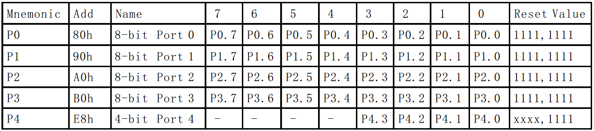

# 五十一、单片机特殊功能寄存器和位定义

接下来的几节，我们会带着大家编写第一个单片机程序。在此之前，我们先来了解一些 51 单片机特有的程序语法以及 Keil 软件的基本操作步骤，请大家一定要有耐心。

我们主要是用 C 语言来对单片机编程，而有的单片机有那么几条很特殊的独有的编程语句，51 单片机就有，先介绍 2 条。

**第一条语句是：sfr  P0 = 0x80;**

sfr 这个关键字，是 51 单片机特有的，他的作用是定义一个单片机特殊功能寄存器(special function register)。51 单片机内部有很多个小模块，每个模块居住在拥有唯一房间号的房间内，同时每个模块都有 8 个控制开关。P0 就是一个功能模块，就住在了 0x80 这个房间里，我们就是通过设置 P0 内部这个模块的 8 个开关，来让单片机的 P0 这 8 个 IO 口输出高电平或者低电平的。而 51 单片机内部有很多寄存器，如果我们想使用的话必须提前进行 sfr 声明。不过 Keil 软件已经把所有这些声明都预先写好并保存到一个专门的文件中去了，我们要用的话只要文件开头添加一行#include<reg52.h>即可，这个在后边有用法详解。

**第二条语句是：sbit  LED = P0⁰;**

这个 sbit，就是对刚才所说的 SFR 里边的 8 个开关其中的一个进行定义。经过上边第二条语句后，以后只要在程序里写 LED，就代表了 P0.0 口（“^”这个符号在数字键 6 上边），注意这个 P 必须大写，也就是说我们给 P0.0 又取了一个更形象的名字叫做 LED。

了解了这两个语句后，我们来大概看一下单片机的特殊功能寄存器。请注意，每个型号的单片机都会配有生产厂商所编写的数据手册(Datasheet)，所以我们来看一下 STC89C52 的数据手册，从 21 页到 24 页，全部是对特殊功能寄存器的介绍以及地址映射列表。我们在使用这个寄存器之前，必须对这个寄存器的地址进行说明。是不是花花绿绿的太多了，记不住啊，这个没关系的，不需要你记住，了解一下，后边大部分我会慢慢给大家解释，少部分需要用到的时候，自己过来查手册就可以了，做技术不是为了应付考试，你可以随时翻阅手册查找你需要的资料。

如图 2-7，是截取的手册中第 22 页最下边的一个表格。

图 2-7  IO 口特殊功能寄存器

我们来看一下这个表，其中 P4 口 STC89C52 对标准 51 的扩展，我们先忽略它，只看前边的 P0、P1、P2、P3 这 4 个，每个 P 口本身又有 8 个控制端口。大家可以结合我们的开发板原理图或者图 2-1 来看，那么这样就确定了我们的单片机一共有 32 个 IO 口（IO，Input 和 Output，分别是输入和输出）。

其中 P0 口所在的地址是 0x80，一共有从 7 到 0 这 8 个 IO 口控制位，后边有个 Reset Value（复位值），这个很重要，是我们看寄存器必看的一个参数，8 个控制位复位值全部都是 1。

这就是告诉我们，每当单片机上电复位的时候，所有的引脚的值默认是都是 1，即高电平，我们在设计电路的时候也要充分的考虑这个问题。

那么上边那 2 条语句，我们写 sfr 的时候，必须要根据手册里的这个地址(Add)去写，写 sbit 的时候，就可以直接将一个字节其中某一位取出来。我们编程的时候，也有现成的写好寄存器地址的头文件，我们直接包含该头文件就可以了，不需要逐一去写了。