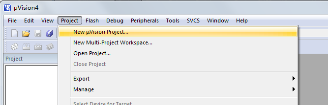
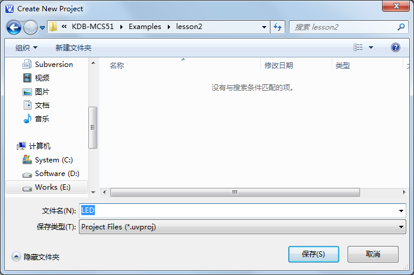
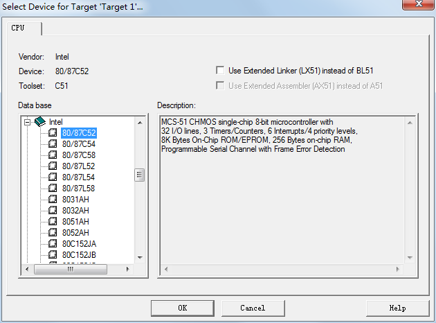
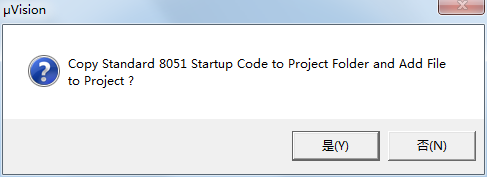
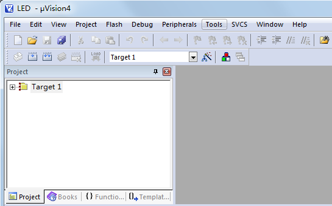
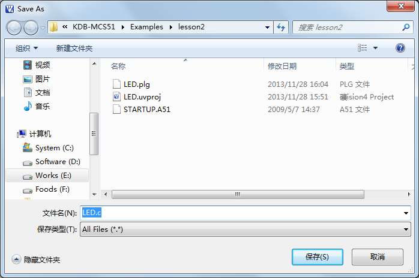
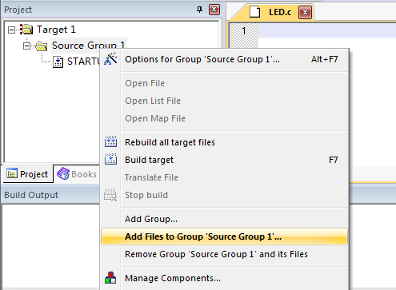
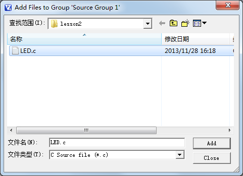

# 使用 Keil uVision 新建一个工程

对于单片机程序来说，每个功能程序，都必须要有一个配套的工程（Project），即使是点亮 LED 这样简单的功能程序也不例外，因此我们首先要新建一个工程，打开我们的 Keil 软件后，点击：Project-->New uVision Project...然后会出现一个新建工程的界面，如图 2-8 所示。

图 2-8  新建一个工程

因为现在讲到了第二章，所以我们在硬盘上建立了一个 lesson2 的目录，然后把 LED 这个工程的路径指定到这里，这样方便今后管理程序，不同的功能程序放到不同的文件夹下，并且给这个工程起一个名字叫做 LED，软件会自动添加扩展名.uvproj。如图 2-9 所示。

图 2-9  保存工程

我们直接点保存就可以了，工程会自动保存成 LED.uvproj 文件，下次要打开 LED 这个工程时，可以直接找到文件夹，双击这个.uvproj 文件就可以直接打开了。

保存之后会弹出一个对话框，这个对话框让我们选择单片机型号。因为 Keil 软件是外国人开发的，所以我们国内的 STC89C52 并没有上榜，但是只要选择同类型号就可以了。因为 51 内核是由 Intel 公司创造的，所以这里我们直接选择 Intel 公司名下的 80/87C52 来代替，这个选项的选择对于后边的编程没有任何的不良影响。如图 2-10 所示。

图 2-10  单片机型号选择

点击 OK 之后，会弹出一个对话框，如图 2-11 所示，每个工程都需要一段启动代码，如果点“否”编译器会自动处理这个问题，如果点“是”，这部分代码会提供给我们用户，我们就可以按需要自己去处理这部分代码，那这部分代码在我们初学 51 的这段时间内，一般是不需要去修改的，但是随着技术的提高和知识的扩展，我们就有可能会需要了解这块内容，因此这个地方我们选一下“是”，让这段代码出现，但是我们暂时不需要修改它，大家知道这么回事就可以了。

图 2-11  启动代码选择

这样工程就建立好了，如图 2-12 所示，如果我们点击 Target 1 左边的加号，会出现我们刚才加入的初始化文件 STARTUP.A51，这个我们先不管。

图 2-12  工程文件

工程有了之后，我们要建立编写代码的文件，点击 File-->New，如图 2-13，新建一个文件，也就是我们编写程序的平台。然后点 File-->Save 或者直接点击那个 Save 的快捷键，可以保存文件，保存时我们把它命名为 LED.c，这个地方必须加上.c，因为如果写汇编语言，这个地方的扩展名是.asm，头文件就是.h 等等，我们编写的是 C 语言程序，这个地方必须自己添加文件的扩展名.c，如图 2-14 所示。

图 2-13  新建文件

图 2-14  保存文件

现在我们就可以在我们建立好的文件中输入我们的程序代码了，在编写之前还有个工作要做。我们每做一个功能程序，必须要新建一个工程，一个工程代表了单片机要实现的一个功能。但是一个工程，有时候我们可以把我们的程序分多个文件写，所以每写一个文件，我们都要添加到我们所建立的工程中去，鼠标右键点 Source Group 1，点 Add Files to Group„Source Group 1‟...，如图 2-15 所示。

图 2-15  添加文件（一）

在弹出的对话框中，单击 LED.c 选中它，然后点 Add，或者直接双击 LED.c 都可以将文件加入到这个工程下，然后单击 Close，关闭添加。这个时候大家会看到在 Source Group 1 下边又多了一个 LED.c 文件。

图 2-16  添加文件（二）