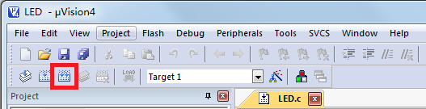

# 第一个单片机程序(C 语言编写)

忙活了半天，准备工作做了那么多，终于要编写我们的程序代码了。如果学过 C 语言的话，你应该很轻松的跟着我的编程自己写出来，如果没学过 C 语言也没关系，你先照着我的抄，我会在合适的位置写出来对 C 语言语法的解释，这样抄几次后再看看解释，就应该很明白了，抄的时候一定要认真，尤其标点符号不可以搞错。

第一个单片机程序：

```
#include <reg52.h>  //包含特殊功能寄存器定义的头文件
sbit LED = P0⁰;  //位地址声明，注意：sbit 必须小写、P 大写！
void main(){  //任何一个 C 程序都必须有且仅有一个 main 函数
    LED = 0;  //分号表示一条语句结束
}
```

先从程序语法上来分析一下：

*   main 是主函数的函数名字，每一个 C 程序都必须有且仅有一个 main 函数。
*   void 是函数的返回值类型，本程序没有返回值，用 void 表示。
*   {}在这里是函数开始和结束的标志，不可省略。
*   每条 C 语言语句以;结束的。

逻辑上来看，程序这样写就可以了，但是在实际单片机应用中，存在一个问题。比如我们的程序空间可以容纳 100 行代码，但是我们实际上的程序只用了 50 行代码，当运行完了 50 行，再继续运行时，第 51 行的程序不是我们想运行的程序，而是不确定的未知内容，一旦执行下去程序就会出错从而可能导致单片机自动复位，所以我们通常在程序中加入一个死循环，让程序停留在我们希望的这个状态下，不要乱运行，有以下两种写法可以参考：

参考程序一：

```
#include <reg52.h>
sbit LED = P0⁰;
void main(){
    while(1){
        LED = 0;
    }
}
```

参考程序二：

```
#include <reg52.h>
sbit LED = P0⁰;
void main(){
    LED = 0;
    while(1);
}
```

程序一的功能是程序在反复不断的无限次执行 LED = 0;这条语句，而程序二的功能是执行一次，然后程序直接停留下来等待，相对程序一来说程序二更加简洁一些。针对于图 2-6，我们这个程序能够把小灯点亮，但是这个程序却点不亮我们板子上的小灯，这是为什么呢？

这里大家就要培养一个意识了，我们做单片机编程，实际上算是硬件底层驱动程序开发，这种程序的开发，是离不开电路图的，必须根据我们的电路图来进行程序的编写。如果我们设计电路板的电路图和图 2-6 一样的话，程序可以成功点亮小灯，但是如果不一样，就可能点不亮。

我们的开发板上，还有一个 74HC138 作为 8 个 LED 小灯的总开关，而 P0.0 仅仅是个分开关。如同我们家里总是有一个供电总闸，然后每个电灯又有一个专门的开关，我们刚才的程序仅仅打开了那个电灯的开关，但是没有打开那个总电闸，所以程序需要加上这部分代码。

因为这节课要介绍的内容比较多，所以我们把 74HC138 的原理以及为什么要加额外的代码在下节课统一介绍，这节课我们直接加上这部分代码，大家知道有这么一回事就可以了。

```
#include <reg52.h>  //包含特殊功能寄存器定义的头文件
sbit LED = P0⁰;  //位地址声明，注意：sbit 必须小写、P 大写！
sbit ADDR0 = P1⁰;
sbit ADDR1 = P1¹;
sbit ADDR2 = P1²;
sbit ADDR3 = P1³;
sbit ENLED = P1⁴;

void main(){
    ENLED = 0;
    ADDR3 = 1;
    ADDR2 = 1;
    ADDR1 = 1;
    ADDR0 = 0;
    LED = 0;  //点亮小灯
    while (1);  //程序停止在这里
}
```

写了这么多啰嗦的语句，刚开始大家可能觉得很麻烦，为什么有的书上程序很简单就可以点亮小灯，我们这里却这么麻烦呢。大家要了解一点，就是我们做这个学习板，虽然仅仅提供给大家简单学习使用，但是我们也得按照实际产品的开发模式去设计，所以综合考虑因素很多，大家学到后边就会明白它的设计价值了，这里大家只要跟着我们去做就可以了。

程序编好了，我们要对我们的程序进行编译，生成我们需要的可以下载到单片机里的文件，在编译之前，我们先要勾选一个选项，Project-->Options for Target „Target1‟...，或者直接点图 2-17 中红框内的快捷图标：


图 2-17  工程选项图标

在弹出的对话框中，点击 Output 选项页，勾选其中的“Create HEX File”复选框，然后点 OK，如图 2-18 所示。


图 2-18  创建 HEX 文件

设置好以后呢，点击“Project-->rebuild all target files”，或者鼠标点击图 2-19 中红框内的快捷图标，就可以对程序进行编译了。



图 2-19  编译程序

编译完成后，在我们的 Keil 下方的 Output 窗口会出现相应的提示，大家注意看图 2-20，这个窗口告诉我们编译完成后的情况，data=9.0，指的是我们的程序使用了单片机内部的 256 字节 RAM 资源中的 9 个字节，code=29 的意思是使用了 8K 代码 Flash 资源中的 29 个字节。

当提示“0 Error(s), 0 warning(s)”表示我们的程序没有错误和警告，就会出现“creating hex file from “LED”...，意思是从当前工程生成了一个 HEX 文件，我们要下载到单片机上的就是这个 HEX 文件。如果出现有错误和警告提示的话，就是 Error 和 warning 不是 0，那么我们就要对程序进行检查，找出问题，解决好了再进行编译产生 HEX 才可以。


图 2-20  编译输出信息

到此为止，程序就编译好了，下边我们就要把编译好的程序文件下载到单片机里了。