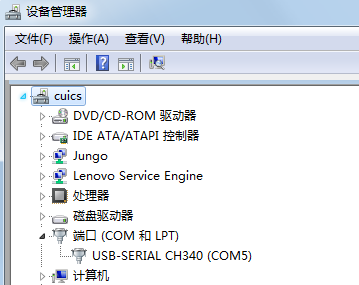
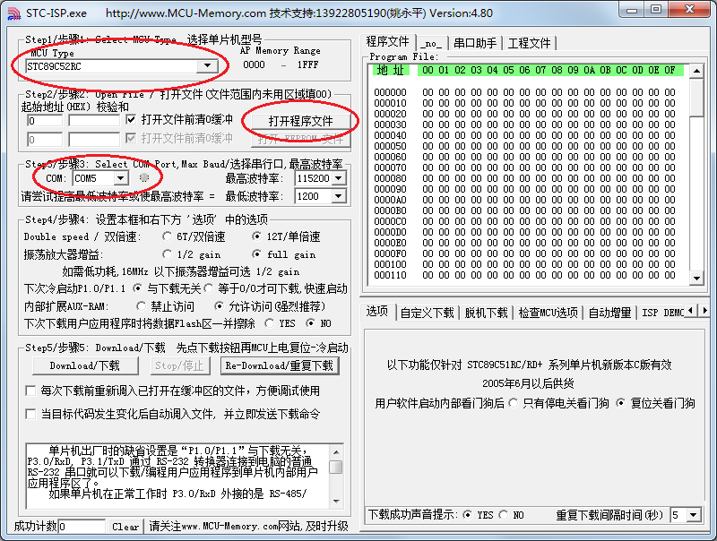
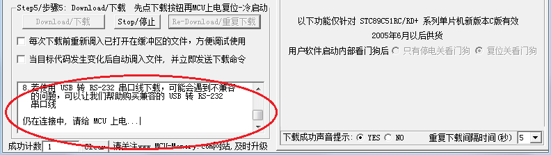
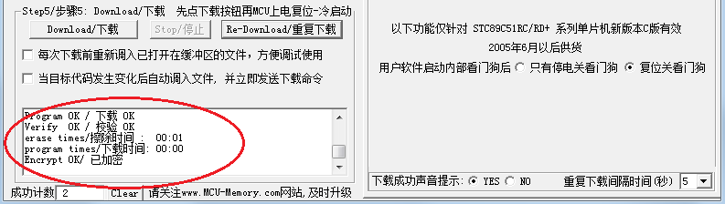

# 将程序下载到单片机

首先，我们要把硬件连接好，把板子插到我们的电脑上，打开设备管理器查看所使用的是哪个 COM 口，如图 2-21 所示，找到“USB-SERIAL CH340(COM5)”这一项，这里最后的数字就是开发板目前所使用的 COM 端口号。

图 2-21  查看 COM 口

然后 STC 系列单片的下载软件——STC-ISP，如图 2-22 所示。

图 2-22  程序下载设置

下载软件列出了 5 个步骤：第一步，选择单片机型号，我们现在用的单片机型号是 STC89C52RC，这个一定不能选错了；第二步，点击“打开程序文件”，找到我们刚才建立工程的那个 lesson2 文件夹，找到 LED.hex 这个文件，点击打开；第三步，选择刚才查到的 COM 口，波特率使用默认的就行；第四步，这里的所有选项都使用默认设置，不要随便更改，有的选项改错了以后可能会产生麻烦。第五步，因为 STC 单片机要冷启动下载，就是先点下载，然后再给单片机上电，所以我们先关闭板子上的电源开关，然后点击“Download/下载”按钮，等待软件提示你请上电后，如图 2-23 所示，然后再按下板子的电源开关，就可以将程序下载到单片机里边了。当软件显示“已加密”就表示程序下载成功了，如图 2-24 所示。

图 2-23  程序下载过程

图 2-24  程序下载完毕

程序下载完毕后，就会自动运行，大家可以在板子上看到那一排 LED 中最右侧的小灯已经发光了。那现在如果我们把 LED = 0 改成 LED = 1，再重新编译程序下载进去新的 HEX 文件，灯就会熄灭。至此，点亮一个 LED 的实验已经完成，终于迈出了第一步，是不是还挺好玩的呢。