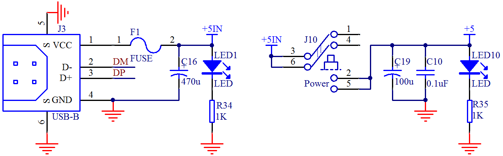
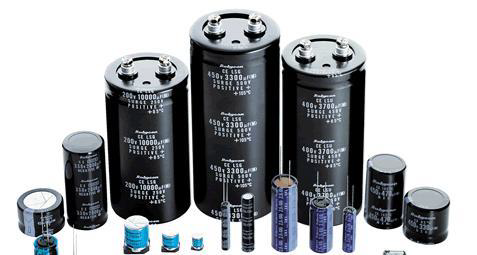
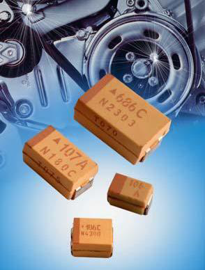
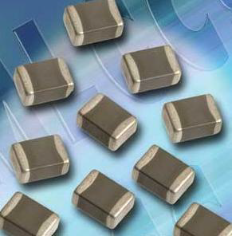

# 单片机中去耦电容的应用

首先来看图 3-1，这是上节课已经见过的 USB 接口和供电电路。

图 3-1  USB 接口和供电电路

左边这张图，过了保险丝以后，接了一个 470uF 的电容 C16，右边这张图，经过开关后，接了一个 100uF 的电容 C19，并且并联了一个 0.1uF 的电容 C10。其中 C16 和 C19 起到的作用是一样的，C10 的作用和他们两个不一样，我们先来介绍这 2 个大一点的电容。

容值比较大的电容，理论上可以理解成水缸或者水池子，同时，大家可以直接把电流理解成水流，其实大自然万物的原理都是类似的。

作用一，缓冲作用。当上电的瞬间，电流从电源处流下来的时候，不稳定，容易冲击电子器件，加个电容可以起到缓冲作用。就如同我们直接用水龙头的水浇地，容易冲坏花花草草。我们只需要在水龙头处加个水池，让水经过水池后再缓慢流进草地，就不会冲坏花草，起到有效的保护作用。

作用二，稳定作用。我们的一整套电路，后级电子器件的功率大小都不一样，而器件正常工作的时候，所需电流的大小也不是一成不变的。比如后级有个器件还没有工作的时候，电流消耗是 100mA，突然它参与工作了，电流猛的增大到了 150mA，这个时候如果没有一个水缸的话，电路中的电压（水位）就会直接突然下降，比如我们的 5V 电压突然降低到 3V 了。而我们系统中有些电子元器件，必须高于一定的电压才能正常工作，电压太低就直接不工作了，这个时候水缸就必不可少了。电容会在这个时候把存储在里边的电量释放一下，稳定电压，当然，随后前级的电流会及时把水缸充满的。

有了这个电容，可以说我们的电压和电流就会很稳定了，不会产生大的波动。这种电容常用的有如图 3-2、图 3-3、图 3-4 所示三种：

图 3-2  铝电解电容

        

图 3-3   钽电容                                                图 3-4  陶瓷电容

这三种电容是最常用的三种，其中第一种个头大，占空间大，单位容量价格最便宜，第 二种和第三种个头小，占空间小，性能一般也略好于第一种，但是价格也贵不少。当然，除 了价格，还有一些特殊参数，在通信要求高的场合也要考虑很多，这里暂且不说。我们板子 上现在用的是第一种，在同样的符合条件的耐压值和容值下，第一种 470uF 的电容不到一毛钱，而第二种和第三种可能要 1 块钱左右了。

电容的选取，第一个参数是耐压值的考虑。我们用的是 5V 系统，电容的耐压值要高于 5V，一般推荐 1.5 倍到 2 倍即可，有些场合稍微再高点也可以。我们板子上用的是 10V 耐压的。第二个参数是电容容值，这个就需要根据经验来选取了，选取的时候，要看这个电容起作用的整套系统的功率消耗情况，如果系统耗电较大，波动可能比较大，那么容值就要选大一些，反之可以小一些。

同学们刚开始设计电路也是要模仿别人，别人用多大自己也用多大，慢慢积累。比如咱上边讲电容作用二的时候，电流从 100mA 突然增大到 150mA 的时候，其实即使加上这个电容，电压也会轻微波动，比如从 5V 波动到 4.9V，但是只要我们板子上的器件在电压 4.9V 以上也可以正常工作的话，这点波动是被容许的，但是如果不加或者加的很小，电压波动比较大，有些器件的工作就会不正常了。但是如果加的太大，占空间并且价格也高，所以这个地方电容的选取多参考经验。

我们再来看图 3-1 中的另一种电容 C10，它容值较小，是 0.1uF，也就是 100nF，是用来滤除高频信号干扰的。比如 ESD，EFT 等。我们初中学过电容的特性——可以通交流隔直流，但是电容的参数对不同频率段的干扰的作用是不一样的。这个 100nF 的电容，是我们的前辈根据干扰的频率段，根据板子的参数，根据电容本身的参数所总结出来的一个值。也就是说，以后大家在设计数字电路的时候，在电源处的去耦高频电容，直接用这个 0.1uF 就可以了，不需要再去计算和考量太多。

还有一点，大家可以仔细观察我们的 KST-51 开发板，在电路中需要较大电流供给的器件附近，会加一个大电容，比如在 1602 液晶左上角的 C18，靠近单片机的 VCC 以及 1602 液晶背光的 VCC，起到稳定电压的作用，而图 3-1 中的 C19 的实际位置也是放在了在左上角电机和蜂鸣器附近，因为它们所需的电流都比较大，而且工作时电流的波动也很大。还有在所有的 IC 器件的 VCC 和 GND 之间，都会放一个 0.1uF 的高频去耦电容，特别在布板的时候，这个 0.1uF 电容要尽可能的靠近 IC，尽量很顺利的与这个 IC 的 VCC 和 GND 连到一起，这个大家先了解，细节以后再讨论。