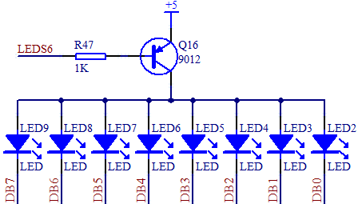
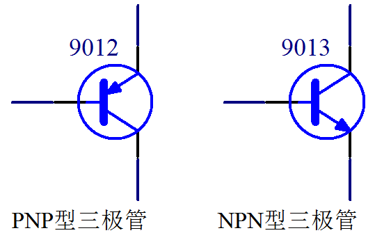
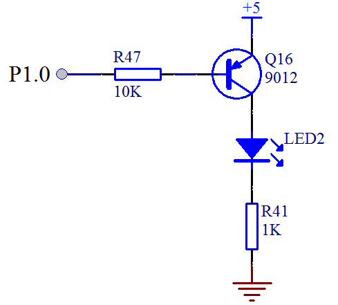

# 三极管的的概念及其工作原理

三极管在我们数字电路和模拟电路中都有大量的应用，在我们开发板上也用了多个三极管。在我们板子上的 LED 小灯部分，就有这个三极管的应用了，图 3-5 的 LED 电路中的 Q16 就是一个 PNP 型的三极管。

图 3-5  LED 电路

## 三极管的初步认识

三极管是一种很常用的控制和驱动器件，常用的三极管根据材料分有硅管和锗管两种，原理相同，压降略有不同，硅管用的较普遍，而锗管应用较少，本课程就用硅管的参数来进行讲解。三极管有 2 种类型，分别是 PNP 型和 NPN 型。先来认识一下，如图 3-6。

图 3-6  三极管示意图

三极管一共有 3 个极，从图 3-6 来看，横向左侧的引脚叫做基极(base)，中间有一个箭头，一头连接基极，另外一头连接的是发射极 e(emitter)，那剩下的一个引脚就是集电极 c(collector)了。这是必须要记住的内容，死记硬背即可，后边慢慢用的多了，每次死记硬背一次，多次以后就会深入脑海了。

## 三极管的原理

三极管有截止、放大、饱和三种工作状态。放大状态主要应用于模拟电路中，且用法和计算方法也比较复杂，我们暂时用不到。而数字电路主要使用的是三极管的开关特性，只用到了截止与饱和两种状态，所以我们也只来讲解这两种用法。三极管的类型和用法我给大家总结了一句口诀，大家要把这句口诀记牢了：箭头朝内 PNP，导通电压顺箭头过，电压导通，电流控制。

下面我们一句一句来解析口诀。大家可以看图 3-6，三极管有 2 种类型，箭头朝内就是 PNP，那箭头朝外的自然就是 NPN 了，在实际应用中，要根据实际电路的需求来选择到底用哪种类型，大家多用几次也就会了，很简单。

三极管的用法特点，关键点在于 b 极（基极）和 e 级（发射极）之间的电压情况，对于 PNP 而言，e 极电压只要高于 b 级 0.7V 以上，这个三极管 e 级和 c 级之间就可以顺利导通。也就是说，控制端在 b 和 e 之间，被控制端是 e 和 c 之间。同理，NPN 型三极管的导通电压是 b 极比 e 极高 0.7V，总之是箭头的始端比末端高 0.7V 就可以导通三极管的 e 极和 c 极。这就是关于“导通电压顺箭头过，电压导通”的解释，我们来看图 3-7。

图 3-7  三极管的用法

我们以图 3-7 为例介绍一下。三极管基极通过一个 10K 的电阻接到了单片机的一个 IO 口上，假定是 P1.0，发射极直接接到 5V 的电源上，集电极接了一个 LED 小灯，并且串联了一个 1K 的限流电阻最终接到了电源负极 GND 上。

如果 P1.0 由我们的程序给一个高电平 1，那么基极 b 和发射极 e 都是 5V，也就是说 e 到 b 不会产生一个 0.7V 的压降，这个时候，发射极和集电极也就不会导通，那么竖着看这个电路在三极管处是断开的，没有电流通过，LED2 小灯也就不会亮。如果程序给 P1.0 一个低电平 0，这时 e 极还是 5V，于是 e 和 b 之间产生了压差，三极管 e 和 b 之间也就导通了，三极管 e 和 b 之间大概有 0.7V 的压降，那还有(5-0.7)V 的电压会在电阻 R47 上。这个时候，e 和 c 之间也会导通了，那么 LED 小灯本身有 2V 的压降，三极管本身 e 和 c 之间大概有 0.2V 的压降，我们忽略不计。那么在 R41 上就会有大概 3V 的压降，可以计算出来，这条支路的电流大概是 3mA，可以成功点亮 LED。

最后一个概念，电流控制。前边讲过，三极管有截止，放大，饱和三个状态，截止就不用说了，只要 e 和 b 之间不导通即可。我们要让这个三极管处于饱和状态，就是我们所谓的开关特性，必须要满足一个条件。三极管都有一个放大倍数β，要想处于饱和状态，b 极电流就必须大于 e 和 c 之间电流值除以β。这个β，对于常用的三极管大概可以认为是 100。那么上边的 R47 的阻值我们必须要来计算一下了。

刚才我们算过了，e 和 c 之间的电流是 3mA，那么 b 极电流最小就是 3mA 除以 100 等于 30uA，大概有 4.3V 电压会落在基极电阻上，那么基极电阻最大值就是 4.3V/30uA = 143K。电阻值只要比这个值小就可以，当然也不能太小，太小会导致单片机的 IO 口电流过大烧坏三极管或者单片机，STC89C52 的 IO 口输入电流最大理论值是 25mA，我推荐不要超过 6mA，我们用电压和电流算一下，就可以算出来最小电阻值，我们图 3-7 取的是经验值。