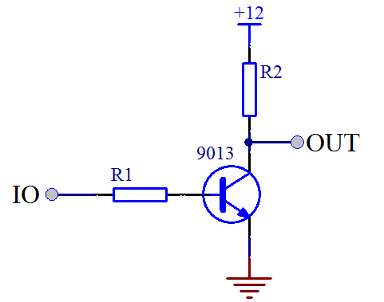
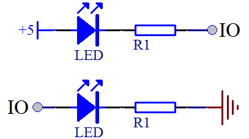
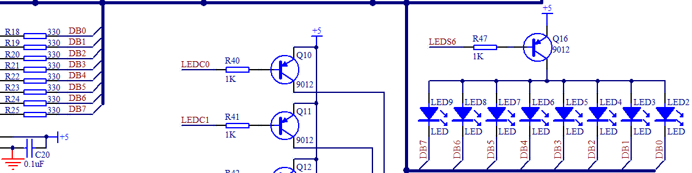
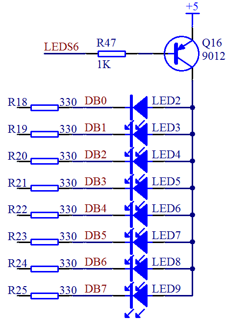
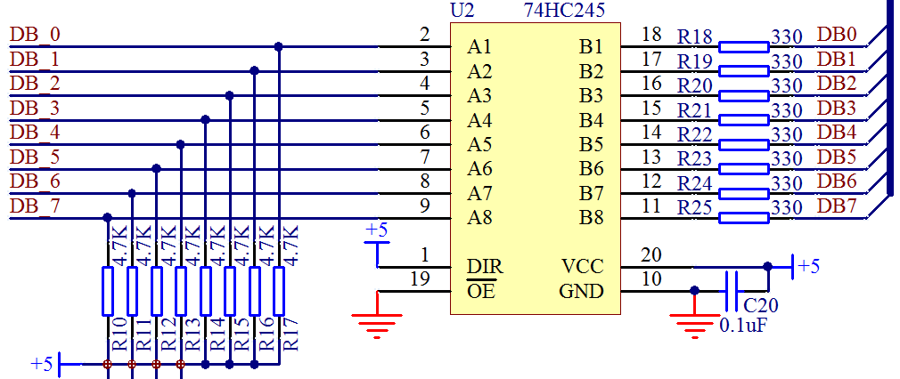
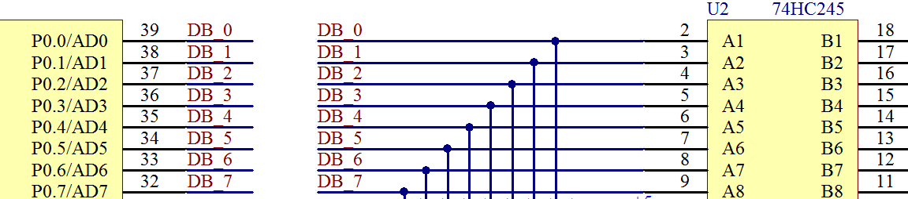

# 单片机中三极管的应用

三极管在数字电路里的开关特性，最常见的应用有 2 个：一个是控制应用，一个是驱动应用。所谓的控制就是如图 3-7 里边介绍的，我们可以通过单片机控制三极管的基极来间接控制后边的小灯的亮灭，用法大家基本熟悉了。还有一个控制就是进行不同电压之间的转换控制，比如我们的单片机是 5V 系统，它现在要跟一个 12V 的系统对接，如果 IO 直接接 12V 电压就会烧坏单片机，所以我们加一个三极管，三极管的工作电压高于单片机的 IO 口电压，用 5V 的 IO 口来控制 12V 的电路，如图 3-8 所示。

图 3-8 三极管实现电压转换

图 3-8 中，当 IO 口输出高电平 5V 时，三极管导通，OUT 输出低电平 0V，当 IO 口输出低电平时，三极管截止，OUT 则由于上拉电阻 R2 的作用而输出 12V 的高电平，这样就实现了低电压控制高电压的工作原理。

所谓的驱动，主要是指电流输出能力。我们再来看如图 3-9 中两个电路之间的对比。

图 3-9  LED 小灯控制方式对比

图 3-9 中上边的 LED 灯，和我们第二课讲过的 LED 灯是一样的，当 IO 口是高电平时，小灯熄灭，当 IO 口是低电平时，小灯点亮。那么下边的电路呢，按照这种推理，IO 口是高电平的时候，应该有电流流过并且点亮小灯，但实际上却并非这么简单。

单片机主要是个控制器件，具备四两拨千斤的特点。就如同杠杆必须有一个支点一样，想要撑起整个地球必须有力量承受的支点。单片机的 IO 口可以输出一个高电平，但是他的输出电流却很有限，普通 IO 口输出高电平的时候，大概只有几十到几百 uA 的电流，达不到 1mA，也就点不亮这个 LED 小灯或者是亮度很低，这个时候如果我们想用高电平点亮 LED，就可以用上三极管来处理了，我们板上的这种三极管型号，可以通过 500mA 的电流，有的三极管通过的电流还更大一些，如图 3-10 所示。

图 3-10  三极管驱动 LED 小灯

图 3-10 中，当 IO 口是高电平，三极管导通，因为三极管的电流放大作用，c 极电流就可以达到 mA 以上了，就可以成功点亮 LED 小灯。

虽然我们用了 IO 口的低电平可以直接点亮 LED，但是单片机的 IO 口作为低电平，输入电流就可以很大吗？这个我想大家都能猜出来，当然不可以。单片机的 IO 口电流承受能力，不同型号不完全一样，就 STC89C52 来说，官方手册的 81 页有对电气特性的介绍，整个单片机的工作电流，不要超过 50mA，单个 IO 口总电流不要超过 6mA。即使一些增强型 51 的 IO 口承受电流大一点，可以到 25mA，但是还要受到总电流 50mA 的限制。那我们来看电路图的 8 个 LED 小灯这部分电路，如图 3-11 所示。

图 3-11   LED 电路图（一）

这里我们要学会看电路图的一个知识点，电路图右侧所有的 LED 下侧的线最终都连到一根黑色的粗线上去了，大家注意，这个地方不是实际的完全连到一起，而是一种总线的画法，画了这种线以后，表示这是个总线结构。而所有的名字一样的节点是一一对应的连接到一起，其他名字不一样的，是不连在一起的。比如左侧的 DB0 和右侧的最右边的 LED2 小灯下边的 DB0 是连在一起的，而和 DB1 等其他线不是连在一起的。

那么我们把图 3-11 中现在需要讲解的这部分单独摘出来看，如图 3-12 所示。

图 3-12  LED 电路图（二）

现在我们通过 3-12 的电路图来计算一下，5V 的电压减去 LED 本身的压降，减掉三极管 e 和 c 之间的压降，限流电阻用的是 330 欧，那么每条支路的电流大概是 8mA，那么 8 路 LED 如果全部同时点亮的话电流总和就是 64mA。这样如果直接接到单片机的 IO 口，那单片机肯定是承受不了的，即使短时间可以承受，长时间工作就会不稳定，甚至导致单片机烧毁。

有的同学会提出来可以加大限流电阻的方式来降低这个电流。比如改到 1K，那么电流不到 3mA，8 路总的电流就是 20mA 左右。首先，降低电流会导致 LED 小灯亮度变暗，小灯的亮度可能关系还不大，但因为我们同样的电路接了数码管，后边我们要讲数码管还要动态显示，如果数码管亮度不够的话，那视觉效果就会很差，所以降低电流的方法并不可取。其次，对于单片机来说，他主要是起到控制作用，电流输入和输出的能力相对较弱，P0 的 8 个口总电流也有一定限制，所以如果接一两个 LED 小灯观察，可以勉强直接用单片机的 IO 口来接，但是接多个小灯，从实际工程的角度去考虑，就不推荐直接接 IO 口了。那么我们如果要用单片机控制多个 LED 小灯该怎么办呢？

除了三极管之外，其实还有一些驱动 IC，这些驱动 IC 可以作为单片机的缓冲器，仅仅是电流驱动缓冲，不起到任何逻辑控制的效果，比如我们板子上用的 74HC245 这个芯片，这个芯片在逻辑上起不到什么别的作用，就是当做电流缓冲器的，我们通过查看其数据手册，74HC245 稳定工作在 70mA 电流是没有问题的，比单片机的 8 个 IO 口大多了，所以我们可以把他接在小灯和 IO 口之间做缓冲，如图 3-13 所示。

图 3-13  74HC245 功能图

从图 3-13 我们来分析，其中 VCC 和 GND 就不用多说了，细心的同学会发现这里有个 0.1uF 的去耦电容哦。

74HC245 是个双向缓冲器，1 引脚 DIR 是方向引脚，当这个引脚接高电平的时候，右侧所有的 B 编号的电压都等于左侧 A 编号对应的电压。比如 A1 是高电平，那么 B1 就是高电平，A2 是低电平，B2 就是低电平等等。如果 DIR 引脚接低电平，得到的效果是左侧 A 编号的电压都会等于右侧 B 编号对应的电压。因为我们这个地方控制端是左侧接的是 P0 口，我们要求 B 等于 A 的状态，所以 1 脚我们直接接的 5V 电源，即高电平。图 3-13 中还有一排电阻 R10 到 R17 是上拉电阻，这个电阻的用法我们在后边介绍。

还有最后一个使能引脚 19 脚 OE，叫做输出使能，这个引脚上边有一横，表明是低电平有效，当接了低电平后，74HC245 就会按照刚才上边说的起到双向缓冲器的作用，如果 OE 接了高电平，那么无论 DIR 怎么接，A 和 B 的引脚是没有关系的，也就是 74HC245 功能不能实现出来。

从下面的图 3-14 可以看出来，单片机的 P0 口和 74HC245 的 A 端是直接接起来的。这个地方，有个别同学有个疑问，就是我们明明在电源 VCC 那地方加了一个三极管驱动了，为何还要再加 245 驱动芯片呢。这里大家要理解一个道理，电路上从正极经过器件到地，首先必须有电流才能正常工作，电路中任何一个位置断开，都不会有电流，器件也就不会参与工作了。其次，和水流一个道理，从电源正极到负极的电流水管的粗细都要满足要求，任何一个位置的管子过细，都会出现瓶颈效应，电流在整个通路中细管处会受到限制而降低，所以在电路通路的每个位置上，都要保证通道足够畅通，这个 74HC245 的作用就是消除单片机 IO 这一环节的瓶颈。

图 3-14  单片机与 74HC245 的连接