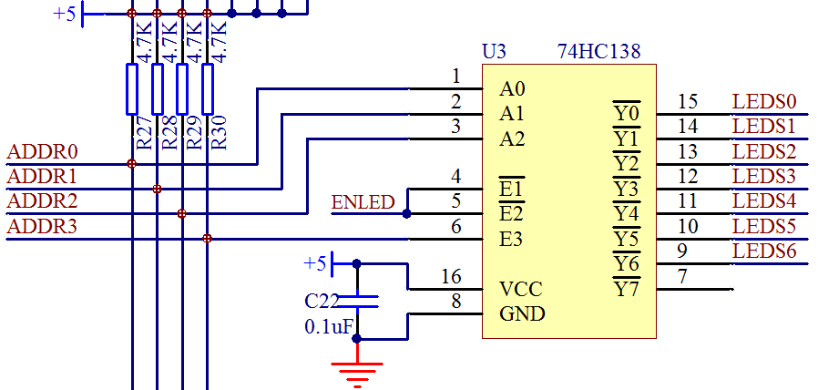
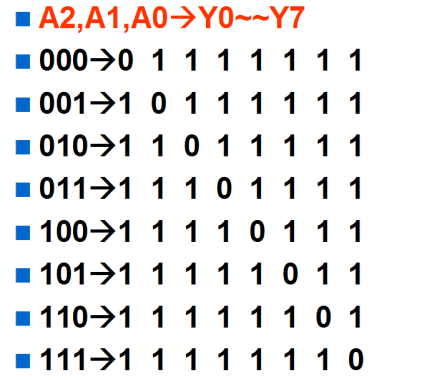
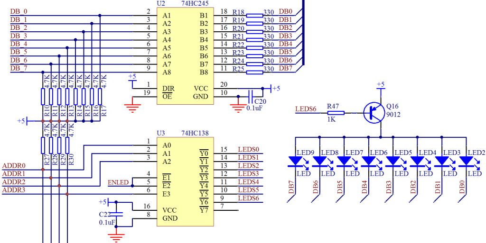
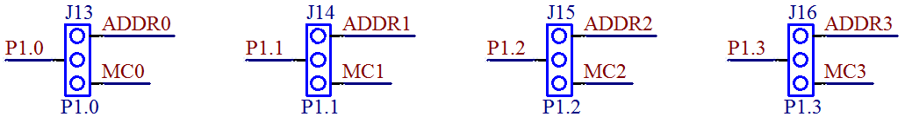
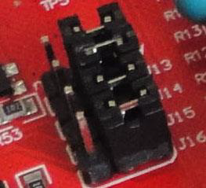

# 单片机中 74HC138 三八译码器的应用

在我们设计单片机电路的时候，单片机的 IO 口数量是有限的，有时并满足不了我们的设计需求，比如我们的 STC89C52 一共有 32 个 IO 口，但是我们为了控制更多的器件，就要使用一些外围的数字芯片，这种数字芯片由简单的输入逻辑来控制输出逻辑，比如 74HC138 这个三八译码器，图 3-15 是 74HC138 在我们原理图上的一个应用。

图 3-15  74HC138 应用原理图

从这个名字来分析，三八译码器，就是把 3 种输入状态翻译成 8 种输出状态。从图 3-15 所能看出来的，74HC138 有 1～6 一共是 6 个输入引脚，但是其中 4、5、6 这三个引脚是使能引脚。使能引脚和我们前边讲 74HC245 的 OE 引脚是一样的，这三个引脚如果不符合规定的输入要求，Y0 到 Y7 不管你输入的 1、2、3 引脚是什么电平状态，总是高电平。所以我们要想让这个 74HC138 正常工作，ENLED 那个输入位置必须输入低电平，ADDR3 位置必须输入高电平，这两个位置都是使能控制端口。不知道大家是否记得我们第二课的程序有这么两句 ENLED = 0；ADDR3 = 1；就是控制使这个 74HC138 使能的。

这类逻辑芯片，大多都是有使能引脚的，使能符合要求了，那下面就要研究控制逻辑了。对于数字器件的引脚，如果一个引脚输入的时候，有 0 和 1 两种状态；对于两个引脚输入的时候，就会有 00、01、10、11 这四种状态了，那么对于 3 个输入的时候，就会出现 8 种状态了，大家可以看下边的这个真值表——图 3-16，其中输入是 A2、A1、A0 的顺序，输出是从 Y0、Y1......Y7 的顺序。

图 3-16  74HC138 真值表

从图 3-16 可以看出，任一输入状态下，只有一个输出引脚是低电平，其他的引脚都是高电平。在前面的电路中我们已经看到，8 个 LED 小灯的总开关三极管 Q16 基极的控制端是 LEDS6，也就是 Y6 输出一个低电平的时候，可以开通三极管 Q16，从右侧的希望输出的结果，我们可以推导出我们的 A2、A1、A0 的输入状态应该是 110，如图 3-17。

图 3-17  LED 小灯整体电路图

那么我们再整体捋一遍点亮 LED 小灯的过程，首先看 74HC138，我们要让 LEDS6 为低电平才能导通三极管 Q16，所以 ENLED = 0;ADDR3 = 1;保证 74HC138 使能。然后 ADDR2 =1; ADDR1 = 1; ADDR0 = 0;这样保证了三极管 Q16 这个开关开通，5V 电源加到 LED 上。

而 74HC245 左侧是通过 P0 口控制，我们让 P0.0 引脚等于 0，就是 DB_0 等于 0，而右侧 DB0 等于 DB_0 的状态，也是 0，那么这样在这一排共 8 个 LED 小灯当中，只有最右侧的小灯和 5V 之间有压差，有压差就会有电流通过，有电流通过我们的 LED2 就会发光了。

74HC245 左侧我们可以看出来，是直接接到 P0 口上的，而 74HC138 的 ADDR0 ~ ADDR3 接在何处呢？来看图 3-18。

图 3-18  显示译码与步进电机的选择跳线

跳线是大家以后经常会接触到的一个器件，它就是 2 根或者 3 根靠在一起的排针，然后可以用一个叫作跳线帽的东西连接其相邻的 2 根针。它的作用就是起到导线的作用，我们可以通过跳线帽来实现连接线的切换。如图 3-19。

图 3-19  跳线实物图

从图中可以看出，跳线帽本身可以占 2 个针的位置，现在是把右侧和中间的针连到了一起，这样实现的就是图 3-18 中的 P1.0 和 ADDR0 连接到一起、P1.1 和 ADDR1 接一起、P1.2 和 ADDR2 接一起、P1.3 和 ADDR3 接一起。这样就可以透彻理解我们第二课的程序了。

好了，大家认真再回顾一下我们第二课的那个程序，再领悟一下这几个数字器件的用法。