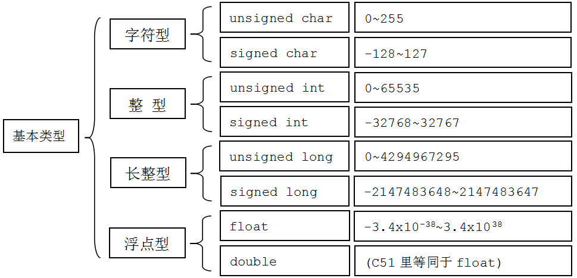

# C 语言变量类型和范围

什么是变量？变量自然和常量是相对的。常量就是 1、2、3、4.5、10.6......等固定的数字，而变量则根我们小学学的 x 是一个概念，我们可以让它是 1，也可以让它是 2，我们想让它是几是我们的程序说了算的。

那么我们小学学的数学里边，有这么几类，正数、负数、整数和小数。在 C 语言里，除名字和我们数学里学的不一样外，还对数据大小进行了限制。这个地方有一点复杂的是，在 C51 里边的数据范围和其他编程环境还可能不完全一样，因此我们下边的这个图，仅仅代表的是 C51，其他编程环境可能不一样，大家知道有这回事就可以了。

C 语言的数据基本类型分为字符型、整型、长整型以及浮点型，如图 4-1 所示。

图 4-1   C 语言基本数据类型

图 4-1 中，四种基本类型，每个基本类型又包含了两个类型。字符型、整型、长整型，除了可表达的数值大小范围不同之外，都是只能表达整数，而 unsigned 型的又只能表达正整数，要表达负整数则必须用 signed 型，如要表达小数的话，则必须用浮点型了。

比如上节课最后的闪烁 LED 小灯的程序，我们用的是 unsigned int i = 0;这个地方 i 的取值范围就是 0～65535，在接下来的 for 语句里，如果我们把原来那个 30000 改成 70000 的话，for(i=0;i<70000;i++);大家会发现小灯会一直亮，而不是闪烁了，这里自然就有因超出 i 取值范围所造成的问题，但要彻底搞明白这个问题，我们还要来了解 for 语句的用法。不用急，接下来我们很快就会学到它了。

这里有一个编程宗旨，就是能用小不用大。就是说定义能用 1 个字节 char 解决问题的，就不定义成 int，一方面节省 RAM 空间可以让其他变量或者中间运算过程使用，另外一方面，占空间小程序运算速度也快一些。