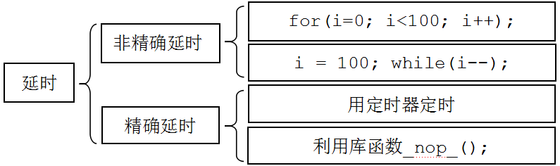
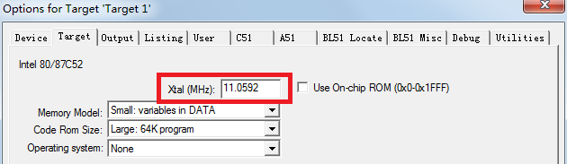
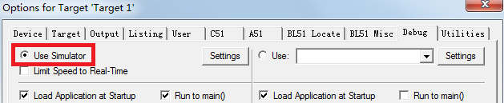
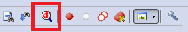
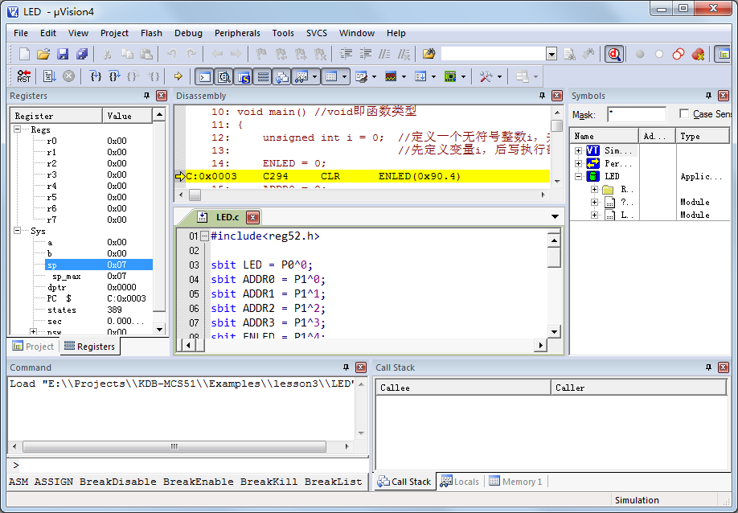
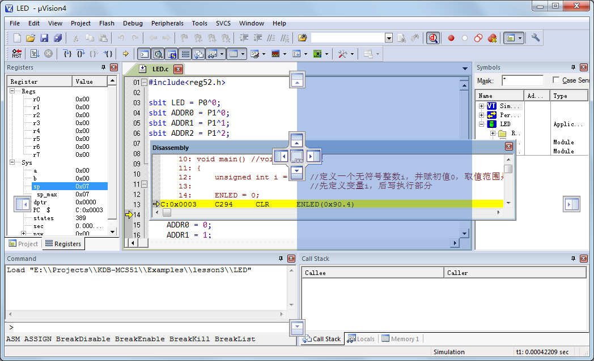
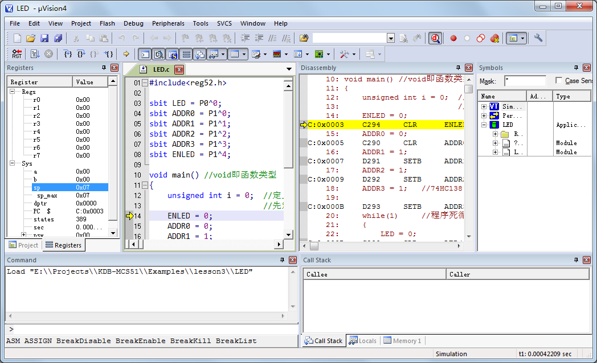
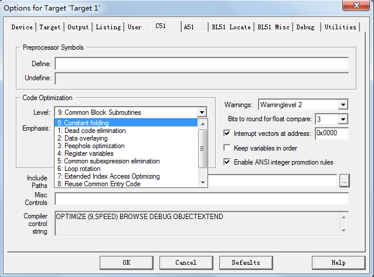
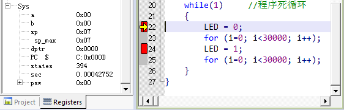
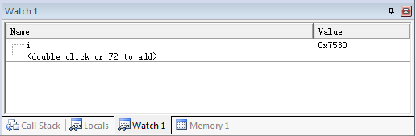

# 单片机延时方法(Keil 软件延时)

C 语言常用的延时方法，有如图 4-2 所示 4 种。

图 2-4  C 语言延时方法

图 4-2 是 C 语言编程常用的 4 种延时方法，其中两种非精确延时，两种精确一些的延时。for 语句和 while 语句都可以通过改变 i 的范围值来改变延时时间，但是 C 语言循环的执行时间都是不能通过程序看出来的。精确延时有两个方法，一个方法是用定时器来延时，这个方法我们后边课程要详细介绍，定时器是单片机的一个重点。另外一个就是用库函数 _nop_();，一个 NOP 的时间是一个机器周期的时间，这个后边也要介绍。

非精确延时，只是在我们做一些比如小灯闪烁，流水灯等简单演示实验中使用，而实际项目开发过程中其实这种非精确延时用的很少。

好了，介绍完了，我们就要实战了。上节课的 LED 小灯闪烁的程序，我们用的延时方式是 for(i=0;i<30000;i++);大家如果把这里的 i 改成 100，下载进入单片机，会发现小灯一直亮，而不是闪烁状态，现在就请大家都把这个程序改一下，改成 100，然后下载观察一下现象再继续......

观察完了，毫无疑问，实际现象和我提到的理论是相符合的，这是为什么呢？这里介绍一个常识。我们人的肉眼对闪烁的光线有一个最低分辨能力，通常情况下当闪烁的频率高于 50Hz 时，我们看到的信号就是常亮的。即，延时的时间低于 20ms 的时候，我们的肉眼是分辨不出来小灯是在闪烁的，可能最多看到的是小灯亮暗稍微变化了一下。要想清楚的看到小灯闪烁，延时的值必须大一点，大到什么程度呢，不同的亮度的灯不完全一样，大家可以自己做实验。

那么如何观察我们写的延时到底有多长时间呢？选择 Keil 菜单项 Project-->Options for Target „Target1‟...，或点击在图 2-17 中已提到过的图标，进入工程选项，如图 4-3 所示。

图 4-3  工程选项——时钟频率设置

首先打开 Target 这个选项卡，找到里边的 Xtal(MHz)这个位置，这是填写我们进行模拟时间的晶振选项，从我们原理图以及板子上都可以看到，单片机所使用的晶振是 11.0592MHz，所以这个地方我们要填上 11.0592。然后找到 Debug 这个选项卡，选择左侧的 Use Simulator，然后点击最下边的 OK 就可以了，如图 4-4 所示。

图 4-4  工程选项——仿真设置

选择菜单项 Debug-->Start/Stop Debug Session，或者点击图 4-5 中红框内的按钮，就会进入一个新的页面，如图 4-6 所示。

图 4-5  启动/结束调试按钮

图 4-6   工程调试界面

最左侧那一栏显示单片机一些寄存器的当前值和系统信息，最上边那一栏是 Keil 将 C 语言转换成汇编的代码，下边就是我们写 C 语言的程序，调试界面包含很多的子窗口，都可以通过菜单 View 中的选项打开和关闭。你可能会感觉这种默认的分布不符合习惯或者不方便观察特定信息，好办，界面上几乎所有子窗口的位置都可以调整的。比如我想把 Disassembly 反汇编窗口和源代码窗口横向并排摆放，那么只需要用鼠标拖动反汇编窗口的标题栏，这时会在屏幕上出现多个指示目标位置的图标，拖着窗口把鼠标移动到相应的图标上，软件还会用蓝色底纹指示具体的位置，如图 4-7 所示，松开鼠标窗口就会放到新位置了。调整后的效果如图 4-8 所示。

图 4-7  调整窗口位置

图 4-8  窗口位置调整效果

你可能已经注意到在 C 语言的源代码文件和反汇编窗口内都有一个黄色的箭头，这个箭头代表的就是程序当前运行的位置，因为反汇编内的代码就由源文件编译生成的，所以它们指示的是相同的实际位置。在这个工程调试界面里，我们可以看到程序运行的过程。在左上角的工具栏里有这样三个按钮：第一个标注有 RST 字样的是复位，点击一下之后，程序就会跑到最开始的位置运行；右侧紧挨着的按钮是全速运行，点击一下程序就会全速跑起来；再右边打叉的是停止按钮，当程序全速运行起来后，我们可以通过点击第三个图标来让程序停止，观察程序运行到哪里了。点击一下复位后，会发现 C 语言程序左侧有灰色或绿色，有的地方还是保持原来的白色，我们可以在我们灰色的位置双击鼠标设置断点，就是比如程序一共 20 行，在第十行设置断点后，点全速运行，程序就会运行到第十行停止，方便我们观察运行到这个地方的情况。

同学们会发现，有的位置可以设置断点，有的地方不可以设置断点，这是为什么呢？因为 Keil 软件本身具备程序优化的功能，如果大家想在所有的代码位置都能设置断点，可以在工程选项里把优化等级设置为 0，就是告诉 Keil 不要进行优化。如图 4-9 所示。

图 4-9  工程优化等级

这节课我们重点是看看 C 语言代码的运行时间，在最左侧的 register 那个框内，有一个 sec 选项，这个选项显示就是单片机运行了多少时间。单击一下复位按钮，会发现这个 sec 变成了 0，然后我们在 LED = 0;这一句加一个断点，在 LED = 1;这个位置加一个断点，我们点击全速运行按钮，会直接停留在 LED = 0;我们会看到我们的时间变化成 0.00042752 秒，如图 4-10 所示。请注意，我们这里设置的优化等级是默认的 8，如果你用的是其它等级的话运行时间就会有所差别，因为优化等级会直接影响程序的执行效率。

图 4-10  查看程序运行时间

再点一下全速运行，会发现 sec 变成了 0.16342556，那么减去上次的值，就是程序在这两个断点之间执行所经历的时间，也就是这个 for 循环的执行时间，大概是 163ms。我们也可以通过改变 30000 这个数字来改变这个延时时间。当然了，大家要注意 i 的取值范围，你如果写成了大于 65535 的值以后，程序就一直运行不下去了，因为 i 无论如何变化，都不会大于这个值，如果要大于这个值且正常运行，必须改变 i 定义的类型了。后边如果我们要查看一段程序运行了多长时间，都可以通过这种方式来查看。

实际上，进入 debug 模式，除了可以看程序运行了多长时间外，还可以观察各个寄存器、各个变量的数值变化情况。点击 View 菜单里的 Watch Windows-->Watch 1，可以打开变量观察窗口，如图 4-11 所示。

图 4-11  变量观察窗口

在这个窗口内，可以通过双击或按 F2 键，然后输入我们想观察的变量或寄存器的名字，后边就会显示出它的数值，这个功能在我们后边的调试程序中比较有用，大家先了解一下。