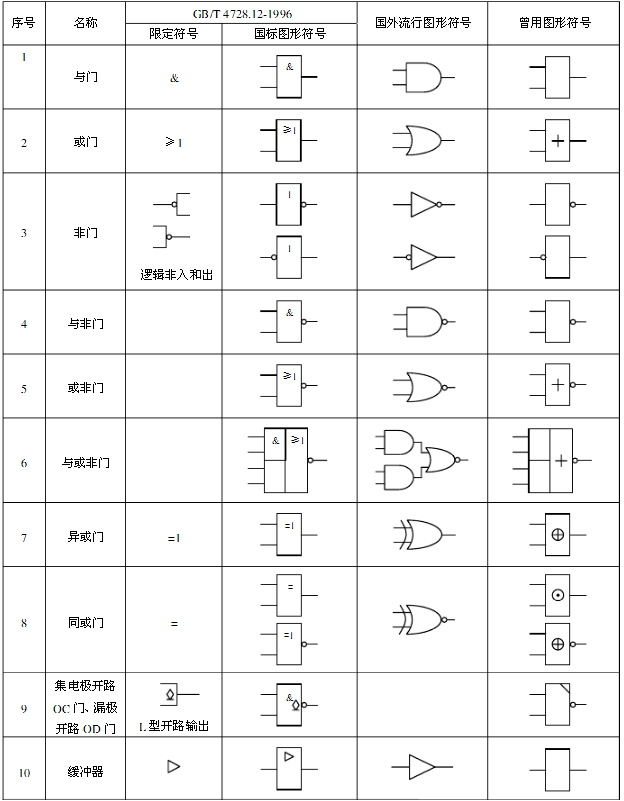

# 单片机逻辑电路与逻辑运算

在数字电路，我们经常会遇到逻辑电路，而在 C 语言中，我们则经常用到逻辑运算。二者在原理上是相互关联的，我们在这里就先简单介绍一下，随着学习的深入，再慢慢加深理解。

首先，在“逻辑”这个概念范畴内，存在真和假这两个逻辑值，而将其对应到数字电路或 C 语言中，就变成了“非 0 值”和“0 值”这两个值，即逻辑上的“假”就是数字电路或 C 语言中的“0”这个值，而逻辑“真”就是其它一切“非 0 值”。

然后，我们来具体分析一下几个主要的逻辑运算符。我们假定有 2 个字节变量：A 和 B，二者进行某种逻辑运算后的结果为 F。

以下逻辑运算符都是按照变量整体值进行运算的，通常就叫做**逻辑运算符**：

| 逻辑运算符 | 说明 |
| && 逻辑与 | F = A && B，当 A、B 的值都为真（即非 0 值，下同）时，其运算结果 F 为真（具体数值为 1，下同）；当 A、B 值任意一个为假（即 0，下同）时，结果 F 为假（具体数值为 0，下同）。 |
| &#124;&#124; 逻辑或 | F = A &#124;&#124; B，当 A、B 值任意一个为真时，其运算结果 F 为真；当 A、B 值都为假时，结果 F 为假。 |
| ! 逻辑非 | F = !A，当 A 值为假时，其运算结果 F 为真；当 A 值为真时，结果 F 为假。 |

以下逻辑运算符都是按照变量内的每一个位来进行运算的，通常就叫做**位运算符**：

| 逻辑运算 | 说明 |
| & 按位与 | F = A & B，将 A、B 两个字节中的每一位都进行与运算，再将得到的每一位结果组合为总结果 F，例如 A = 0b11001100，B = 0b11110000，则结果 F 就等于 0b11000000。 |
| &#124; 按位或 | F = A &#124; B，将 A、B 两个字节中的每一位都进行或运算，再将得到的每一位结果组合为总结果 F，例如 A = 0b11001100，B = 0b11110000，则结果 F 就等于 0b11111100。 |
| ~ 按位取反 | F = ~A，将 A 字节内的每一位进行非运算（就是取反），再将得到的每一位结果组合为总结果 F，例如 A = 0b11001100，则结果 F 就等于 0b00110011；这个运算符我们在前面的流水灯实验里已经用过了，现在再回头看一眼，是不是清楚多了。 |
| ^ 按位异或 | 异或的意思是，如果运算双方的值不同（即相异）则结果为真，双方值相同则结果为假。在 C 语言里没有按变量整体值进行的异或运算，所以我们仅以按位异或为例，F = A ^ B，A = 0b11001100，B = 0b11110000，则结果 F 就等于 0b00111100。 |

我们今后要看资料或芯片手册的时候，会经常遇到一些电路符号，图 5-1 所示就是数字电路中的常用符号，知道这些符号有利于我们理解器件的逻辑结构，尤其重点认识图 5-1 中的国外流行图形符号。在这里我们先简单看一下，如果日后遇到了可以到这里来查阅。

图 5-1  逻辑电路符号