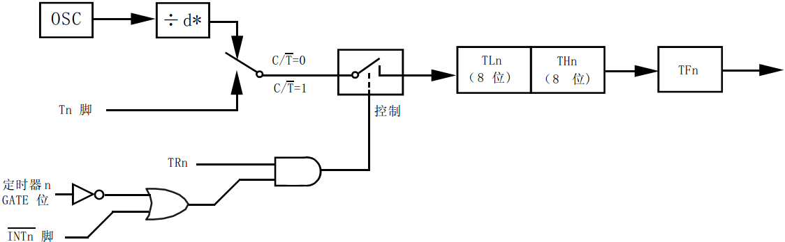

# 单片机定时器的寄存器

标准的 51 单片机内部有 T0 和 T1 这两个定时器，T 就是 Timer 的缩写，现在很多 51 系列单片机还会增加额外的定时器，在这里我们先讲定时器 0 和 1。前边提到过，对于单片机的每一个功能模块，都是由它的 SFR，也就是特殊功能寄存器来控制。与定时器有关的特殊功能寄存器，有以下几个，大家不需要去记忆这些寄存器的名字和作用，你只要大概知道就行，用的时候，随时可以查手册，找到每个寄存器的名字和每个寄存器所起到的作用。

表 5-1 的寄存器是存储定时器的计数值的。TH0/TL0 用于 T0，TH1/TL1 用于 T1。

表 5-1 定时值存储寄存器

| 名称 | 描述 | SFR 地址 | 复位值 |
| TH0 | 定时器 0 高字节 | 0x8C | 0x00 |
| TL0 | 定时器 0 低字节 | 0x8A | 0x00 |
| TH1 | 定时器 1 高字节 | 0x8D | 0x00 |
| TL1 | 定时器 1 低字节 | 0x8B | 0x00 |

表 5-2 是定时器控制寄存器 TCON 的位分配，表 5-3 是则是对每一位的具体含义的描述。

表 5-2 TCON——定时器控制寄存器的位分配（地址 0x88、可位寻址）

| 位 | 7 | 6 | 5 | 4 | 3 | 2 | 1 | 0 |
| 符号 | TF1 | TR1 | TF0 | TR0 | IE1 | IT1 | IE0 | IT0 |
| 复位值 | 0 | 0 | 0 | 0 | 0 | 0 | 0 | 0 |

表 5-3 TCON——定时器控制寄存器的位描述

| 位 | 符号 | 描述 |
| 7 | TF1 | 定时器 1 溢出标志。一旦定时器 1 发生溢出时硬件置 1。清零有两种方式：软件清零，或者进入定时器中断时硬件清零。 |
| 6 | TR1 | 定时器 1 运行控制位。软件置位/清零来进行启动/停止定时器。 |
| 5 | TF0 | 定时器 0 溢出标志。一旦定时器 0 发生溢出时硬件置 1。清零有两种方式：软件清零，或者进入定时器中断时硬件清零。 |
| 4 | TR0 | 定时器 0 运行控制位。软件置位/清零来进行启动/停止定时器。 |
| 3 | IE1 | 外部中断部分，与定时器无关，暂且不看。 |
| 2 | IT1 |
| 1 | IE0 |
| 0 | IT0 |

大家注意在表 5-3 中的描述中，只要写到硬件置 1 或者清 0 的，就是指一旦符合条件，单片机将自动完成的动作，只要写软件置 1 或者清 0 的，是指我们必须用程序去完成这个动作，后续遇到此类描述就不再另做说明了。

对于 TCON 这个 SFR，其中有 TF1、TR1、TF0、TR0 这 4 位需要我们理解清楚，它们分别对应于 T1 和 T0，我们以定时器 1 为例讲解，那么定时器 0 同理。先看 TR1，当我们程序中写 TR1 = 1 以后，定时器值就会每经过一个机器周期自动加 1，当我们程序中写 TR1 = 0 以后，定时器就会停止加 1，其值会保持不变化。TF1，这个是一个标志位，他的作用是告诉我们定时器溢出了。比如我们的定时器设置成 16 位的模式，那么每经过一个机器周期，TL1 加 1 一次，当 TL1 加到 255 后，再加 1，TL1 变成 0，TH1 会加 1 一次，如此一直加到 TH1 和 TL1 都是 255（即 TH1 和 TL1 组成的 16 位整型数为 65535）以后，再加 1 一次，就会溢出了，TH1 和 TL1 同时都变为 0，只要一溢出，TF1 马上自动变成 1，告诉我们定时器溢出了，仅仅是提供给我们一个信号，让我们知道定时器溢出了，它不会对定时器是否继续运行产生任何影响。

本节开头我们就提到了定时器有多种工作模式，工作模式的选择就由 TMOD 来控制，TMOD 的位分配和描述见表 5-4 到 5-6 所示，TMOD 的位功能如表 5-5 所示。

表 5-4 TMOD——定时器模式寄存器的位分配（地址 0x89、不可位寻址）

| 位 | 7 | 6 | 5 | 4 | 3 | 2 | 1 | 0 |
| 符号 | GATE(T1) | C/T(T1) | M1(T1) | M0(T1) | GATE(T0) | C/T(T0) | M1(T0) | M0(T0) |
| 复位值 | 0 | 0 | 0 | 0 | 0 | 0 | 0 | 0 |

表 5-5 TMOD——定时器模式寄存器的位描述

| 符号 | 描述 |
| T1/T0 | 在表 5-5 中，标 T1 的表示控制定时器 1 的位，标 T0 的表示控制定时器 0 的位。 |
| GATE | 该位被置 1 时为门控位。仅当„INTx‟脚为高并且„TRx‟控制位被置 1 时使能定时器„x‟，定时器开始计时，当该位被清 0 时，只要„TRx‟位被置 1，定时器 x 就使能开始计时，不受到单片机引脚„INTx‟外部信号的干扰，常用来测量外部信号脉冲宽度。这是定时器一个额外功能，本节课暂不介绍。 |
| C/T | 定时器或计数器选择位。该位被清零时用作定时器功能（内部系统时钟），被置 1 用作计数器功能。 |

表 5-6 TMOD——定时器模式寄存器 M1/M0 工作模式

| M1 | M0 | 工作模式 | 描述 |
| 0 | 0 | 0 | 兼容 8048 单片机的 13 位定时器，THn 的 8 位和 TLn 的 5 位组成一个 13 位定时器。 |
| 0 | 1 | 1 | THn 和 TLn 组成一个 16 位的定时器。 |
| 1 | 0 | 2 | 8 位自动重装模式，定时器溢出后 THn 重装到 TLn 中。 |
| 1 | 1 | 3 | 禁用定时器 1，定时器 0 变成 2 个 8 位定时器。 |

可能你已经注意到了，表 5-2 的 TCON 最后标注了“可位寻址”，而表 5-4 的 TMOD 标注的是“不可位寻址”。意思就是说：比如 TCON 有一个位叫 TR1，我们可以在程序中直接进行 TR1 = 1 这样的操作。但对 TMOD 里的位比如(T1)M1 = 1 这样的操作就是错误的。我们要操作就必须一次操作这整个字节，也就是必须一次性对 TMOD 所有位操作，不能对其中某一位单独进行操作，那么我们能不能只修改其中的一位而不影响其它位的值呢？当然可以，在后续课程中你就会学到方法的，现在就先不关心它了。

表 5-6 列出的就是定时器的 4 中工作模式，其中模式 0 是为了兼容老的 8048 系列单片机而设计的，现在的 51 几乎不会用到这种模式，而模式 3 根据我的应用经验，它的功能用模式 2 完全可以取代，所以基本上也是不用的，那么我们就重点来学习模式 1 和模式 2。

模式 1，是 THn 和 TLn 组成了一个 16 位的定时器，计数范围是 0～65535，溢出后，只要不对 THn 和 TLn 重新赋值，则从 0 开始计数。模式 2，是 8 位自动重装载模式，只有 TLn 做加 1 计数，计数范围 0～255，THn 的值并不发生变化，而是保持原值，TLn 溢出后，TFn 就直接置 1 了，并且 THn 原先的值直接赋给 TLn，然后 TLn 从新赋值的这个数字开始计数。这个功能可以用来产生串口的通信波特率，我们讲串口的时候要用到，本章节我们重点来学习模式 1。为了加深大家理解定时器的原理，我们来看一下他的模式 1 的电路示意图 5-2。

图 5-2  定时器/计数器模式 1 示意图

我带领大家一起来分析一遍这个示意图，日后如果再遇到类似的图，大家就可以自己研究了。OSC 框表示时钟频率，因为 1 个机器周期等于 12 个时钟周期，所以那个 d 就等于 12。下边 GATE 右边的那个门是一个非门电路，再右侧是一个或门，再往右是一个与门电路，大家可以对照一下 5-1 节的内容。

图上可以看出来，下边部分电路是控制了上边部分，那我们先来看下边是如何控制的，我们以定时器 0 为例。

1) TR0 和下边或门电路的结果要进行与运算，TR0 如果是 0 的话，与运算完了肯定是 0，所以如果要让定时器工作，那么 TR0 就必须置 1。

2) 这里的与门结果要想得到 1，那么前面的或门出来的结果必须也得是 1 才行。在 GATE 位为 1 的情况下，经过一个非门变成 0，或门电路结果要想是 1 的话，那 INT0 即 P3.2 引脚必须是 1 的情况下，这个时候定时器才会工作，而 INT0 引脚是 0 的情况下，定时器不工作，这就是 GATE 位的作用。

3) 当 GATE 位为 0 的时候，经过一个非门会变成 1，那么不管 INT0 引脚是什么电平，经过或门电路后都肯定是 1，定时器就会工作。

4) 要想让定时器工作，就是自动加 1，从图上看有两种方式，第一种方式是那个开关打到上边的箭头，就是 C/T = 0 的时候，一个机器周期 TL 就会加 1 一次，当开关打到下边的箭头，即 C/T =1 的时候，T0 引脚即 P3.4 引脚来一个脉冲，TL 就加 1 一次，这也就是计数器功能。