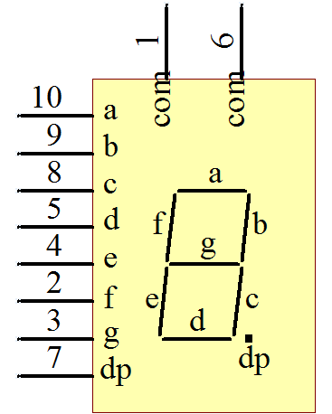
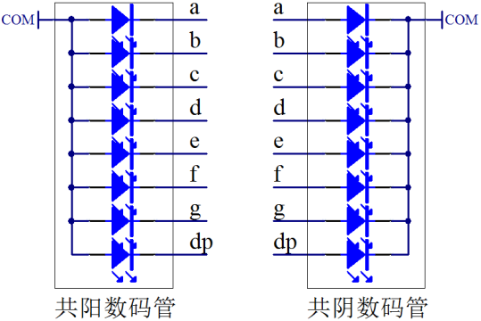
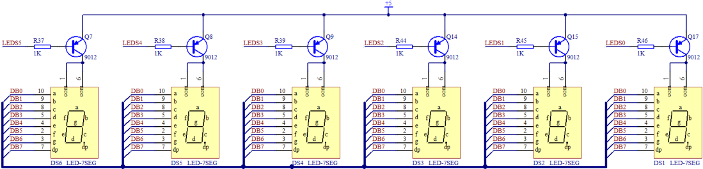
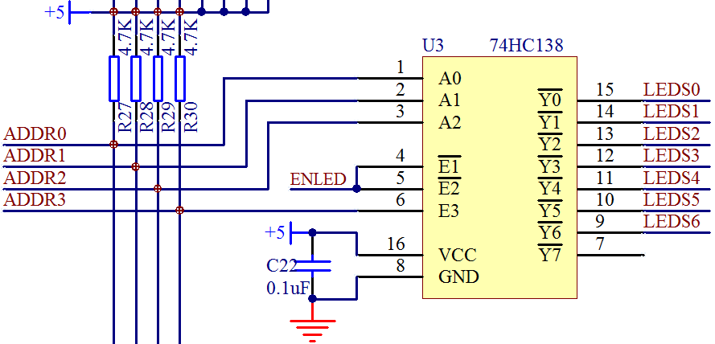

# 单片机中 LED 数码管的介绍

LED 小灯是一种简单的 LED，只能通过亮和灭来表达简单的信息。而这节课我们要来学习一种能表达更复杂信息的器件——LED 数码管。

先给大家提供一张原理图看一下，如图 5-3 所示。

图 5-3  数码管原理图

这是比较常见的数码管的原理图，我们板子上一共有 6 个数码管。前边有了 LED 小灯的学习，数码管学习就会轻松的多了。从图 5-3 可以看出来，数码管共有 a、b、c、d、e、f、g、dp 这么 8 个段，而实际上，这 8 个段每一段都是一个 LED 小灯，所以一个数码管就是由 8 个 LED 小灯组成的。我们看一下数码管内部结构的示意图，如图 5-4。

图 5-4  数码管结构示意图

数码管分为共阳和共阴两种，共阴数码管就是 8 只 LED 小灯的阴极是连接在一起的，阴极是公共端，由阳极来控制单个小灯的亮灭。同理，共阳数码管就是阳极接在一起，大家可以认真研究下图 5-4。细心的同学会发现，图 5-3 的数码管上边有 2 个 com，这就是我们数码管的公共端。为什么有 2 个呢，一方面是 2 个可以起到对称的效果，刚好是 10 个引脚，另外一个方面，公共端通过的电流较大，我们初中就学过，并联电路电流之和等于总电流，用 2 个 com 可以把公共电流平均到 2 个引脚上去，降低单条线路承受的电流。

从我们开发板的电路图上能看出来，我们所用的数码管都是共阳数码管，一共有 6 个，如图 5-5 所示。

图 5-5  KST-51 数码管电路

6 个数码管的 com 都是接到了正极上，当然了，和 LED 小灯电路一样，也是由 74HC138 控制三极管的导通来控制整个数码管的使能。先来看最右边的 DS1 这个数码管，原理图上可以看出，控制 DS1 的三极管是 Q17，控制 Q17 的引脚是 LEDS0，对应到 74HC138 上边就是 U3 的 Y0 输出，如图 5-6 所示。

图 5-6  74HC138 控制图

我们现在的目的是让 LEDS0 这个引脚输出低电平，相信大家现在可以根据前边学过的知识独立把 ADDR0、ADDR1、ADDR2、ADDR3、ENLED 这 4 个所需输入的值写出来了，现在大家不要偷懒，根据 74HC138 的手册去写一下，不需要你记住这些结论，但是遇到就写一次，锻炼过几次后，遇到同类芯片自己就知道如何去解决问题了。

数码管通常是用来显示数字的，我们板子上有 6 个数码管，习惯上称之为 6 位，那控制位选择的就是 74HC138 了。而数码管内部的 8 个 LED 小灯我们称之为数码管的段，那么数码管的段选择（即该段的亮灭）是通过 P0 口控制，经过 74HC245 驱动。