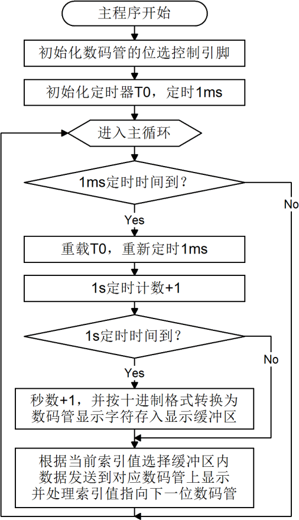

# 单片机数码管动态显示程序[带解释]

我们在上一章学习数码管静态显示的时候说到，74HC138 只能在同一时刻导通一个三极管，而我们的数码管是靠了 6 个三极管来控制，那我们如何来让数码管同时显示呢？这就用到了动态显示的概念。

多个数码管显示数字的时候，我们实际上是轮流点亮数码管（一个时刻内只有一个数码管是亮的），利用人眼的视觉暂留现象（也叫余辉效应），就可以做到看起来是所有数码管都同时亮了，这就是动态显示，也叫做动态扫描。

例如：有 2 个数码管，我们要显示“12”这个数字，先让高位的位选三极管导通，然后控制段选让其显示“1”，延时一定时间后再让低位的位选三极管导通，然后控制段选让其显示“2”。把这个流程以一定的速度循环运行就可以让数码管显示出“12”，由于交替速度非常快，人眼识别到的就是“12”这两位数字同时亮了。

那么一个数码管需要点亮多长时间呢？也就是说要多长时间完成一次全部数码管的扫描呢（很明显：整体扫描时间=单个数码管点亮时间*数码管个数）？答案是：10ms 以内。当电视机和显示器还处在 CRT（电子显像管）时代的时候，有一句很流行的广告语——“100Hz 无闪烁”，没错，只要刷新率大于 100Hz，即刷新时间小于 10ms，就可以做到无闪烁，这也就是我们的动态扫描的硬性指标。那么你也许会问，有最小值的限制吗？理论上没有，但实际上做到更快的刷新却没有任何进步的意义了，因为已经无闪烁了，再快也还是无闪烁，只是徒然增加 CPU 的负荷而已（因为 1 秒内要执行更多次的扫描程序）。所以，通常我们设计

程序的时候，都是取一个接近 10ms，又比较规整的值就行了。我们开发板上有 6 个数码管，那么我们现在就来着手写一个数码管动态扫描的程序，实现兼验证上面讲的动态显示原理。

我们的目标还是实现秒表功能，只不过这次有 6 个位了，最大可以计到 999999 秒。那么现在要实现的这个程序相对于前几章的例程来说就要复杂的多了，既要处理秒表计数，又要处理动态扫描。在编写这类稍复杂的程序时，建议初学者们先用程序流程图来把程序的整个流程理清，在动手写程序之前先把整个程序的结构框架搭好，把每一个环节要实现的功能先细化出来，然后再用程序代码一步一步的去实现出来。这样就可以避免无处下笔的迷茫感了。如图 6-1 就是本例的程序流程图，大家先根据流程图把程序的执行经过在大脑里走一遍，然后再看接下来的程序代码，体会一下流程图的作用，看是不是能帮助你更顺畅的理清程序流程。



图 6-1  数码管动态显示秒表程序流程图

```
#include <reg52.h>

sbit ADDR0 = P1⁰;
sbit ADDR1 = P1¹;
sbit ADDR2 = P1²;
sbit ADDR3 = P1³;
sbit ENLED = P1⁴;

unsigned char code LedChar[] = {  //数码管显示字符转换表
    0xC0, 0xF9, 0xA4, 0xB0, 0x99, 0x92, 0x82, 0xF8,
    0x80, 0x90, 0x88, 0x83, 0xC6, 0xA1, 0x86, 0x8E
};
unsigned char LedBuff[6] = { //数码管显示缓冲区，初值 0xFF 确保启动时都不亮
    0xFF, 0xFF, 0xFF, 0xFF, 0xFF, 0xFF
};

void main(){
    unsigned char i = 0;  //动态扫描的索引

    unsigned int cnt = 0; //记录 T0 中断次数
    unsigned long sec = 0; //记录经过的秒数

    ENLED = 0;  //使能 U3，选择控制数码管
    ADDR3 = 1; //因为需要动态改变 ADDR0-2 的值，所以不需要再初始化了

    TMOD = 0x01;  //设置 T0 为模式 1
    TH0 = 0xFC;  //为 T0 赋初值 0xFC67，定时 1ms
    TL0 = 0x67;
    TR0 = 1;  //启动 T0

    while (1){
        if (TF0 == 1){  //判断 T0 是否溢出
            TF0 = 0;  //T0 溢出后，清零中断标志
            TH0 = 0xFC;  //并重新赋初值
            TL0 = 0x67;
            cnt++;  //计数值自加 1

            if (cnt >= 1000){ //判断 T0 溢出是否达到 1000 次
                cnt = 0;  //达到 1000 次后计数值清零
                sec++;  //秒计数自加 1

                //以下代码将 sec 按十进制位从低到高依次提取并转为数码管显示字符
                LedBuff[0] = LedChar[sec%10];
                LedBuff[1] = LedChar[sec/10%10];
                LedBuff[2] = LedChar[sec/100%10];
                LedBuff[3] = LedChar[sec/1000%10];
                LedBuff[4] = LedChar[sec/10000%10];
                LedBuff[5] = LedChar[sec/100000%10];
            }
            //以下代码完成数码管动态扫描刷新
            if (i == 0)
            { ADDR2=0; ADDR1=0; ADDR0=0; i++; P0=LedBuff[0]; }
            else if (i == 1)
            { ADDR2=0; ADDR1=0; ADDR0=1; i++; P0=LedBuff[1]; }
            else if (i == 2)
            { ADDR2=0; ADDR1=1; ADDR0=0; i++; P0=LedBuff[2]; }
            else if (i == 3)
            { ADDR2=0; ADDR1=1; ADDR0=1; i++; P0=LedBuff[3]; }
            else if (i == 4)
            { ADDR2=1; ADDR1=0; ADDR0=0; i++; P0=LedBuff[4]; }
            else if (i == 5)
            { ADDR2=1; ADDR1=0; ADDR0=1; i=0; P0=LedBuff[5]; }
        }
    }
}
```

这段程序，大家自己抄到 Keil 中，然后边抄边结合程序流程图来理解，最终下载到实验板上看一下运行结果。其中下边的 if...else 语句就是每 1ms 快速的刷新一个数码管，这样 6 个数码管整体刷新一遍的时间就是 6ms，视觉感官上就是 6 个数码管同时亮起来了。

在 C 语言中， /”等同于数学里的除法运算，而“%”等同于我们小学学的求余数运算，这个前边已有介绍。如果是 123456 这个数字，我们要正常显示在数码管上，个位显示，就是直接对 10 取余数，这个“6”就出来了，十位数字就是先除以 10，然后再对 10 取余数，以此类推，就把 6 个数字全部显示出来了。

对于多选一的动态刷新数码管的方式，我们如果用 switch 会有更好的效果，大家来看一下我们用 switch 语句完成的情况。

```
#include <reg52.h>

sbit ADDR0 = P1⁰;
sbit ADDR1 = P1¹;
sbit ADDR2 = P1²;
sbit ADDR3 = P1³;
sbit ENLED = P1⁴;

unsigned char code LedChar[] = { //数码管显示字符转换表
    0xC0, 0xF9, 0xA4, 0xB0, 0x99, 0x92, 0x82, 0xF8,
    0x80, 0x90, 0x88, 0x83, 0xC6, 0xA1, 0x86, 0x8E
};
unsigned char LedBuff[6] = { //数码管显示缓冲区，初值 0xFF 确保启动时都不亮
    0xFF, 0xFF, 0xFF, 0xFF, 0xFF, 0xFF
};

void main(){
    unsigned char i = 0;  //动态扫描的索引
    unsigned int cnt = 0;  //记录 T0 中断次数
    unsigned long sec = 0;  //记录经过的秒数

    ENLED = 0;  //使能 U3，选择控制数码管
    ADDR3 = 1;  //因为需要动态改变 ADDR0-2 的值，所以不需要再初始化了
    TMOD = 0x01; //设置 T0 为模式 1
    TH0 = 0xFC; //为 T0 赋初值 0xFC67，定时 1ms
    TL0 = 0x67;
    TR0 = 1;  //启动 T0

    while (1){
        if (TF0 == 1){  //判断 T0 是否溢出
            TF0 = 0;  //T0 溢出后，清零中断标志
            TH0 = 0xFC;  //并重新赋初值
            TL0 = 0x67;
            cnt++;  //计数值自加 1

            if (cnt >= 1000){  //判断 T0 溢出是否达到 1000 次
                cnt = 0;  //达到 1000 次后计数值清零
                sec++;  //秒计数自加 1

                //以下代码将 sec 按十进制位从低到高依次提取并转为数码管显示字符
                LedBuff[0] = LedChar[sec%10];
                LedBuff[1] = LedChar[sec/10%10];
                LedBuff[2] = LedChar[sec/100%10];
                LedBuff[3] = LedChar[sec/1000%10];
                LedBuff[4] = LedChar[sec/10000%10];
                LedBuff[5] = LedChar[sec/100000%10];
            }
            //以下代码完成数码管动态扫描刷新
            switch (i){
                case 0: ADDR2=0; ADDR1=0; ADDR0=0; i++; P0=LedBuff[0]; break;
                case 1: ADDR2=0; ADDR1=0; ADDR0=1; i++; P0=LedBuff[1]; break;
                case 2: ADDR2=0; ADDR1=1; ADDR0=0; i++; P0=LedBuff[2]; break;
                case 3: ADDR2=0; ADDR1=1; ADDR0=1; i++; P0=LedBuff[3]; break;
                case 4: ADDR2=1; ADDR1=0; ADDR0=0; i++; P0=LedBuff[4]; break;
                case 5: ADDR2=1; ADDR1=0; ADDR0=1; i=0; P0=LedBuff[5]; break;
                default: break;
            }
        }
    }
}
```

程序完成的功能是一模一样的，但大家看一下，switch 语句是不是比 if...else 语句显得要整齐清爽呢。