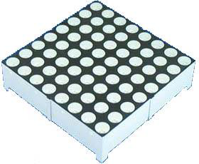
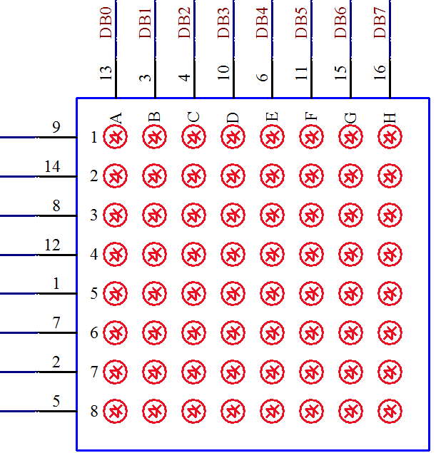

# 单片机 LED 点阵的介绍

点阵 LED 显示屏作为一种现代电子媒体，具有灵活的显示面积（可任意分割和拼装）、高亮度、长寿命、数字化、实时性等特点，应用非常广泛。

前边学了 LED 小灯和 LED 数码管后，学 LED 点阵就要轻松得多了。一个数码管是 8 个 LED 组成，同理，一个 8*8 的点阵就是由 64 个 LED 小灯组成。图 7-1 就是一个点阵 LED 最小单元，即一个 8*8 的点阵 LED，图 7-2 是它的内部结构原理图。



图 7-1  8*8LED 点阵外观



图 7-2  8*8 点阵结构原理图

从图 7-2 上可以看出，其实点阵 LED 点亮原理还是很简单的。在图中大方框外侧的就是点阵 LED 的引脚号，左侧的 8 个引脚是接的内部 LED 的阳极，上侧的 8 个引脚接的是内部 LED 的阴极。那么如果我们把 9 脚置成高电平、13 脚置成低电平的话，左上角的那个 LED 小灯就会亮了。下面我们就用程序来实现一下，特别注意，控制点阵左侧引脚的 74HC138 是原理图上的 U4，8 个引脚自上而下依次由 U4 的 Y0～Y7 输出来控制。

```
#include <reg52.h>

sbit LED = P0⁰;
sbit ADDR0 = P1⁰;
sbit ADDR1 = P1¹;
sbit ADDR2 = P1²;
sbit ADDR3 = P1³;
sbit ENLED = P1⁴;

void main(){
    ENLED = 0;  //U3、U4 两片 74HC138 总使能
    ADDR3 = 0;  //使能 U4 使之正常输出
    ADDR2 = 0;  //经 U4 的 Y0 输出开启三极管 Q10
    ADDR1 = 0;
    ADDR0 = 0;
    LED = 0;  //向 P0.0 写入 0 来点亮左上角的一个点
    while(1);  //程序停止在这里
}
```

那么同样的方法，通过对 P0 的整体赋值我们可以一次点亮点阵的一行，那么这次我们用程序来点亮点阵的第二行，对应的就需要编号 U4 的 74HC138 在其 Y1 引脚输出低电平了。

```
#include <reg52.h>

sbit ADDR0 = P1⁰;
sbit ADDR1 = P1¹;
sbit ADDR2 = P1²;
sbit ADDR3 = P1³;
sbit ENLED = P1⁴;

void main(){
    ENLED = 0;  //U3、U4 两片 74HC138 总使能
    ADDR3 = 0;  //使能 U4 使之正常输出
    ADDR2 = 0;  //经 U4 的 Y1 输出开启三极管 Q11
    ADDR1 = 0;
    ADDR0 = 1;
    P0 = 0x00;  //向 P0 写入 0 来点亮一行
    while(1);  //程序停止在这里
}
```

从这里我们可以逐步发现点阵的控制原理了。我们前面讲了一个数码管就是 8 个 LED 小灯，一个点阵是 64 个 LED 小灯。同样的道理，我们还可以把一个点阵理解成是 8 个数码管。经过前面的学习已经掌握了 6 个数码管同时显示的方法，那 8 个数码管也应该轻轻松松了。下面我们就利用定时器中断和数码管动态显示的原理来把这个点阵全部点亮。

```
#include <reg52.h>

sbit ADDR0 = P1⁰;
sbit ADDR1 = P1¹;
sbit ADDR2 = P1²;
sbit ADDR3 = P1³;
sbit ENLED = P1⁴;

void main(){
    EA = 1;  //使能总中断
    ENLED = 0;  //使能 U4，选择 LED 点阵
    ADDR3 = 0;  //因为需要动态改变 ADDR0-2 的值，所以不需要再初始化了
    TMOD = 0x01; //设置 T0 为模式 1
    TH0 = 0xFC; //为 T0 赋初值 0xFC67，定时 1ms
    TL0 = 0x67;
    ET0 = 1;  //使能 T0 中断
    TR0 = 1;  //启动 T0
    while (1);  //程序停在这里，等待定时器中断
}
/* 定时器 0 中断服务函数 */
void InterruptTimer0() interrupt 1{
    static unsigned char i = 0; //动态扫描的索引

    TH0 = 0xFC;  //重新加载初值
    TL0 = 0x67;
    //以下代码完成 LED 点阵动态扫描刷新
    P0 = 0xFF;  //显示消隐
    switch (i){
        case 0: ADDR2=0; ADDR1=0; ADDR0=0; i++; P0=0x00; break;
        case 1: ADDR2=0; ADDR1=0; ADDR0=1; i++; P0=0x00; break;
        case 2: ADDR2=0; ADDR1=1; ADDR0=0; i++; P0=0x00; break;
        case 3: ADDR2=0; ADDR1=1; ADDR0=1; i++; P0=0x00; break;
        case 4: ADDR2=1; ADDR1=0; ADDR0=0; i++; P0=0x00; break;
        case 5: ADDR2=1; ADDR1=0; ADDR0=1; i++; P0=0x00; break;
        case 6: ADDR2=1; ADDR1=1; ADDR0=0; i++; P0=0x00; break;
        case 7: ADDR2=1; ADDR1=1; ADDR0=1; i=0; P0=0x00; break;
        default: break;
    }
}
```