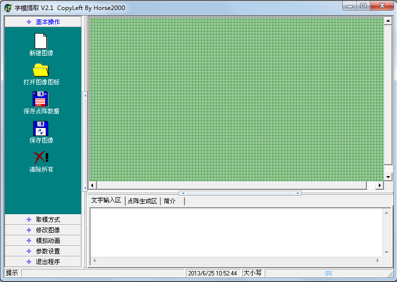
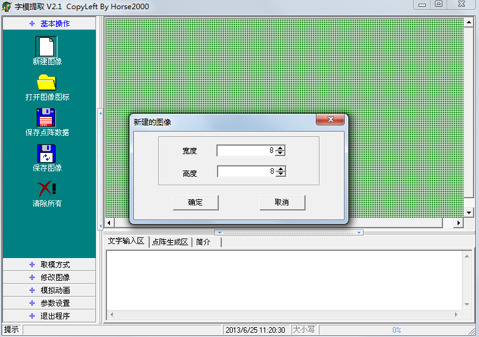
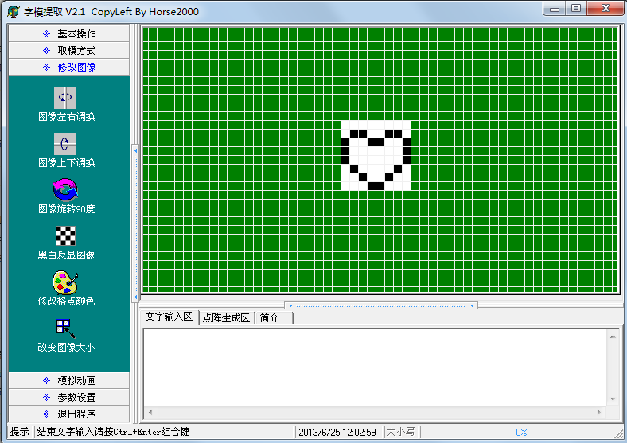
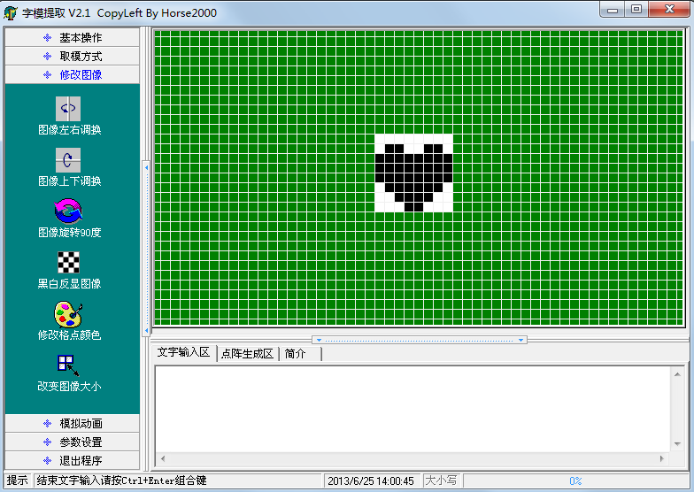
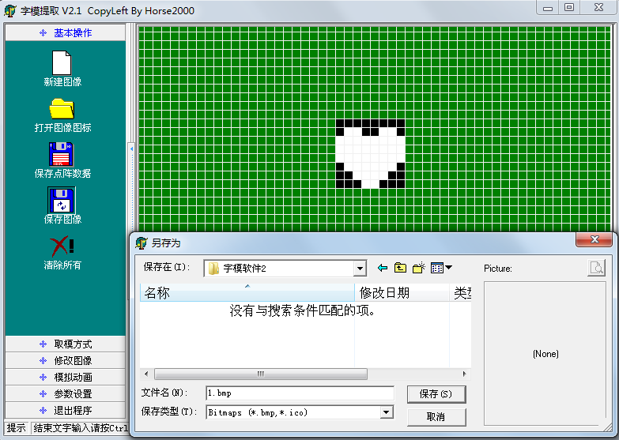
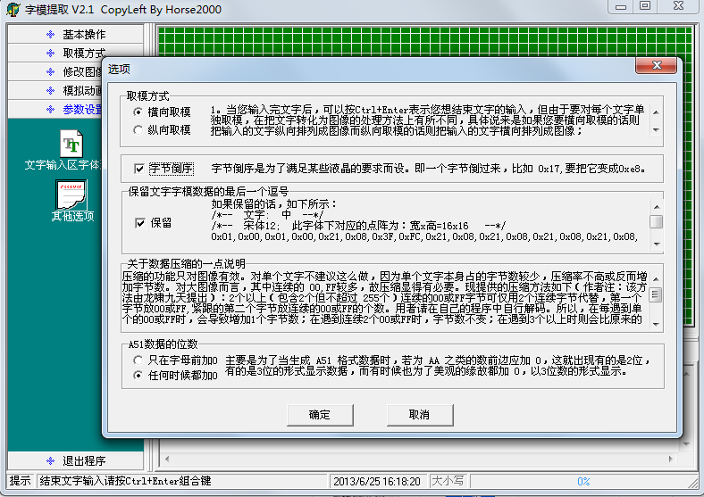
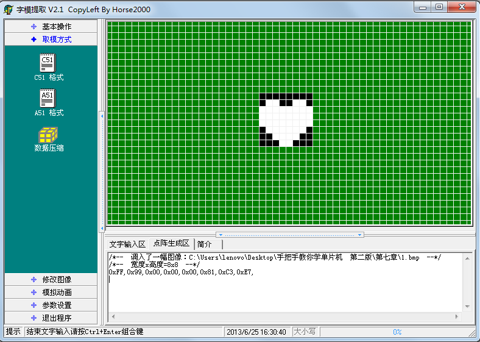

# 单片机 LED 点阵的图形显示

独立的 LED 小灯可以实现流水灯，数码管可以显示多位数字，那点阵 LED 就得来显示一点花样了。

我们要显示花样的时候，往往要先做出来一些小图形，这些小图形的数据要转换到我们的程序当中去，这个时候就需要取模软件。给大家介绍一款简单的取模软件，这种取模软件在网上都可以下载到，大家来了解一下如何使用，先看一下操作界面，如图 7-3 所示。



图 7-3  字模提取软件界面

鼠标点一下“新建图形”，根据我们板子上的点阵，把宽度和高度分别改成 8，然后点确定，如图 7-4 所示。



图 7-4  新建图形

点击左侧的“模拟动画”菜单，再点击“放大格点”选项，一直放大到最大，那我们就可以在我们的 8*8 的点阵图形中用鼠标填充黑点，就可以画图形了，如图 7-5 所示。



图 7-5  字模提取软件画图

经过我们的一番精心设计，画出来一个心形图形，并且填充满，最终出现我们想要的效果图，如图 7-6 所示。



图 7-6  心型图形

由于取模软件是把黑色取为 1，白色取为 0，但我们点阵是 1 对应 LED 熄灭，0 对应 LED 点亮，而我们需要的是一颗点亮的“心”，所以我们要选“修改图像”菜单里的“黑白反显图像”这个选项，再点击“基本操作”菜单里边的“保存图像”可以把我们设计好的图片进行保存，如图 7-7 所示。



图 7-7  保存图形

保存文件只是为了再次使用或修改使方便方便，当然你也可以不保存。操作完了这一步后，点击“参数设置”菜单里的“其他选项”，如图 7-8 所示。



图 7-8  选项设置

这里的选项，要结合图 7-2 来进行设置，大家可以看到 P0 口控制的是一行，所以用“横向取模”，如果控制的是一列，就要选“纵向取模”。选中“字节倒序”这个选项，是因为图 7-2 中左边是低位 DB0，右边是高位 DB7，所以是字节倒序，其它两个选项大家自己了解，点确定后，选择“取模方式”这个菜单，点一下“C51 格式”后，在“点阵生成区”自动产生了 8 个字节的数据，这 8 个字节的数据就是取出来的“模”，如图 7-9 所示。



图 7-9  取模结果

大家注意，虽然我们用了软件来取模，但是也得知道其原理是什么，在这个图片里，黑色的一个格子表示一位二进制的 1，白色的一个格子表示一位二进制的 0。第一个字节是 0xFF，其实就是这个 8*8 图形的第一行，全黑就是 0xFF；第二个字节是 0x99，低位在左边，高位在右边，大家注意看，黑色的表示 1，白色的表示 0，就组成了 0x99 这个数值。同理其它的数据大家也就知道怎么来的了。

那么下面我们就用程序把这些数据依次送到点阵上去，看看运行效果如何。

```
#include <reg52.h>

sbit ADDR0 = P1⁰;
sbit ADDR1 = P1¹;
sbit ADDR2 = P1²;
sbit ADDR3 = P1³;
sbit ENLED = P1⁴;

unsigned char code image[] = { //图片的字模表
    0xFF, 0x99, 0x00, 0x00, 0x00, 0x81, 0xC3, 0xE7
};

void main(){
    EA = 1;  //使能总中断
    ENLED = 0;  //使能 U4，选择 LED 点阵
    ADDR3 = 0;
    TMOD = 0x01;  //设置 T0 为模式 1
    TH0 = 0xFC;  //为 T0 赋初值 0xFC67，定时 1ms
    TL0 = 0x67;
    ET0 = 1;  //使能 T0 中断
    TR0 = 1;//启动 T0
    while (1);
}
/* 定时器 0 中断服务函数 */
void InterruptTimer0() interrupt 1{
    static unsigned char i = 0;  //动态扫描的索引

    TH0 = 0xFC; //重新加载初值
    TL0 = 0x67;
    //以下代码完成 LED 点阵动态扫描刷新
    P0 = 0xFF;  //显示消隐
    switch (i){
        case 0: ADDR2=0; ADDR1=0; ADDR0=0; i++; P0=image[0]; break;
        case 1: ADDR2=0; ADDR1=0; ADDR0=1; i++; P0=image[1]; break;
        case 2: ADDR2=0; ADDR1=1; ADDR0=0; i++; P0=image[2]; break;
        case 3: ADDR2=0; ADDR1=1; ADDR0=1; i++; P0=image[3]; break;
        case 4: ADDR2=1; ADDR1=0; ADDR0=0; i++; P0=image[4]; break;
        case 5: ADDR2=1; ADDR1=0; ADDR0=1; i++; P0=image[5]; break;
        case 6: ADDR2=1; ADDR1=1; ADDR0=0; i++; P0=image[6]; break;
        case 7: ADDR2=1; ADDR1=1; ADDR0=1; i=0; P0=image[7]; break;
        default: break;
    }
}
```

对于 8*8 的点阵来说，我们可以显示一些简单的图形，字符等。但大部分汉字通常来说要用到 16*16 个点，而 8*8 的点阵只能显示一些简单笔画的汉字，大家可以自己取模做出来试试看。使用大屏显示汉字的方法和小屏的方法是类似的，所需要做的只是按照相同的原理来扩展行数和列数而已。