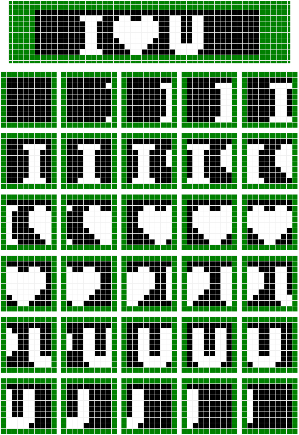

# 单片机 LED 点阵的横向移动(动态显示)

上下移动我们会了，那我们还想左右移动该如何操作呢？

**方法一、最简单，就是把板子侧过来放，纵向取模就可以完成。**

这里大家是不是有种头顶冒汗的感觉？我们要做好技术，但是不能沉溺于技术。技术是我们的工具，我们在做开发的时候除了用好这个工具外，也得多拓展自己解决问题的思路，要慢慢培养自己的多角度思维方式。

那把板子正过来，左右移动就完不成了吗？当然不是。大家慢慢的学多了就会培养了一种感觉，就是一旦硬件设计好了，我们要完成一种功能，大脑就可以直接思考出来能否完成这个功能，这个在我们进行电路设计的时候最为重要。我们在开发产品的时候，首先是设计电路，设计电路的时候，工程师就要在大脑中通过思维来验证板子硬件和程序能否完成我们想要的功能，一旦硬件做好了，做好板子回来剩下的就是靠编程来完成了。只要是硬件逻辑上没问题，功能上软件肯定可以实现。

当然了，我们在进行硬件电路设计的时候，也得充分考虑软件编程的方便性。因为我们的程序是用 P0 来控制点阵的整行，所以对于我们这样的电路设计，上下移动程序是比较好编写的。那如果我们设计电路的时候知道我们的图形要左右移动，那我们设计电路画板子的时候就要尽可能的把点阵横过来放，有利于我们编程方便，减少软件工作量。

**方法二、利用二维数组来实现，算法基本上和上下移动相似。**

二维数组，前边提过一次，他的使用其实也没什么复杂的。它的声明方式是：

    数据类型 数组名[数组长度 1][数组长度 2];

与一位数组类似，数据类型是全体元素的数据类型，数组名是标识符，数组长度 1 和数组长度 2 分别代表数组具有的行数和列数。数组元素的下标一律从 0 开始。

例如：unsigned char a[2][3];声明了一个具有 2 行 3 列的无符号字符型的二维数组 a。

二维数组的数组元素总个数是两个长度的乘积。二维数组在内存中存储的时候，采用行优先的方式来存储，即在内存中先存放第 0 行的元素，再存放第一行的元素......，同一行中再按照列顺序存放，刚才定义的那个 a[2][3]的存放形式就如表 7-1 所示。

表 7-1 二维数组的物理存储结构

| a[0][0] | a[0][1] | a[0][2] | a[1][0] | a[1][1] | a[1][2] |

二维数组的初始化方法分两种情况，我们前边学一维数组的时候学过，数组元素的数量可以小于数组元素个数，没有赋值的会自动给 0。当数组元素的数量等于数组个数的时候，如下所示：

    unsigned char a[2][3] = {{1,2,3}, {4,5,6}};

或者是

    unsigned char a[2][3] = {1,2,3,4,5,6};

当数组元素的数量小于数组个数的时候，如下所示：

    unsigned char a[2][3] = {{1,2}, {3,4}};

等价于

    unsigned char a[2][3] = {1,2,0,3,4,0};

而反过来的写法

    unsigned char a[2][3] = {1,2,3,4};

等价于

    unsigned char a[2][3] = {{1,2,3}, {4,0,0}};

此外，二维数组初始化的时候，行数可以省略，编译系统会自动根据列数计算出行数，但是列数不能省略。

讲这些，只是为了让大家了解一下，看别人写的代码的时候别发懵就行了，但是我们今后写程序的时候，按照规范，行数列数都不要省略，全部写齐，初始化的时候，全部写成 unsigned char a[2][3] = {{1,2,3}, {4,5,6}};的形式，而不允许写成一维数组的格式，防止大家出错，同时也是提高程序的可读性。

那么下面我们要进行横向做 I ❤ U 的动画了，先把我们需要的图片画出来，再逐一取模，和上一张图片类似的是，我们这个图形共有 30 张图片，通过程序每 250ms 改变一张图片，就可以做出来动画效果了。但是不同的是，我们这个是要横向移动，横向移动的图片切换时的字模数据不是连续的，所以这次我们要对 30 张图片分别取模，如图 7-11 所示。



图 7-11  横向动画取模图片

图 7-11 中最上面的图形是横向连在一起的效果，而实际上我们要把它分解为 30 个帧，每帧图片单独取模，取出来都是 8 个字节的数据，一共就是 30*8 个数据，我们用一个二维数组来存储它们。

```
#include <reg52.h>

sbit ADDR0 = P1⁰;
sbit ADDR1 = P1¹;
sbit ADDR2 = P1²;
sbit ADDR3 = P1³;
sbit ENLED = P1⁴;

unsigned char code image[30][8] = {
    {0xFF,0xFF,0xFF,0xFF,0xFF,0xFF,0xFF,0xFF}, //动画帧 1
    {0xFF,0x7F,0xFF,0xFF,0xFF,0xFF,0xFF,0x7F}, //动画帧 2
    {0xFF,0x3F,0x7F,0x7F,0x7F,0x7F,0x7F,0x3F}, //动画帧 3
    {0xFF,0x1F,0x3F,0x3F,0x3F,0x3F,0x3F,0x1F}, //动画帧 4
    {0xFF,0x0F,0x9F,0x9F,0x9F,0x9F,0x9F,0x0F}, //动画帧 5
    {0xFF,0x87,0xCF,0xCF,0xCF,0xCF,0xCF,0x87}, //动画帧 6
    {0xFF,0xC3,0xE7,0xE7,0xE7,0xE7,0xE7,0xC3}, //动画帧 7
    {0xFF,0xE1,0x73,0x73,0x73,0xF3,0xF3,0xE1}, //动画帧 8
    {0xFF,0x70,0x39,0x39,0x39,0x79,0xF9,0xF0}, //动画帧 9
    {0xFF,0x38,0x1C,0x1C,0x1C,0x3C,0x7C,0xF8}, //动画帧 10
    {0xFF,0x9C,0x0E,0x0E,0x0E,0x1E,0x3E,0x7C}, //动画帧 11
    {0xFF,0xCE,0x07,0x07,0x07,0x0F,0x1F,0x3E}, //动画帧 12
    {0xFF,0x67,0x03,0x03,0x03,0x07,0x0F,0x9F}, //动画帧 13
    {0xFF,0x33,0x01,0x01,0x01,0x03,0x87,0xCF}, //动画帧 14
    {0xFF,0x99,0x00,0x00,0x00,0x81,0xC3,0xE7}, //动画帧 15
    {0xFF,0xCC,0x80,0x80,0x80,0xC0,0xE1,0xF3}, //动画帧 16
    {0xFF,0xE6,0xC0,0xC0,0xC0,0xE0,0xF0,0xF9}, //动画帧 17
    {0xFF,0x73,0x60,0x60,0x60,0x70,0x78,0xFC}, //动画帧 18
    {0xFF,0x39,0x30,0x30,0x30,0x38,0x3C,0x7E}, //动画帧 19
    {0xFF,0x9C,0x98,0x98,0x98,0x9C,0x1E,0x3F}, //动画帧 20
    {0xFF,0xCE,0xCC,0xCC,0xCC,0xCE,0x0F,0x1F}, //动画帧 21
    {0xFF,0x67,0x66,0x66,0x66,0x67,0x07,0x0F}, //动画帧 22
    {0xFF,0x33,0x33,0x33,0x33,0x33,0x03,0x87}, //动画帧 23
    {0xFF,0x99,0x99,0x99,0x99,0x99,0x81,0xC3}, //动画帧 24
    {0xFF,0xCC,0xCC,0xCC,0xCC,0xCC,0xC0,0xE1}, //动画帧 25
    {0xFF,0xE6,0xE6,0xE6,0xE6,0xE6,0xE0,0xF0}, //动画帧 26
    {0xFF,0xF3,0xF3,0xF3,0xF3,0xF3,0xF0,0xF8}, //动画帧 27
    {0xFF,0xF9,0xF9,0xF9,0xF9,0xF9,0xF8,0xFC}, //动画帧 28
    {0xFF,0xFC,0xFC,0xFC,0xFC,0xFC,0xFC,0xFE}, //动画帧 29
    {0xFF,0xFE,0xFE,0xFE,0xFE,0xFE,0xFE,0xFF} //动画帧 30
};

void main(){
    EA = 1;  //使能总中断
    ENLED = 0;  //使能 U4，选择 LED 点阵
    ADDR3 = 0;
    TMOD = 0x01; //设置 T0 为模式 1
    TH0 = 0xFC; //为 T0 赋初值 0xFC67，定时 1ms
    TL0 = 0x67;
    ET0 = 1;  //使能 T0 中断
    TR0 = 1;  //启动 T0
    while (1);
}
/* 定时器 0 中断服务函数 */
void InterruptTimer0() interrupt 1{
    static unsigned char i = 0; //动态扫描的索引
    static unsigned char tmr = 0; //250ms 软件定时器
    static unsigned char index = 0; //图片刷新索引
    TH0 = 0xFC; //重新加载初值
    TL0 = 0x67;
    //以下代码完成 LED 点阵动态扫描刷新
    P0 = 0xFF;  //显示消隐

    switch (i){
        case 0: ADDR2=0; ADDR1=0; ADDR0=0; i++; P0=image[index][0]; break;
        case 1: ADDR2=0; ADDR1=0; ADDR0=1; i++; P0=image[index][1]; break;
        case 2: ADDR2=0; ADDR1=1; ADDR0=0; i++; P0=image[index][2]; break;
        case 3: ADDR2=0; ADDR1=1; ADDR0=1; i++; P0=image[index][3]; break;
        case 4: ADDR2=1; ADDR1=0; ADDR0=0; i++; P0=image[index][4]; break;
        case 5: ADDR2=1; ADDR1=0; ADDR0=1; i++; P0=image[index][5]; break;
        case 6: ADDR2=1; ADDR1=1; ADDR0=0; i++; P0=image[index][6]; break;
        case 7: ADDR2=1; ADDR1=1; ADDR0=1; i=0; P0=image[index][7]; break;
        default: break;
    }
    //以下代码完成每 250ms 改变一帧图像
    tmr++;
    if (tmr >= 250){ //达到 250ms 时改变一次图片索引
        tmr = 0;
        index++;
        if (index >= 30){ //图片索引达到 30 后归零
           index = 0;
        }
    }
}
```

下载进到板子上瞧瞧，是不是有一种帅到掉渣的感觉呢。技术这东西，外行人看的是很神秘的，其实我们做出来会发现，也就是那么回事而已，每 250ms 更改一张图片，每 1ms 在定时器中断里刷新单张图片的某一行。

不管是上下移动还是左右移动，大家要建立一种概念，就是我们是对一帧帧的图片的切换，这种切换带给我们的视觉效果就是一种动态的了。比如我们的 DV 拍摄动画，实际上就是快速的拍摄了一帧帧的图片，然后对这些图片的快速回放，把动画效果给显示了出来。因为我们硬件设计的缘故，所以在写上下移动程序的时候，数组定义的元素比较少，但是实际上大家也得理解成是 32 张图片的切换显示，而并非是真正的“移动”。