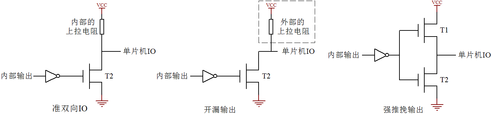

# 单片机 IO 口的结构

上节课我们提到了单片机 IO 口的其中一种“准双向 IO”的内部结构，实际上我们的单片机 IO 口还有另外三种状态，分别是开漏、推挽、高阻态，我们通过图 9-1 来分析下另外这三种状态。

图 9-1  单片机 IO 结构示意图

前边我们简单介绍“准双向 IO”的时候，我们是用三极管来说明的，出于严谨的态度，我们这里按照实际情况用 MOS 管画图示意。实际上三极管是靠电流导通的，而 MOS 管是靠电压导通的，具体缘由和它们的内部构造有关系，在这里我们暂且不必关心，如果今后有必要了解可以直接查找模拟电子书或者百度相关资料进行细致学习。在单片机 IO 口状态这一块内容上，我们可以把 MOS 管当三极管来理解。在图 9-1 中，T1 相当于一个 PNP 三极管，T2 相当于一个 NPN 三极管。

其中准双向 IO 口原理已经讲过了，开漏输出和准双向 IO 的唯一区别，就是开漏输出把内部的上拉电阻去掉了。开漏输出如果要输出高电平时，T2 关断，IO 电平要靠外部的上拉电阻才能拉成高电平，如果没有外部上拉电阻 IO 电平就是一个不确定态。标准 51 单片机的 P0 口默认就是开漏输出，如果要用的时候外部需要加上拉电阻。而强推挽输出就是有比较强的驱动能力，如图 9-1 中第三张小图，当内部输出一个高电平时，通过 MOS 管直接输出电流，没有电阻的限流，电流输出能力也比较大；如果内部输出一个低电平，那反向电流也可以很大，强推挽的一个特点就是驱动能力强。

单片机 IO 还有一种状态叫高阻态。通常我们用来做输入引脚的时候，可以将 IO 口设置成高阻态，高阻态引脚本身如果悬空，用万用表测量的时候可能是高可能是低，它的状态完全取决于外部输入信号的电平，高阻态引脚对 GND 的等效电阻很大（理论上相当于无穷大，但实际上总是有限值而非无穷大），所以称之为高阻。

这就是单片机的 IO 口的四种状态，在我们 51 单片机的学习过程中，主要应用的是准双向 IO 口，随着我们学习的深入，其它状态也会有接触，在这里介绍给大家学习一下。