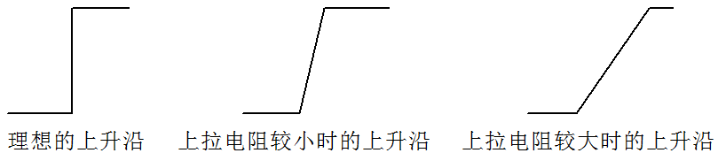

# 单片机上下拉电阻

前边似乎我们很多次提到了上拉电阻，下拉电阻，具体到底什么样的电阻算是上下拉电阻，上下拉电阻都有何作用呢？

上拉电阻就是将不确定的信号通过一个电阻拉到高电平，同时此电阻也起到一个限流作用，下拉就是下拉到低电平。

比如我们的 IO 设置为开漏输出高电平或者是高阻态时，默认的电平就是不确定的，外部经一个电阻接到 VCC，也就是上拉电阻，那么相应的引脚就是高电平；经一个电阻到 GND，也就是下拉电阻，那么相应的引脚就是一个低电平。

上拉电阻应用很多，都可以起到什么作用呢？我们现在主要先了解最常用的以下 4 点：

1.  OC 门要输出高电平，必须外部加上拉电阻才能正常使用，其实 OC 门就相当于单片机 IO 的开漏输出，其原理可参照图 9-1 中的开漏电路。
2.  加大普通 IO 口的驱动能力。标准 51 单片机的内部 IO 口的上拉电阻，一般都是在几十 K 欧，比如 STC89C52 内部是 20K 的上拉电阻，所以最大输出电流是 250uA，因此外部加个上拉电阻，可以形成和内部上拉电阻的并联结构，增大高电平时电流的输出能力。
3.  在电平转换电路中，比如我们前边讲的 5V 转 12V 的电路中，上拉电阻其实起到的是限流电阻的作用，可以回顾一下图 3-8。
4.  单片机中未使用的引脚，比如总线引脚，引脚悬空时，容易受到电磁干扰而处于紊乱状态，虽然不会对程序造成什么影响，但通常会增加单片机的功耗，加上一个对 VCC 的上拉电阻或者一个对 GND 的下拉电阻后，可以有效的抵抗电磁干扰。

那么我们在进行电路设计的时候，又该如何选择合适的上下拉电阻的阻值呢？

1.  从降低功耗的方面考虑应当足够大，因为电阻越大，电流越小。
2.  从确保足够的引脚驱动能力考虑应当足够小，电阻小了，电流才能大。
3.  在开漏输出时，过大的上拉电阻会导致信号上升沿变缓。我们来解释一下：实际电平的变化都是需要时间的，虽然很小，但永远都达不到零，而开漏输出时上拉电阻的大小就直接影响了这个上升过程所需要的时间，如图 9-2 所示。想一下，如果电阻很大，而信号频率又很快的话，最终将导致信号还没等上升到高电平就又变为低了，于是信号就无法正确传送了。

图 9-2  上拉电阻阻值对波形的影响

综合考虑各种情况，我们常用的上下拉电阻值大多选取在 1K 到 10K 之间，具体到底多大通常要根据实际需求来选，通常情况下在标准范围内就可以了，不一定是一个固定的值。