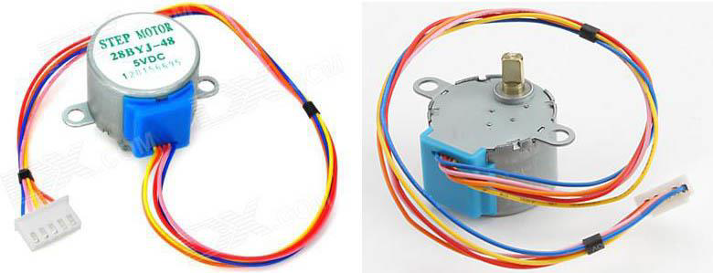
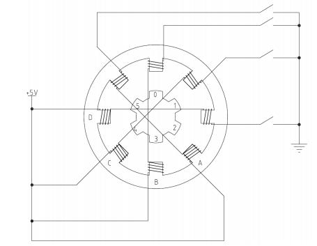

# 28BYJ-48 步进电机原理

28BYJ-48 是 4 相永磁式减速步进电机，其外观如图 9-3 所示：

图 9-3  步进电机外观

我们先来解释“4 相永磁式”的概念，28BYJ-48 的内部结构示意图 9-4 所示。先看里圈，它上面有 6 个齿，分别标注为 0～5，这个叫做转子，顾名思义，它是要转动的，转子的每个齿上都带有永久的磁性，是一块永磁体，这就是“永磁式”的概念。再看外圈，这个就是定子，它是保持不动的，实际上它是跟电机的外壳固定在一起的，它上面有 8 个齿，而每个齿上都缠上了一个线圈绕组，正对着的 2 个齿上的绕组又是串联在一起的，也就是说正对着的 2 个绕组总是会同时导通或关断的，如此就形成了 4 相，在图中分别标注为 A-B-C-D，这就是“4 相”的概念。

图 9-4  步进电机内部结构示意图

现在我们分析一下它的工作原理：

假定电机的起始状态就如图 9-4 所示，逆时针方向转动，起始时是 B 相绕组的开关闭合，B 相绕组导通，那么导通电流就会在正上和正下两个定子齿上产生磁性，这两个定子齿上的磁性就会对转子上的 0 和 3 号齿产生最强的吸引力，就会如图所示的那样，转子的 0 号齿在正上、3 号齿在正下而处于平衡状态；此时我们会发现，转子的 1 号齿与右上的定子齿也就是 C 相的一个绕组呈现一个很小的夹角，2 号齿与右边的定子齿也就是 D 相绕组呈现一个稍微大一点的夹角，很明显这个夹角是 1 号齿和 C 绕组夹角的 2 倍，同理，左侧的情况也是一样的。

接下来，我们把 B 相绕组断开，而使 C 相绕组导通，那么很明显，右上的定子齿将对转子 1 号齿产生最大的吸引力，而左下的定子齿将对转子 4 号齿，产生最大的吸引力，在这个吸引力的作用下，转子 1、4 号齿将对齐到右上和左下的定子齿上而保持平衡，如此，转子就转过了起始状态时 1 号齿和 C 相绕组那个夹角的角度。

再接下来，断开 C 相绕组，导通 D 相绕组，过程与上述的情况完全相同，最终将使转子 2、5 号齿与定子 D 相绕组对齐，转子又转过了上述同样的角度。

那么很明显，当 A 相绕组再次导通，即完成一个 B-C-D-A 的四节拍操作后，转子的 0、3 号齿将由原来的对齐到上下 2 个定子齿，而变为了对齐到左上和右下的两个定子齿上，即转子转过了一个定子齿的角度。依此类推，再来一个四节拍，转子就将再转过一个齿的角度，8 个四节拍以后转子将转过完整的一圈，而其中单个节拍使转子转过的角度就很容易计算出来了，即 360 度/(8*4)=11.25 度，这个值就叫做步进角度。而上述这种工作模式就是步进电机的单四拍模式——单相绕组通电四节拍。

我们再来讲解一种具有更优性能的工作模式，那就是在单四拍的每两个节拍之间再插入一个双绕组导通的中间节拍，组成八拍模式。比如，在从 B 相导通到 C 项导通的过程中，假如一个 B 相和 C 相同时导通的节拍，这个时候，由于 B、C 两个绕组的定子齿对它们附近的转子齿同时产生相同的吸引力，这将导致这两个转子齿的中心线对比到 B、C 两个绕组的中心线上，也就是新插入的这个节拍使转子转过了上述单四拍模式中步进角度的一半，即 5.625 度。这样一来，就使转动精度增加了一倍，而转子转动一圈则需要 8*8=64 拍了。另外，新增加的这个中间节拍，还会在原来单四拍的两个节拍引力之间又加了一把引力，从而可以大大增加电机的整体扭力输出，使电机更“有劲”了。

除了上述的单四拍和八拍的工作模式外，还有一个双四拍的工作模式——双绕组通电四节拍。其实就是把八拍模式中的两个绕组同时通电的那四拍单独拿出来，而舍弃掉单绕组通电的那四拍而已。其步进角度同单四拍是一样的，但由于它是两个绕组同时导通，所以扭矩会比单四拍模式大，在此就不做过多解释了。

八拍模式是这类 4 相步进电机的最佳工作模式，能最大限度的发挥电机的各项性能，也是绝大多数实际工程中所选择的模式，因此我们就重点来讲解如何用单片机程序来控制电机按八拍模式工作。