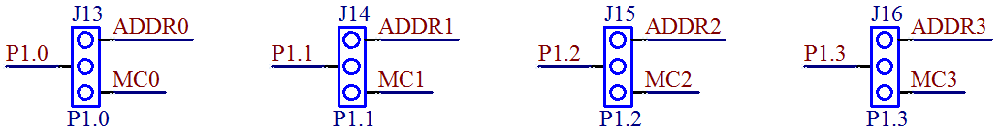
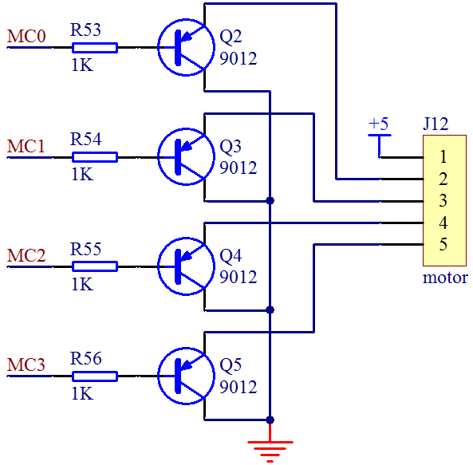

# 让 28BYJ-48 步进电机转起来

再重新看一下上面的步进电机外观图和内部结构图：步进电机一共有 5 根引线，其中红色的是公共端，连接到 5V 电源，接下来的橙、黄、粉、蓝就对应了 A、B、C、D 相；那么如果要导通 A 相绕组，就只需将橙色线接地即可，B 相则黄色接地，依此类推；再根据上述单四拍和八拍工作过程的讲解，可以得出下面的绕组控制顺序表，如表 9-1 所示：

表 9-1 八拍模式绕组控制顺序表

|   | 1 | 2 | 3 | 4 | 5 | 6 | 7 | 8 |
| P1-红 | VCC | VCC | VCC | VCC | VCC | VCC | VCC | VCC |
| P2-橙 | GND | GND |   |   |   |   |   | GND |
| P3-黄 |   | GND | GND | GND |   |   |   |   |
| P4-粉 |   |   |   | GND | GND | GND |   |   |
| P5-蓝 |   |   |   |   |   | GND | GND | GND |

我们板子上控制步进电机部分是和板子上的显示控制的 74HC138 译码器部分复用的 P1.0～P1.3，关于跳线我们在第三章已经讲过了，通过调整跳线帽的位置可以让 P1.0～P1.3 控制步进电机的四个绕组，如图 9-5 所示。



图 9-5  显示译码与步进电机的选择跳线

如果要使用电机的话，需要把 4 个跳线帽都调到跳线组的左侧（开发板上的实际位置），即左侧针和中间针连通（对应原理图中的中间和下边的针），就可以使用 P1.0 到 P1.3 控制步进电机了，如要再使用显示部分的话，就要再换回到右侧了。那如果大家既想让显示部分正常工作，又想让电机工作该怎么办呢？跳线帽保持在右侧，用杜邦线把步进电机的控制引脚（即左侧的排针）连接到其它的暂不使用的单片机 IO 上即可。

再来看一下我们步进电机的原理图，步进电机的控制电路如图 9-6 所示。



图 9-6  步进电机控制电路

诚然，单片机的 IO 口可以直接输出 0V 和 5V 的电压，但是电流驱动能力，也就是带载能力非常有限，所以我们在每相的控制线上都增加一个三极管来提高驱动能力。由图中可以看出，若要使 A 相导通，则必须是 Q2 导通，此时 A 相也就是橙色线就相当于接地了，于是 A 相绕组导通，此时单片机 P1 口低 4 位应输出 0b1110，即 0xE；如要 A、B 相同时导通，那么就是 Q2、Q3 导通，P1 口低 4 位应输出 0b1100，即 0xC，依此类推，我们可以得到下面的八拍节拍的 IO 控制代码数组：

    unsigned char code BeatCode[8] = { 0xE, 0xC, 0xD, 0x9, 0xB, 0x3, 0x7, 0x6 };

到这里，似乎所有的逻辑问题都解决了，循环将这个数组内的值送到 P1 口就行了。但是，只要再深入想一下就会发现还有个问题：多长时间送一次数据，也就是说一个节拍要持续多长时间合适呢？是随意的吗？当然不是了，这个时间是由步进电机的启动频率决定的。启动频率，就是步进电机在空载情况下能够正常启动的最高脉冲频率，如果脉冲频率高于该值，电机就不能正常启动。表 9-2 就是由厂家提供的步进电机参数表，我们来看一下。

表 9-2 28BYJ-48 步进电机参数表

| 供电电压 | 相数 | 相电阻Ω | 步进角度 | 减速比 | 启动频率 P.P.S | 转矩 g.cm | 噪声 dB | 绝缘介电强度 |
| 5V | 4 | 50±10% | 5.625/64 | 1:64 | ≥550 | ≥300 | ≤35 | 600VAC |

表中给出的参数是≥550，单位是 P.P.S，即每秒脉冲数，这里的意思就是说：电机保证在你每秒给出 550 个步进脉冲的情况下，可以正常启动。那么换算成单节拍持续时间就是 1s/550=1.8ms，为了让电机能够启动，我们控制节拍刷新时间大于 1.8ms 就可以了。有了这个参数，我们就可以动手写出最简单的电机转动程序了，如下：

```
#include <reg52.h>

unsigned char code BeatCode[8] = { //步进电机节拍对应的 IO 控制代码
    0xE, 0xC, 0xD, 0x9, 0xB, 0x3, 0x7, 0x6
};
void delay();

void main(){
    unsigned char tmp;  //定义一个临时变量
    unsigned char index = 0;  //定义节拍输出索引
    while (1){
        tmp = P1; //用 tmp 把 P1 口当前值暂存
        tmp = tmp & 0xF0; //用&操作清零低 4 位
        //用|操作把节拍代码写到低 4 位
        tmp = tmp | BeatCode[index];
        //把低 4 位的节拍代码和高 4 位的原值送回 P1
        P1 = tmp;
        index++;  //节拍输出索引递增
        index = index & 0x07;  //用&操作实现到 8 归零
        delay();  //延时 2ms，即 2ms 执行一拍
    }
}
/* 软件延时函数，延时约 2ms */
void delay(){
    unsigned int i = 200;
    while (i--);
}
```

把程序编译下载到板子上试试吧！看看电机转了没有？要记得换跳线哦！