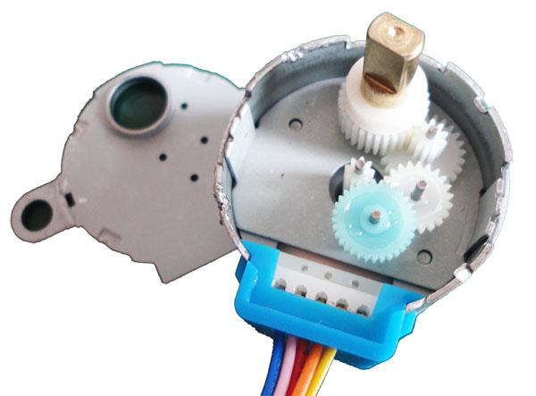

# 28BYJ-48 步进电机转动精度与深入分析

转是转了，但是不是感觉有点不太对劲呢？太慢了？别急，咱们继续。根据本章开头讲解的原理，八拍模式时，步进电机转过一圈是需要 64 个节拍，而我们程序中是每个节拍持续 2ms，那么转一圈就应该是 128ms，即 1 秒钟转 7 圈多，可怎么看上去它好像是 7 秒多才转了一圈呢？

那么，是时候来了解“永磁式减速步进电机”中这个“减速”的概念了。图 9-7 是这个 28BYJ-48 步进电机的拆解图，从图中可以看到，位于最中心的那个白色小齿轮才是步进电机的转子输出，64 个节拍只是让这个小齿轮转了一圈，然后它带动那个浅蓝色的大齿轮，这就是一级减速。大家看一下右上方的白色齿轮的结构，除电机转子和最终输出轴外的 3 个传动齿轮都是这样的结构，由一层多齿和一层少齿构成，而每一个齿轮都用自己的少齿层去驱动下一个齿轮的多齿层，这样每 2 个齿轮都构成一级减速，一共就有了 4 级减速，那么总的减速比是多少呢？即转子要转多少圈最终输出轴才转一圈呢？



图 9-7  步进电机内部齿轮示意图

回头看一下电机参数表中的减速比这个参数吧——1:64，转子转 64 圈，最终输出轴才会转一圈，也就是需要 64*64=4096 个节拍输出轴才转过一圈，2ms*4096=8192ms，8 秒多才转一圈呢，是不是跟刚才的实验结果正好吻合了？4096 个节拍转动一圈，那么一个节拍转动的角度——步进角度就是 360/4096，看一下表中的步进角度参数 5.625/64，算一下就知道这两个值是相等的，一切都已吻合了。

关于基本的控制原理本该到这里就全部结束了，但是，我们希望大家都能培养一种“实践是检验真理的唯一标准”的思维方式！回想一下，步进电机最大的特点是什么？精确控制转动量！那么我们是不是应该检验一下它到底是不是能精确呢？精确到什么程度呢？怎么来检验呢？让它转过 90 度，然后量一下准不准？也行，但是如果它只差了 1 度甚至不到 1 度，你能准确测量出来吗？在没有精密仪器的情况很难。我们还是让它多转几个整圈，看看它最后停下的位置还是不是原来的位置。对应的，我们把程序修改一下，以方便控制电机转过任意的圈数。

```
#include <reg52.h>
void TurnMotor(unsigned long angle);
void main(){
    TurnMotor(360*25);  //360 度*25，即 25 圈
    while (1);
}
/* 软件延时函数，延时约 2ms */
void delay(){
    unsigned int i = 200;
    while (i--);
}
/* 步进电机转动函数，angle-需转过的角度 */
void TurnMotor(unsigned long angle){
    unsigned char tmp;  //临时变量
    unsigned char index = 0;  //节拍输出索引
    unsigned long beats = 0;  //所需节拍总数
    //步进电机节拍对应的 IO 控制代码
    unsigned char code BeatCode[8] = {
        0xE, 0xC, 0xD, 0x9, 0xB, 0x3, 0x7, 0x6
    };
    //计算需要的节拍总数，4096 拍对应一圈
    beats = (angle*4096) / 360;
    //判断 beats 不为 0 时执行循环，然后自减 1
    while (beats--){
        tmp = P1;  //用 tmp 把 P1 口当前值暂存
        tmp = tmp & 0xF0;  //用&操作清零低 4 位
        tmp = tmp | BeatCode[index]; //用|操作把节拍代码写到低 4 位
        P1 = tmp;  //把低 4 位的节拍代码和高 4 位的原值送回 P1
        index++;  //节拍输出索引递增
        index = index & 0x07;  //用&操作实现到 8 归零
        delay();  //延时 2ms，即 2ms 执行一拍
    }
    P1 = P1 | 0x0F; //关闭电机所有的相
}
```

上述程序中，我们先编写了一个控制电机转过指定角度的函数，这个角度值由函数的形式参数给出，然后在主函数中就可以方便的通过更改调用时的实际参数来控制电机转过任意的角度了。我们用了 360*25，也就是 25 圈，当然你也可以随意改为其它的值，看看是什么结果。我们的程序会执行 25*8=200 秒的时间，先记下输出轴的初始位置，然后上电并耐心等它执行完毕，看一下，是不是„„有误差？怎么回事，哪儿出问题了，不是说能精确控制转动量吗？

这个问题其实是出在了减速比上，再来看一下，厂家给出的减速比是 1:64，不管是哪个厂家生产的电机，只要型号是 28BYJ-48，其标称的减速比就都是 1:64。但实际上呢？经过我们的拆解计算发现：真实准确的减速比并不是这个值 1:64，而是 1:63.684！得出这个数据的方法也很简单，实际数一下每个齿轮的齿数，然后将各级减速比相乘，就可以得出结果了，实测的减速比为(32/9)*(22/11)*(26/9)*(31/10)≈63.684，从而得出实际误差为 0.0049，即约为百分之 0.5，转 100 圈就会差出半圈，那么我们刚才转了 25 圈，是不是就差了八分之一圈了，也就是 45 度，看一下刚才的误差是 45 度吧。那么按照 1:63.684 的实际减速比，可以得出转过一圈所需要节拍数是 64*63.684≈4076。那么就把上面程序中电机驱动函数里的 4096 改成 4076 再试一下吧。是不是看不出丝毫的误差了？但实际上误差还是存在的，因为上面的计算结果都是约等得出的，实际误差大约是 0.000056，即万分之 0.56，转一万圈才会差出半圈，已经可以忽略不计了。

那么厂家的参数为什么会有误差呢？难道厂家不知道吗？要解释这个问题，我们得回到实际应用中，步进电机最通常的目的是控制目标转过一定的角度，通常都是在 360 度以内的，而这个 28BYJ-48 最初的设计目的是用来控制空调的扇叶的，扇叶的活动范围是不会超过 180 度的，所以在这种应用场合下，厂商给出一个近似的整数减速比 1:64 已经足够精确了，这也是合情合理的。然而，正如我们的程序那样，我们不一定是要用它来驱动空调扇叶，我们可以让它转动很多圈来干别的，这个时候就需要更为精确的数据了，这也是我们希望同学们都能了解并掌握的，就是说我们要能自己“设计”系统并解决其中发现的问题，而不要被所谓的“现成的方案”限制住思路。