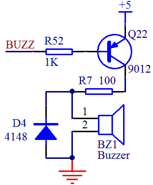

# 单片机蜂鸣器控制程序和驱动电路

蜂鸣器从结构区分分为压电式蜂鸣器和电磁式蜂鸣器。压电式为压电陶瓷片发音，电流比较小一些，电磁式蜂鸣器为线圈通电震动发音，体积比较小。

按照驱动方式分为有源蜂鸣器和无源蜂鸣器。这里的有源和无源不是指电源，而是振荡源。有源蜂鸣器内部带了振荡源，如图 9-8 所示中，给了 BUZZ 引脚一个低电平，蜂鸣器就会直接响。而无源蜂鸣器内部是不带振荡源的，要让他响必须给 500Hz～4.5KHz 之间的脉冲频率信号来驱动它才会响。有源蜂鸣器往往比无源蜂鸣器贵一些，因为里边多了振荡电路，驱动发音也简单，靠电平就可以驱动，而无源蜂鸣器价格比较便宜，此外无源蜂鸣器声音频率可以控制，而音阶与频率又有确定的对应关系，因此就可以做出来“do re mi fa sol la si”的效果，可以用它制作出简单的音乐曲目，比如生日歌、两只老虎等等。



图 9-8  蜂鸣器电路原理图

我们来看一下图 9-8 的电路，蜂鸣器电流依然相对较大，因此需要用三极管驱动，并且加了一个 100 欧的电阻作为限流电阻。此外还加了一个 D4 二极管，这个二极管叫做续流二极管。我们的蜂鸣器是感性器件，当三极管导通给蜂鸣器供电时，就会有导通电流流过蜂鸣器。而我们知道，电感的一个特点就是电流不能突变，导通时电流是逐渐加大的，这点没有问题，但当关断时，经“电源-三极管-蜂鸣器-地”这条回路就截断了，过不了任何电流了，那么储存的电流往哪儿去呢，就是经过这个 D4 和蜂鸣器自身的环路来消耗掉了，从而就避免了关断时由于电感电流造成的反向冲击。接续关断时的电流，这就是续流二极管名称的由来。

蜂鸣器经常用于电脑、打印机、万用表这些设备上做提示音，提示音一般也很简单，就是简单发出个声音就行，我们用程序简单做了个 4KHZ 频率下的发声和 1KHZ 频率下的发声程序，同学们可以自己研究下程序，比较下实际效果。

```
#include <reg52.h>
sbit BUZZ = P1⁶; //蜂鸣器控制引脚
unsigned char T0RH = 0; //T0 重载值的高字节
unsigned char T0RL = 0; //T0 重载值的低字节
void OpenBuzz(unsigned int frequ);
void StopBuzz();

void main(){
    unsigned int i;
    TMOD = 0x01; //配置 T0 工作在模式 1，但先不启动
    EA = 1;
    while (1){ //使能全局中断
        OpenBuzz(4000); //以 4KHz 的频率启动蜂鸣器
        for (i=0; i<40000; i++);
        StopBuzz(); //停止蜂鸣器
        for (i=0; i<40000; i++);
        OpenBuzz(1000); //以 1KHz 的频率启动蜂鸣器
        for (i=0; i<40000; i++);
        StopBuzz(); //停止蜂鸣器
        for (i=0; i<40000; i++);
    }
}
/* 蜂鸣器启动函数，frequ-工作频率 */
void OpenBuzz(unsigned int frequ){
    unsigned int reload;//计算所需的定时器重载值
    reload = 65536 - (11059200/12)/(frequ*2); //由给定频率计算定时器重载值
    T0RH = (unsigned char)(reload >> 8); //16 位重载值分解为高低两个字节
    T0RL = (unsigned char)reload;
    TH0 = 0xFF; //设定一个接近溢出的初值，以使定时器马上投入工作
    TL0 = 0xFE;
    ET0 = 1; //使能 T0 中断
    TR0 = 1; //启动 T0
}
/* 蜂鸣器停止函数 */
void StopBuzz(){
    ET0 = 0; //禁用 T0 中断
    TR0 = 0; //停止 T0
}
/* T0 中断服务函数，用于控制蜂鸣器发声 */
void InterruptTimer0() interrupt 1{
    TH0 = T0RH; //重新加载重载值
    TL0 = T0RL;
    BUZZ = ~BUZZ; //反转蜂鸣器控制电平
}
```

另外用蜂鸣器来输出音乐，仅仅是好玩而已，应用很少，里边包含了音阶、乐谱的相关内容，程序也有一点复杂，所以就不详细给大家去讲解了。仅提供一个可以播放《两只老虎》的程序，大家可以下载到板子上玩玩，满足一下好奇心。

```
#include <reg52.h>
sbit BUZZ = P1⁶; //蜂鸣器控制引脚
unsigned int code NoteFrequ[] = { //中音 1-7 和高音 1-7 对应频率列表
    523, 587, 659, 698, 784, 880, 988, //中音 1-7
    1047, 1175, 1319, 1397, 1568, 1760, 1976 //高音 1-7
};
unsigned int code NoteReload[] = { //中音 1-7 和高音 1-7 对应的定时器重载值
    65536 - (11059200/12) / (523*2), //中音 1
    65536 - (11059200/12) / (587*2), //2
    65536 - (11059200/12) / (659*2), //3
    65536 - (11059200/12) / (698*2), //4
    65536 - (11059200/12) / (784*2), //5
    65536 - (11059200/12) / (880*2), //6
    65536 - (11059200/12) / (988*2), //7
    65536 - (11059200/12) / (1047*2), //高音 1
    65536 - (11059200/12) / (1175*2), //2
    65536 - (11059200/12) / (1319*2), //3
    65536 - (11059200/12) / (1397*2), //4
    65536 - (11059200/12) / (1568*2), //5
    65536 - (11059200/12) / (1760*2), //6
    65536 - (11059200/12) / (1976*2), //7
};
bit enable = 1; //蜂鸣器发声使能标志
bit tmrflag = 0; //定时器中断完成标志
unsigned char T0RH = 0xFF; //T0 重载值的高字节
unsigned char T0RL = 0x00; //T0 重载值的低字节
void PlayTwoTiger();

void main(){
    unsigned int i;
    EA = 1; //使能全局中断
    TMOD = 0x01; //配置 T0 工作在模式 1
    TH0 = T0RH;
    TL0 = T0RL;
    ET0 = 1; //使能 T0 中断
    TR0 = 1; //启动 T0

    while (1){
        PlayTwoTiger(); //播放乐曲--两支老虎
        for (i=0; i<40000; i++); //停止一段时间
    }
}
/* 两支老虎乐曲播放函数 */
void PlayTwoTiger(){
    unsigned char beat; //当前节拍索引
    unsigned char note; //当前节拍对应的音符
    unsigned int time = 0; //当前节拍计时
    unsigned int beatTime = 0; //当前节拍总时间
    unsigned int soundTime = 0; //当前节拍需发声时间
    //两只老虎音符表
    unsigned char code TwoTigerNote[] = {
    1,   2,   3, 1,    1,   2,   3, 1,     3, 4, 5,   3, 4, 5,
    5,6, 5,4, 3, 1,    5,6, 5,4, 3, 1,     1, 5, 1,   1, 5, 1,

    };
    //两只老虎节拍表，4 表示一拍，1 就是 1/4 拍，8 就是 2 拍
    unsigned char code TwoTigerBeat[] = {
    4,   4,   4, 4,   4,   4,   4, 4,    4, 4, 8,   4, 4, 8,
    3,1, 3,1, 4, 4,   3,1, 3,1, 4, 4,    4, 4, 8,   4, 4, 8,
    };

    //用节拍索引作为循环变量
    for (beat=0; beat<sizeof(TwoTigerNote); ){
        while (!tmrflag); //每次定时器中断完成后，检测并处理节拍
        tmrflag = 0;
        if (time == 0){ //当前节拍播完则启动一个新节拍
            note = TwoTigerNote[beat] - 1;
            T0RH = NoteReload[note] >> 8;
            T0RL = NoteReload[note];
            //计算节拍总时间，右移 2 位相当于除 4，移位代替除法可以加快执行速度
            beatTime = (TwoTigerBeat[beat] * NoteFrequ[note]) >> 2;
            //计算发声时间，为总时间的 0.75，移位原理同上
            soundTime = beatTime - (beatTime >> 2);
            enable = 1; //指示蜂鸣器开始发声
            time++;
        }else{ //当前节拍未播完则处理当前节拍
            //当前持续时间到达节拍总时间时归零，
            //并递增节拍索引，以准备启动新节拍
            if (time >= beatTime){
                time = 0;
                beat++;
            }else{ //当前持续时间未达到总时间时，
                time++; //累加时间计数
                //到达发声时间后，指示关闭蜂鸣器，
                //插入 0.25*总时间的静音间隔，
                if (time == soundTime){
                    enable = 0; //用以区分连续的两个节拍
                }
            }
        }
    }
}
/* T0 中断服务函数，用于控制蜂鸣器发声 */
void InterruptTimer0() interrupt 1{
    TH0 = T0RH; //重新加载重载值
    TL0 = T0RL;
    tmrflag = 1;
    if (enable){ //使能时反转蜂鸣器控制电平
        BUZZ = ~BUZZ;
    }else{ //未使能时关闭蜂鸣器
        BUZZ = 1;
    }
}
```