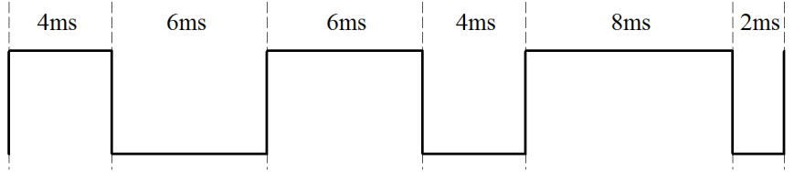

# 单片机中 PWM 的原理与控制程序

PWM 在单片机中的应用是非常广泛的，它的基本原理很简单，但往往应用于不同场合上意义也不完全一样，这里我先把基本概念和基本原理给大家介绍一下，后边遇到用的时候起码知道是个什么东西。

PWM 是 Pulse Width Modulation 的缩写，它的中文名字是脉冲宽度调制，一种说法是它利用微处理器的数字输出来对模拟电路进行控制的一种有效的技术，其实就是使用数字信号达到一个模拟信号的效果。这是个什么概念呢？我们一步步来介绍。

首先从它的名字来看，脉冲宽度调制，就是改变脉冲宽度来实现不同的效果。我们先来看三组不同的脉冲信号，如图 10-1 所示。



图 10-1  PWM 波形

这是一个周期是 10ms，即频率是 100Hz 的波形，但是每个周期内，高低电平脉冲宽度各不相同，这就是 PWM 的本质。在这里大家要记住一个概念，叫做“占空比”。占空比是指高电平的时间占整个周期的比例。比如第一部分波形的占空比是 40%，第二部分波形占空比是 60%，第三部分波形占空比是 80%，这就是 PWM 的解释。

那为何它能对模拟电路进行控制呢？大家想一想，我们数字电路里，只有 0 和 1 两种状态，比如我们第二章学会的点亮 LED 小灯那个程序，当我们写一个 LED = 0;小灯就会长亮，当我们写一个 LED = 1;小灯就会灭掉。当我们让小灯亮和灭间隔运行的时候，小灯是闪烁。

如果我们把这个间隔不断的减小，减小到我们的肉眼分辨不出来，也就是 100Hz 以上的频率，这个时候小灯表现出来的现象就是既保持亮的状态，但亮度又没有 LED = 0;时的亮度高。那我们不断改变时间参数，让 LED = 0;的时间大于或者小于 LED = 1;的时间，会发现亮度都不一样，这就是模拟电路的感觉了，不再是纯粹的 0 和 1，还有亮度不断变化。大家会发现，如果我们用 100Hz 的信号，如图 10-1 所示，假如高电平熄灭小灯，低电平点亮小灯的话，第一部分波形熄灭 4ms，点亮 6ms，亮度最高，第二部分熄灭 6ms，点亮 4ms，亮度次之，第三部分熄灭 8ms，点亮 2ms，亮度最低。那么用程序验证一下我们的理论，我们用定时器 T0 定时改变 P0.0 的输出来实现 PWM，与纯定时不同的是，这里我们每周期内都要重载两次定时器初值，即用两个不同的初值来控制高低电平的不同持续时间。为了使亮度的变化更加明显，程序中使用的占空比差距更大。

```
#include <reg52.h>
sbit PWMOUT = P0⁰;
sbit ADDR0 = P1⁰;
sbit ADDR1 = P1¹;
sbit ADDR2 = P1²;
sbit ADDR3 = P1³;
sbit ENLED = P1⁴;

unsigned char HighRH = 0; //高电平重载值的高字节
unsigned char HighRL = 0; //高电平重载值的低字节
unsigned char LowRH = 0; //低电平重载值的高字节
unsigned char LowRL = 0; //低电平重载值的低字节

void ConfigPWM(unsigned int fr, unsigned char dc);
void ClosePWM();

void main(){
    unsigned int i;
    EA = 1; //开总中断
    ENLED = 0; //使能独立 LED
    ADDR3 = 1;
    ADDR2 = 1;
    ADDR1 = 1;
    ADDR0 = 0;

    while (1){
        ConfigPWM(100, 10); //频率 100Hz，占空比 10%
        for (i=0; i<40000; i++);
        ClosePWM();
        ConfigPWM(100, 40); //频率 100Hz，占空比 40%
        for (i=0; i<40000; i++);
        ClosePWM();
        ConfigPWM(100, 90); //频率 100Hz，占空比 90%
        for (i=0; i<40000; i++);
        ClosePWM(); //关闭 PWM，相当于占空比 100%
        for (i=0; i<40000; i++);
    }
}
/* 配置并启动 PWM，fr-频率，dc-占空比 */
void ConfigPWM(unsigned int fr, unsigned char dc){
    unsigned int high, low;
    unsigned long tmp;

    tmp = (11059200/12) / fr; //计算一个周期所需的计数值
    high = (tmp*dc) / 100; //计算高电平所需的计数值
    low = tmp - high; //计算低电平所需的计数值
    high = 65536 - high + 12; //计算高电平的重载值并补偿中断延时
    low = 65536 - low + 12;//计算低电平的重载值并补偿中断延时

    HighRH = (unsigned char)(high>>8); //高电平重载值拆分为高低字节
    HighRL = (unsigned char)high;
    LowRH = (unsigned char)(low>>8); //低电平重载值拆分为高低字节
    LowRL = (unsigned char)low;

    TMOD &= 0xF0; //清零 T0 的控制位
    TMOD |= 0x01; //配置 T0 为模式 1
    TH0 = HighRH; //加载 T0 重载值
    TL0 = HighRL;
    ET0 = 1; //使能 T0 中断
    TR0 = 1; //启动 T0
    PWMOUT = 1; //输出高电平
}
/* 关闭 PWM */
void ClosePWM(){
    TR0 = 0; //停止定时器
    ET0 = 0; //禁止中断
    PWMOUT = 1; //输出高电平
}
/* T0 中断服务函数，产生 PWM 输出 */
void InterruptTimer0() interrupt 1{
    if (PWMOUT == 1){ //当前输出为高电平时，装载低电平值并输出低电平
        TH0 = LowRH;
        TL0 = LowRL;
        PWMOUT = 0;
    }else{ //当前输出为低电平时，装载高电平值并输出高电平
        TH0 = HighRH;
        TL0 = HighRL;
        PWMOUT = 1;
    }
}
```

需要提醒大家的是，由于标准 51 单片机中没有专门的 PWM 模块，所以我们用定时器加中断的方式来产生 PWM，而现在有很多的单片机都会集成硬件的 PWM 模块，这种情况下需要我们做的就仅仅是计算一下周期计数值和占空比计数值然后配置到相关的 SFR 中即可，既使程序得到了简化又确保了 PWM 的输出品质（因为消除了中断延时的影响）。

大家编译下载程序后，会发现小灯从最亮到灭一共 4 个亮度等级。如果我们让亮度等级更多，并且让亮度等级连续起来，会产生一个小灯渐变的效果，与呼吸有点类似，所以我们习惯上称之为呼吸灯，程序代码如下，这个程序用了 2 个定时器 2 个中断，这是我们第一次这样用，大家可以学习一下。我们来试试这个程序，试完了大家一定要能自己把程序写出来，切记。

```
#include <reg52.h>
sbit PWMOUT = P0⁰;
sbit ADDR0 = P1⁰;
sbit ADDR1 = P1¹;
sbit ADDR2 = P1²;
sbit ADDR3 = P1³;
sbit ENLED = P1⁴;

unsigned long PeriodCnt = 0; //PWM 周期计数值
unsigned char HighRH = 0; //高电平重载值的高字节
unsigned char HighRL = 0; //高电平重载值的低字节
unsigned char LowRH = 0; //低电平重载值的高字节
unsigned char LowRL = 0; //低电平重载值的低字节
unsigned char T1RH = 0; //T1 重载值的高字节
unsigned char T1RL = 0; //T1 重载值的低字节

void ConfigTimer1(unsigned int ms);
void ConfigPWM(unsigned int fr, unsigned char dc);

void main(){
    EA = 1; //开总中断
    ENLED = 0; //使能独立 LED
    ADDR3 = 1;
    ADDR2 = 1;
    ADDR1 = 1;
    ADDR0 = 0;

    ConfigPWM(100, 10); //配置并启动 PWM
    ConfigTimer1(50); //用 T1 定时调整占空比
    while (1);
}
/* 配置并启动 T1，ms-定时时间 */
void ConfigTimer1(unsigned int ms){
    unsigned long tmp; //临时变量
    tmp = 11059200 / 12; //定时器计数频率
    tmp = (tmp * ms) / 1000; //计算所需的计数值
    tmp = 65536 - tmp; //计算定时器重载值
    tmp = tmp + 12; //补偿中断响应延时造成的误差
    T1RH = (unsigned char)(tmp>>8); //定时器重载值拆分为高低字节
    T1RL = (unsigned char)tmp;
    TMOD &= 0x0F; //清零 T1 的控制位
    TMOD |= 0x10; //配置 T1 为模式 1
    TH1 = T1RH; //加载 T1 重载值
    TL1 = T1RL;
    ET1 = 1; //使能 T1 中断
    TR1 = 1; //启动 T1
}
/* 配置并启动 PWM，fr-频率，dc-占空比 */
void ConfigPWM(unsigned int fr, unsigned char dc){
    unsigned int high, low;
    PeriodCnt = (11059200/12) / fr; //计算一个周期所需的计数值
    high = (PeriodCnt*dc) / 100; //计算高电平所需的计数值
    low = PeriodCnt - high; //计算低电平所需的计数值
    high = 65536 - high + 12; //计算高电平的定时器重载值并补偿中断延时
    low = 65536 - low + 12; //计算低电平的定时器重载值并补偿中断延时
    HighRH = (unsigned char)(high>>8); //高电平重载值拆分为高低字节
    HighRL = (unsigned char)high;
    LowRH = (unsigned char)(low>>8); //低电平重载值拆分为高低字节
    LowRL = (unsigned char)low;

    TMOD &= 0xF0; //清零 T0 的控制位
    TMOD |= 0x01; //配置 T0 为模式 1
    TH0 = HighRH; //加载 T0 重载值
    TL0 = HighRL;
    ET0 = 1; //使能 T0 中断
    TR0 = 1; //启动 T0
    PWMOUT = 1; //输出高电平
}
/* 占空比调整函数，频率不变只调整占空比 */
void AdjustDutyCycle(unsigned char dc){
    unsigned int high, low;
    high = (PeriodCnt*dc) / 100; //计算高电平所需的计数值
    low = PeriodCnt - high; //计算低电平所需的计数值
    high = 65536 - high + 12; //计算高电平的定时器重载值并补偿中断延时
    low = 65536 - low + 12; //计算低电平的定时器重载值并补偿中断延时

    HighRH = (unsigned char)(high>>8); //高电平重载值拆分为高低字节
    HighRL = (unsigned char)high;
    LowRH = (unsigned char)(low>>8); //低电平重载值拆分为高低字节
    LowRL = (unsigned char)low;
}
/* T0 中断服务函数，产生 PWM 输出 */
void InterruptTimer0() interrupt 1{
    if (PWMOUT == 1){ //当前输出为高电平时，装载低电平值并输出低电平
        TH0 = LowRH;
        TL0 = LowRL;
        PWMOUT = 0;
    }else{ //当前输出为低电平时，装载高电平值并输出高电平
        TH0 = HighRH;
        TL0 = HighRL;
        PWMOUT = 1;
    }
}
/* T1 中断服务函数，定时动态调整占空比 */
void InterruptTimer1() interrupt 3{
    static bit dir = 0;
    static unsigned char index = 0;
    unsigned char code table[13] = { //占空比调整表
        5, 18, 30, 41, 51, 60, 68, 75, 81, 86, 90, 93, 95
    };

    TH1 = T1RH; //重新加载 T1 重载值
    TL1 = T1RL;
    AdjustDutyCycle(table[index]); //调整 PWM 的占空比
    if (dir == 0){ //逐步增大占空比
        index++;
        if (index >= 12){
            dir = 1;
        }
    }else{ //逐步减小占空比
        index--;
        if (index == 0){
            dir = 0;
        }
    }
}
```

呼吸灯效果做出来后，利用这个基本原理，其它各种效果的灯光闪烁都应该可以做出来，大家看到的 KTV 里边那绚丽的灯光闪烁，其实就是采用的 PWM 技术控制的。