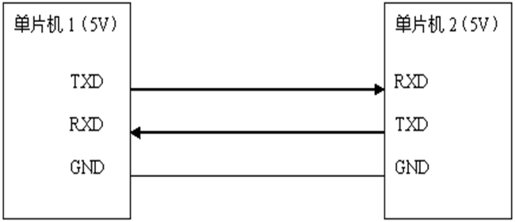
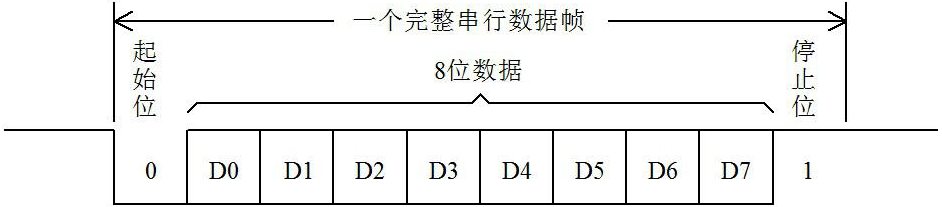

# 单片机串行通信介绍

通信按照基本类型可以分为并行通信和串行通信。并行通信时数据的各个位同时传送，可以实现字节为单位通信，但是通信线多占用资源多，成本高。比如我们前边用到的 P0 = 0xFE;一次给 P0 的 8 个 IO 口分别赋值，同时进行信号输出，类似于有 8 个车道同时可以过去 8 辆车一样，这种形式就是并行的，我们习惯上还称 P0、P1、P2 和 P3 为 51 单片机的 4 组并行总线。

而串行通信，就如同一条车道，一次只能一辆车过去，如果一个 0xFE 这样一个字节的数据要传输过去的话，假如低位在前高位在后的话，那发送方式就是 0-1-1-1-1-1-1-1-1，一位一位的发送出去的，要发送 8 次才能发送完一个字节。

STC89C52 有两个引脚是专门用来做 UART 串行通信的，一个是 P3.0 一个是 P3.1，它们还分别有另外的名字叫做 RXD 和 TXD，由它们组成的通信接口就叫做串行接口，简称串口。用两个单片机进行 UART 串口通信，基本的演示图如图 11-1 所示。

图 11-1  单片机之间 UART 通信示意图

图中，GND 表示单片机系统电源的参考地，TXD 是串行发送引脚，RXD 是串行接收引脚。两个单片机之间要通信，首先电源基准得一样，所以我们要把两个单片机的 GND 相互连接起来，然后单片机 1 的 TXD 引脚接到单片机 2 的 RXD 引脚上，即此路为单片机 1 发送而单片机 2 接收的通道，单片机 1 的 RXD 引脚接到单片机 2 的 TXD 引脚上，即此路为单片机 2 发送而单片机 1 接收的通道。这个示意图就体现了两个单片机相互收发信息的过程。

当单片机 1 想给单片机 2 发送数据时，比如发送一个 0xE4 这个数据，用二进制形式表示就是 0b11100100，在 UART 通信过程中，是低位先发，高位后发的原则，那么就让 TXD 首先拉低电平，持续一段时间，发送一位 0，然后继续拉低，再持续一段时间，又发送了一位 0，然后拉高电平，持续一段时间，发了一位 1„„一直到把 8 位二进制数字 0b11100100 全部发送完毕。这里就涉及到了一个问题，就是持续的这“一段时间”到底是多久？由此便引入了通信中的一个重要概念——波特率，也叫做比特率。

波特率就是发送二进制数据位的速率，习惯上用 baud 表示，即我们发送一位二进制数据的持续时间=1/baud。在通信之前，单片机 1 和单片机 2 首先都要明确的约定好它们之间的通信波特率，必须保持一致，收发双方才能正常实现通信，这一点大家一定要记清楚。

约定好速度后，我们还要考虑第二个问题，数据什么时候是起始，什么时候是结束呢？

不管是提前接收还是延迟接收，数据都会接收错误。在 UART 通信的时候，一个字节是 8 位，规定当没有通信信号发生时，通信线路保持高电平，当要发送数据之前，先发一位 0 表示起始位，然后发送 8 位数据位，数据位是先低后高的顺序，数据位发完后再发一位 1 表示停止位。这样本来要发送一个字节的 8 位数据，而实际上我们一共发送了 10 位，多出来的两位其中一位起始位，一位停止位。而接收方呢，原本一直保持的高电平，一旦检测到了一位低电平，那就知道了要开始准备接收数据了，接收到 8 位数据位后，然后检测到停止位，再准备下一个数据的接收。我们图示看一下，如图 11-2 所示。

图 11-2  串口数据发送示意图

图 11-2 串口数据发送示意图，实际上是一个时域示意图，就是信号随着时间变化的对应关系。比如在单片机的发送引脚上，左边的是先发生的，右边的是后发生的，数据位的切换时间就是波特率分之一秒，如果能够理解时域的概念，后边很多通信的时序图就很容易理解了。