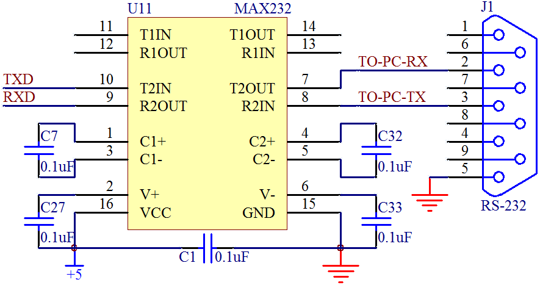

# RS232 通信接口

在我们的台式电脑上，一般都会有一个 9 针的串行接口，这个串行接口叫做 RS232 接口，它和 UART 通信有关联，但是由于现在笔记本电脑都不带这种 9 针串口了，所以和单片机通信越来越趋向于使用 USB 虚拟的串口，因此这一节的内容作为了解内容，大家知道有这么回事就行了。

我们先来认识一下这个标准串口，在物理结构上分为 9 针的和 9 孔的，习惯上我们也称之为公头和母头，如图 11-3 所示。

图 11-3  RS232 通信接口

RS232 接口一共有 9 个引脚，分别定义是：1、载波检测 DCD；2、接收数据 RXD；3、发送数据 TXD；4、数据终端准备好 DTR；5、信号地线 SG；6、数据准备好 DSR；7、请求发送 RTS；8、清除发送 CTS；9、振铃提示 RI。我们要让这个串口和我们单片机进行通信，我们只需要关心其中的 2 脚 RXD、3 脚 TXD 和 5 脚 GND 即可。

虽然这三个引脚的名字和我们单片机上的串口名字一样，但是却不能直接和单片机对连通信，这是为什么呢？随着我们了解的内容越来越多，我们得慢慢知道，不是所有的电路都是 5V 代表高电平而 0V 代表低电平的。对于 RS232 标准来说，它是个反逻辑，也叫做负逻辑。为何叫负逻辑？它的 TXD 和 RXD 的电压，-3V～-15V 电压代表是 1，+3～+15V 电压代表是 0。低电平代表的是 1，而高电平代表的是 0，所以称之为负逻辑。因此电脑的 9 针 RS232 串口是不能和单片机直接连接的，需要用一个电平转换芯片 MAX232 来完成，如图 11-4 所示。

图 11-4  MAX232 转接图

这个芯片就可以实现把标准 RS232 串口电平转换成我们单片机能够识别和承受的 UART 0V/5V 电平。从这里大家似乎慢慢有点明白了，其实 RS232 串口和 UART 串口，它们的协议类型是一样的，只是电平标准不同而已，而 MAX232 这个芯片起到的就是中间人的作用，它把 UART 电平转换成 RS232 电平，也把 RS232 电平转换成 UART 电平，从而实现标准 RS232 接口和单片机 UART 之间的通信连接。