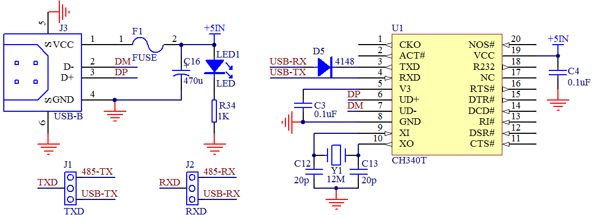

# USB 转串口通信

随着技术的发展，工业上还有 RS232 串口通信的大量使用，但是商业技术的应用上，已经慢慢的使用 USB 转 UART 技术取代了 RS232 串口，绝大多数笔记本电脑已经没有串口这个东西了，那我们要实现单片机和电脑之间的通信该怎么办呢？

我们只需要在电路上添加一个 USB 转串口芯片，就可以成功实现 USB 通信协议和标准 UART 串行通信协议的转换，在我们的开发板上，我们使用的是 CH340T 这个芯片，如图 11-5 所示。

图 11-5  USB 转串口电路

图中左下方 J1 和 J2 是两个跳线的组合，大家可以在我们板子左下方的位置找到，我们需要用跳线帽把中间和下边的针短接在一起。右侧的 CH340T 这个电路很简单，把电源、晶振接好后，6 脚和 7 脚的 DP 和 DM 分别接 USB 口的 2 个数据引脚上去，3 脚和 4 脚通过跳线接到了我们单片机的 TXD 和 RXD 上去。

CH340T 的电路里 3 脚位置加了个 4148 的二极管，是一个小技巧。因为 STC89C52 这个单片机下载程序时需要冷启动，就是先点下载后上电，上电瞬间单片机会先检测需要不需要下载程序。虽然单片机的 VCC 是由开关来控制，但是由于 CH340T 的 3 脚是输出引脚，如果没有此二极管，开关后级单片机在断电的情况下，CH340T 的 3 脚和单片机的 P3.0（即 RXD）引脚连在一起，有电流会通过这个引脚流入后级电路并且给后级的电容充电，造成后级有一定幅度的电压，这个电压值虽然只有两三伏左右，但是可能会影响到正常的冷启动。加了二极管后，一方面不影响通信，另外一个方面还可以消除这种不良影响。这个地方可以暂时作为了解，大家如果自己做这类电路，可以参考一下。