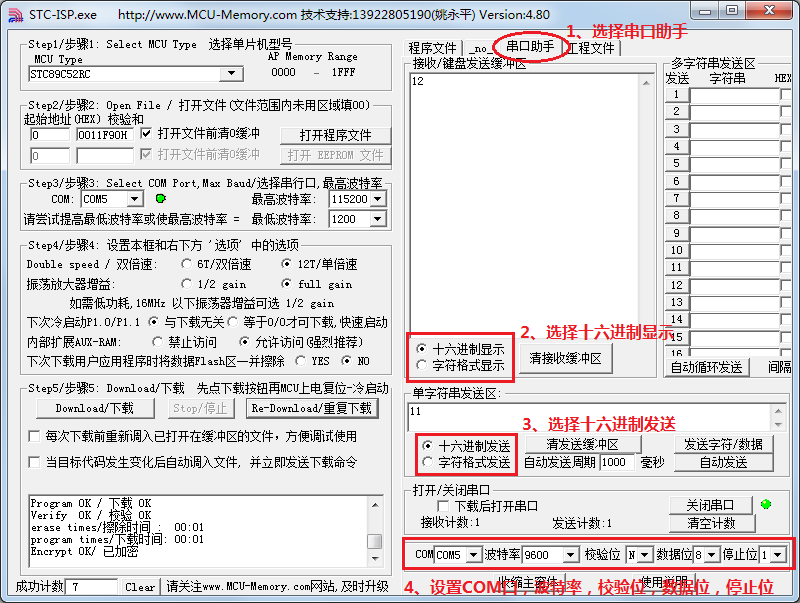

# 单片机 IO 口模拟 UART 串口通信

为了让大家充分理解 UART 串口通信的原理，我们先把 P3.0 和 P3.1 当做 IO 口来进行模拟实际串口通信的过程，原理搞懂后，我们再使用寄存器配置实现串口通信过程。

对于 UART 串口波特率，常用的值是 300、600、1200、2400、4800、9600、14400、19200、28800、38400、57600、115200 等速率。IO 口模拟 UART 串行通信程序是一个简单的演示程序，我们使用串口调试助手下发一个数据，数据加 1 后，再自动返回。

串口调试助手，这里我们直接使用 STC-ISP 软件自带的串口调试助手，先把串口调试助手的使用给大家说一下，如图 11-6 所示。第一步要选择串口助手菜单，第二步选择十六进制显示，第三步选择十六进制发送，第四步选择 COM 口，这个 COM 口要和自己电脑设备管理器里的那个 COM 口一致，波特率按我们程序设定好的选择，我们程序中让一个数据位持续时间是 1/9600 秒，那这个地方选择波特率就是选 9600，校验位选 N，数据位 8，停止位 1。



图 11-6   串口调试助手示意图

串口调试助手的实质就是利用电脑上的 UART 通信接口，发送数据给我们的单片机，也可以把我们的单片机发送的数据接收到这个调试助手界面上。

因为初次接触通信方面的技术，所以我把后面的 IO 模拟串口通信程序进行一下解释，大家可以边看我的解释边看程序，把底层原理先彻底弄懂。

变量定义部分就不用说了，直接看 main 主函数。首先是对通信的波特率的设定，在这里我们配置的波特率是 9600，那么串口调试助手也得是 9600。配置波特率的时候，我们用的是定时器 T0 的模式 2。模式 2 中，不再是 TH0 代表高 8 位，TL0 代表低 8 位了，而只有 TL0 在进行计数，当 TL0 溢出后，不仅仅会让 TF0 变 1，而且还会将 TH0 中的内容重新自动装到 TL0 中。这样有一个好处，就是我们可以把想要的定时器初值提前存在 TH0 中，当 TL0 溢出后，TH0 自动把初值就重新送入 TL0 了，全自动的，不需要程序中再给 TL0 重新赋值了，配置方式很简单，大家可以自己看下程序并且计算一下初值。

波特率设置好以后，打开中断，然后等待接收串口调试助手下发的数据。接收数据的时候，首先要进行低电平检测 while (PIN_RXD)，若没有低电平则说明没有数据，一旦检测到低电平，就进入启动接收函数 StartRXD()。接收函数最开始启动半个波特率周期，初学可能这里不是很明白。大家回头看一下我们的图 11-2 里边的串口数据示意图，如果在数据位电平变化的时候去读取，因为时序上的误差以及信号稳定性的问题很容易读错数据，所以我们希望在信号最稳定的时候去读数据。除了信号变化的那个沿的位置外，其它位置都很稳定，那么我们现在就约定在信号中间位置去读取电平状态，这样能够保证我们读的一定是正确的。

一旦读到了起始信号，我们就把当前状态设定成接收状态，并且打开定时器中断，第一次是半个周期进入中断后，对起始位进行二次判断一下，确认一下起始位是低电平，而不是一个干扰信号。以后每经过 1/9600 秒进入一次中断，并且把这个引脚的状态读到 RxdBuf 里边。等待接收完毕之后，我们再把这个 RxdBuf 加 1，再通过 TXD 引脚发送出去，同样需要先发一位起始位，然后发 8 个数据位，再发结束位，发送完毕后，程序运行到 while (PIN_RXD)，等待第二轮信号接收的开始。

```
#include <reg52.h>
sbit PIN_RXD = P3⁰; //接收引脚定义
sbit PIN_TXD = P3¹; //发送引脚定义
bit RxdOrTxd = 0; //指示当前状态为接收还是发送
bit RxdEnd = 0; //接收结束标志
bit TxdEnd = 0; //发送结束标志
unsigned char RxdBuf = 0; //接收缓冲器
unsigned char TxdBuf = 0; //发送缓冲器
void ConfigUART(unsigned int baud);
void StartTXD(unsigned char dat);
void StartRXD();

void main(){
    EA = 1; //开总中断
    ConfigUART(9600);
    while (1){ //配置波特率为 9600
        while (PIN_RXD); //等待接收引脚出现低电平，即起始位
        StartRXD(); //启动接收
        while (!RxdEnd); //等待接收完成
        StartTXD(RxdBuf+1); //接收到的数据+1 后，发送回去
        while (!TxdEnd); //等待发送完成
    }
}
/* 串口配置函数，baud-通信波特率 */
void ConfigUART(unsigned int baud){
    TMOD &= 0xF0; //清零 T0 的控制位
    TMOD |= 0x02; //配置 T0 为模式 2
    TH0 = 256 - (11059200/12)/baud; //计算 T0 重载值
}
/* 启动串行接收 */
void StartRXD(){
    TL0 = 256 - ((256-TH0)>>1); //接收启动时的 T0 定时为半个波特率周期
    ET0 = 1; //使能 T0 中断
    TR0 = 1; //启动 T0
    RxdEnd = 0; //清零接收结束标志
    RxdOrTxd = 0; //设置当前状态为接收
}
/* 启动串行发送，dat-待发送字节数据 */
void StartTXD(unsigned char dat){
    TxdBuf = dat; //待发送数据保存到发送缓冲器
    TL0 = TH0; //T0 计数初值为重载值
    ET0 = 1; //使能 T0 中断
    TR0 = 1; //启动 T0
    PIN_TXD = 0; //发送起始位
    TxdEnd = 0; //清零发送结束标志
    RxdOrTxd = 1; //设置当前状态为发送
}
/* T0 中断服务函数，处理串行发送和接收 */
void InterruptTimer0() interrupt 1{
    static unsigned char cnt = 0; //位接收或发送计数
    if (RxdOrTxd){ //串行发送处理
        cnt++;
        if (cnt <= 8){ //低位在先依次发送 8bit 数据位
            PIN_TXD = TxdBuf & 0x01;
            TxdBuf >>= 1;
        }else if (cnt == 9){ //发送停止位
            PIN_TXD = 1;
        }else{ //发送结束
            cnt = 0; //复位 bit 计数器
            TR0 = 0; //关闭 T0
            TxdEnd = 1; //置发送结束标志
        }
    }else{ //串行接收处理
        if (cnt == 0){ //处理起始位
            if (!PIN_RXD){ //起始位为 0 时，清零接收缓冲器，准备接收数据位
                RxdBuf = 0;
                cnt++;
            }
        }else{ //起始位不为 0 时，中止接收
            TR0 = 0; //关闭 T0
        }else if (cnt <= 8){ //处理 8 位数据位
            RxdBuf >>= 1; //低位在先，所以将之前接收的位向右移
            //接收脚为 1 时，缓冲器最高位置 1，
            //而为 0 时不处理即仍保持移位后的 0
            if (PIN_RXD){
                RxdBuf |= 0x80;
            }
            cnt++;
        }else{ //停止位处理
            cnt = 0; //复位 bit 计数器
            TR0 = 0; //关闭 T0
            if (PIN_RXD){ //停止位为 1 时，方能认为数据有效
                RxdEnd = 1; //置接收结束标志
            }
        }
    }
}
```