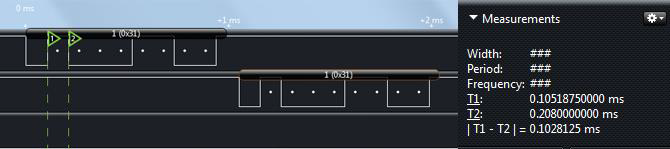
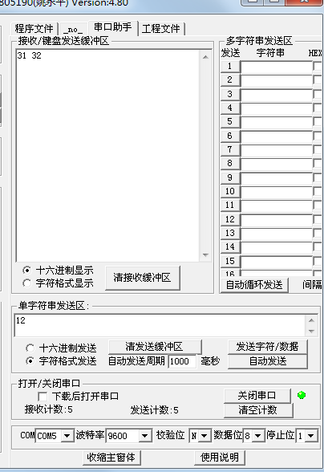
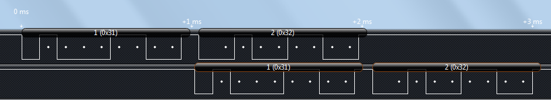

# 单片机通信实例与 ASCII 码

我们学习串口通信主要是要实现单片机和电脑之间的信息交互，可以用电脑控制单片机的一些信息，可以把单片机的一些信息状况发给电脑上的软件。下面我们就做一个简单的例程，实现单片机串口调试助手发送的数据，在我们开发板上的数码管上显示出来。

```
#include <reg52.h>

sbit ADDR3 = P1³;
sbit ENLED = P1⁴;

unsigned char code LedChar[] = { //数码管显示字符转换表
    0xC0, 0xF9, 0xA4, 0xB0, 0x99, 0x92, 0x82, 0xF8,
    0x80, 0x90, 0x88, 0x83, 0xC6, 0xA1, 0x86, 0x8E
};
unsigned char LedBuff[7] = { //数码管+独立 LED 显示缓冲区
    0xFF, 0xFF, 0xFF, 0xFF, 0xFF, 0xFF, 0xFF
};
unsigned char T0RH = 0; //T0 重载值的高字节
unsigned char T0RL = 0; //T0 重载值的低字节
unsigned char RxdByte = 0; //串口接收到的字节
void ConfigTimer0(unsigned int ms);
void ConfigUART(unsigned int baud);
void main(){
    EA = 1; //使能总中断
    ENLED = 0; //选择数码管和独立 LED
    ADDR3 = 1;
    ConfigTimer0(1); //配置 T0 定时 1ms
    ConfigUART(9600); //配置波特率为 9600
    while (1){ //将接收字节在数码管上以十六进制形式显示出来
        LedBuff[0] = LedChar[RxdByte & 0x0F];
        LedBuff[1] = LedChar[RxdByte >> 4];
    }
}
/* 配置并启动 T0，ms-T0 定时时间 */
void ConfigTimer0(unsigned int ms){
    unsigned long tmp; //临时变量
    tmp = 11059200 / 12; //定时器计数频率
    tmp = (tmp * ms) / 1000; //计算所需的计数值
    tmp = 65536 - tmp; //计算定时器重载值
    tmp = tmp + 13; //补偿中断响应延时造成的误差
    T0RH = (unsigned char)(tmp>>8); //定时器重载值拆分为高低字节
    T0RL = (unsigned char)tmp;
    TMOD &= 0xF0; //清零 T0 的控制位
    TMOD |= 0x01; //配置 T0 为模式 1
    TH0 = T0RH; //加载 T0 重载值
    TL0 = T0RL;
    ET0 = 1; //使能 T0 中断
    TR0 = 1; //启动 T0
}
/* 串口配置函数，baud-通信波特率 */
void ConfigUART(unsigned int baud){
    SCON = 0x50; //配置串口为模式 1
    TMOD &= 0x0F; //清零 T1 的控制位
    TMOD |= 0x20; //配置 T1 为模式 2
    TH1 = 256 - (11059200/12/32)/baud; //计算 T1 重载值
    TL1 = TH1; //初值等于重载值
    ET1 = 0; //禁止 T1 中断
    ES = 1; //使能串口中断
    TR1 = 1; //启动 T1
}
/* LED 动态扫描刷新函数，需在定时中断中调用 */
void LedScan(){
    static unsigned char i = 0; //动态扫描索引
    P0 = 0xFF; //关闭所有段选位，显示消隐
    P1 = (P1 & 0xF8) | i; //位选索引值赋值到 P1 口低 3 位
    P0 = LedBuff[i]; //缓冲区中索引位置的数据送到 P0 口
    if (i < 6){ //索引递增循环，遍历整个缓冲区
        i++;
    }else{
        i = 0;
    }
}
/* T0 中断服务函数，完成 LED 扫描 */
void InterruptTimer0() interrupt 1{
    TH0 = T0RH; //重新加载重载值
    TL0 = T0RL;
    LedScan(); //LED 扫描显示
}
/* UART 中断服务函数 */
void InterruptUART() interrupt 4{
    if (RI){ //接收到字节
        RI = 0; //手动清零接收中断标志位
        RxdByte = SBUF; //接收到的数据保存到接收字节变量中
        //接收到的数据又直接发回，叫作-"echo"，
        //用以提示用户输入的信息是否已正确接收
        SBUF = RxdByte;
    }
    if (TI){ //字节发送完毕
        TI = 0; //手动清零发送中断标志位
    }
}
```

大家在做这个实验的时候，有个小问题要注意一下。因为 STC89C52 下载程序是使用了 UART 串口下载，下载完程序后，程序运行起来了，可是下载软件最后还会通过串口发送一些额外的数据，所以程序刚下载进去不是显示 00，而可能是其他数据。大家只要把电源开关关闭，重新打开一次就好了。

细心的同学可能会发现，在串口调试助手发送选项和接收选项处，还有个“字符格式发送”和“字符格式显示”，这是什么意思呢？

先抛开我们使用的汉字不谈，那么我们常用的字符就包含了 0~9 的数字、A~Z/a~z 的字母、还有各种标点符号等。那么在单片机系统里面我们怎么来表示它们呢？ ASCII 码（American Standard Code for Information Interchange，即美国信息互换标准代码）可以完成这个使命：我们知道，在单片机中一个字节的数据可以有 0～255 共 256 个值，我们取其中的 0～127 共 128 个值赋予了它另外一层涵义，即让它们分别来代表一个常用字符，其具体的对应关系如表 11-3 所示。

表 11-3 ASCII 码字符表

| ASC | 控制 | ASCII | 字符 | ASCII | 字符 | ASCII | 字符 |
| 000 值 | NUL 字符 | 032 值 | (space) | 064 值 | @ | 096 值 | ‟ |
| 001 | SOH | 033 | ! | 065 | A | 097 | a |
| 002 | STX | 034 | " | 066 | B | 098 | b |
| 003 | ETX | 035 | # | 067 | C | 099 | c |
| 004 | EOT | 036 | $ | 068 | D | 100 | d |
| 005 | END | 037 | % | 069 | E | 101 | e |
| 006 | ACK | 038 | & | 070 | F | 102 | f |
| 007 | BEL | 039 | ' | 071 | G | 103 | g |
| 008 | BS | 040 | ( | 072 | H | 104 | h |
| 009 | HT | 041 | ) | 073 | I | 105 | i |
| 010 | LF | 042 | * | 074 | J | 106 | j |
| 011 | VT | 043 | + | 075 | K | 107 | k |
| 012 | FF | 044 | ， | 076 | L | 108 | l |
| 013 | CR | 045 | - | 077 | M | 109 | m |
| 014 | SO | 046 | ． | 078 | N | 110 | n |
| 015 | SI | 047 | / | 079 | O | 111 | o |
| 016 | DLE | 048 | 0 | 080 | P | 112 | p |
| 017 | DC1 | 049 | 1 | 081 | Q | 113 | q |
| 018 | DC2 | 050 | 2 | 082 | R | 114 | r |
| 019 | DC3 | 051 | 3 | 083 | S | 115 | s |
| 020 | DC4 | 052 | 4 | 084 | T | 116 | t |
| 021 | NAK | 053 | 5 | 085 | U | 117 | u |
| 022 | SYN | 054 | 6 | 086 | V | 118 | v |
| 023 | ETB | 055 | 7 | 087 | W | 119 | w |
| 024 | CAN | 056 | 8 | 088 | X | 120 | x |
| 025 | EM | 057 | 9 | 089 | Y | 121 | y |
| 026 | SUB | 058 | : | 090 | Z | 122 | z |
| 027 | ESC | 059 | ; | 091 | [ | 123 | { |
| 028 | FS | 060 | < | 092 | \ | 124 | ¦ |
| 029 | GS | 061 | = | 093 | ] | 125 | } |
| 030 | RS | 062 | > | 094 | ^ | 126 | ~ |
| 031 | US | 063 | ? | 095 | _ | 127 | DEL |

这样我们就在常用字符和字节数据之间建立了一一对应的关系，那么现在一个字节就既可以代表一个整数又可以代表一个字符了，但它本质上只是一个字节的数据，而我们赋予了它不同的涵义，什么时候赋予它哪种涵义就看编程者的意图了。ASCII 码在单片机系统中应用非常广泛，我们后续的课程也会经常使用到它，下面我们来对它做一个直观的认识，同学们一定要深刻理解其本质。

对照上述表格，我们就可以实现字符和数字之间的转换了，比如还是这个程序，我们发送的时候改成字符格式发送，接收还是用十六进制接收，这样接收和数码管好做一下对比。

我们用字符格式发送一个小写的 a，返回一个十六进制的 0x61，数码管上显示的也是 61，ASCII 码表里字符 a 对应十进制是 97，等于十六进制的 0x61；我们再用字符格式发送一个数字 1，返回一个十六进制的 0x31，数码管上显示的也是 31，ASCII 表里字符 1 对应的十进制是 49，等于十六进制的 0x31。这下大家就该清楚了：所谓的十六进制发送和十六进制接收，都是按字节数据的真实值进行的；而字符格式发送和字符格式接收，是按 ASCII 码表中字符形式进行的，但它实际上最终传输的还是一个字节数据。这个表格，当然不需要大家去记住，理解它，用的时候过来查就行了。

通信的学习，不像前边控制部分那么直观了，通信部分我们的程序只能获得一个结果，而其过程我们却无法直接看到，所以慢慢的可能大家就会知道有示波器和逻辑分析仪这类测量仪器。如果学校实验室或者公司里有示波器或者逻辑分析仪这类仪器，可以拿过来抓一下串口波形，直观的了解一下。如果暂时还没有这些仪器，先知道这么回事，有条件再说。因为工具类设备有的比较昂贵，有条件可以尽量使用学校或者公司的。在这里我用一款简易的逻辑分析仪把串口通信的波形抓出来给大家看一下，大家了解一下即可，如图 11-7 所示。



图 11-7  逻辑分析仪串口数据示意图

分析仪和示波器的作用，就是把通信过程的波形抓出来进行分析。先大概说一下波形的意思。波形左边是低位，右边是高位，上边这个波形是电脑发送给单片机的，下边这个波形是单片机回发给电脑的。以上边的波形为例，左边第一位是起始位 0，从低位到高位依次是 10001100，顺序倒一下，就是数据 0x31，也就是 ASCII 码表里的‘1’。大家可以注意到分析仪在每个数据位都给标了一个白色的点，表示是数据，起始位和无数据的时候都没有这个白点。时间标 T1 和 T2 的差值在右边显示出来是 0.102ms，大概是 9600 分之一，稍微有点偏差，在容许范围内即可。通过图 11-7，我们可以清晰的了解了串口通信的收发的详细过程。

那我们这里再来了解一下，如果我们使用串口调试助手，用字符格式直接发送一个“12”，我们在我们的数码管上应该显示什么呢？串口调试助手应该返回什么呢？经过试验发现，我们数码管显示的是 32，而串口调试助手返回十六进制显示的是 31、32 两个数据，如图 11-8 所示。



图 11-8  串口调试助手数据显示

我们再用逻辑分析仪把这个数据抓出来看一下，如图 11-9 所示。



图 11-9  逻辑分析仪抓取数据

对于 ASCII 码表来说，数字本身是字符而非数据，所以如果发送“12”的话，实际上是是分别发送了“1”和“2”两个字符，单片机呢，先收到第一个字符“1”，在数码管上会显示出 31 这个对应数字，但是马上就又收到了“2”这个字符，数码管瞬间从 31 变成了 32，而我们视觉上呢，是没有办法发现这种快速变化的，所以我们感觉数码管直接显示的是 32。