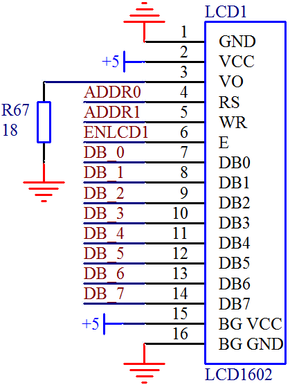

# 一千六百零二、液晶介绍(电路和引脚图)

前边我们讲的流水灯、数码管、LED 点阵这三种都是 LED 设备，这节课我们来学习一下 LCD 显示设备——1602 液晶。那个大大的，平时第一行显示 16 个小黑块，第二行什么都不显示的东西就是 1602 液晶，是不是早就注意到它了呢？

大家学习这些电子器件，头脑中要逐渐形成一种意识，不管是我们的单片机，还是 74HC138，甚至三极管等等，都是有数据手册的。不管是设计电路还是编写程序，器件的数据手册是我们最好的参考资料，那我们今天来学习 1602，首先就要看它的数据手册。手册大家可以在网上找到，这里我讲的时候只挑手册的重点讲。

首先我们来看一个主要技术参数表格，如表 12-3 所示。

表 12-3 1602 液晶主要技术参数

| 显示容量 | 16 x 2 个字符 |
| 芯片工作电压 | 4.5~5.5V |
| 工作电流 | 2.0mA(5.0V) |
| 模块最佳工作电压 | 5.0V |
| 字符尺寸 | 2.95 x 4.35mm (宽乘高) |

1602 液晶，从它的名字我们就可以看出它的显示容量，就是可以显示 2 行，每行 16 个字符的液晶。它的工作电压是 4.5V～5.5V，对于这点我们设计电路的时候，直接按照 5V 系统设计，但是保证我们的 5V 系统最低不能低于 4.5V。在 5V 工作电压下测量它的工作电流是 2mA，大家注意，这个 2mA 仅仅是指液晶，而它的黄绿背光都是用 LED 做的，所以功耗不会太小的，一二十毫安还是有的。

1602 液晶一共 16 个引脚，每个引脚的功能，我们都可以在它的数据手册上获得。而这些基本的信息，在我们设计电路和编写代码之前，必须先看明白，如表 12-4 所示。

表 12-4 1602 液晶引脚功能

| 编号 | 符号 | 引脚说明 | 编号 | 符号 | 引脚说明 |
| 1 | VSS | 电源地 | 9 | D2 | Data  I/O |
| 2 | VDD | 电源正极 | 10 | D3 | Data  I/O |
| 3 | VL | 液晶显示偏压信号 | 11 | D4 | Data  I/O |
| 4 | RS | 数据/命令选择端(H/L) | 12 | D5 | Data  I/O |
| 5 | R/W | 读/写选择端(H/L) | 13 | D6 | Data  I/O |
| 6 | E | 使能信号 | 14 | D7 | Data  I/O |
| 7 | D0 | Data  I/O | 15 | BLA | 背光源正极 |
| 8 | D1 | Data  I/O | 16 | BLK | 背光源负极 |

液晶的电源 1 脚 2 脚以及背光电源 15 脚 16 脚，不用多说，正常接就可以了。

3 脚叫做液晶显示偏压信号，大家注意到小黑块没有，当我们要显示一个字符的时候，有的黑点显示，有的黑点就不能显示，这样就可以实现我们想要的字符了。我们这个 3 脚就是用来调整显示的黑点和不显示的之间的对比度，调整好了对比度，就可以让我们的显示更加清晰一些。在进行电路设计实验的时候，通常的办法是在这个引脚上接个电位器，也就是我们初中学过的滑动变阻器。通过调整电位器的分压值，来调整 3 脚的电压。而当产品批量生产的时候，我们可以把我们调整好的这个值直接用简单电路来实现，就如同在我们板子上，我们直接使用的是一个 18 欧的下拉电阻，市面上有的 1602 的下拉电阻大概 1 到 1.5K 也是比较合适的值。

4 脚是数据命令选择端。对于液晶，有时候我们要发送一些命令，让它实现我们想要的一些状态，有时候我们要发给它一些数据，让它显示出来，液晶就通过这个引脚来判断接收到的是命令还是数据，这个引脚我们接到了 ADDR0 上，通过跳线帽和 P1.0 连接在一起。大家注意学会读手册，看到这个引脚描述里：数据/命令选择端，而后跟了括号(H/L)，他的意思就是当这个引脚是 H(High)高电平的时候，是数据，当这个引脚是 L(Low)低电平的时候，是命令。

5 脚和 4 脚用法类似，功能是读写选择端。我们既可以写给液晶数据或者命令，也可以读取液晶内部的数据或状态，就是控制这个引脚。因为液晶本身内部有 RAM，实际上我们送给液晶的命令或者数据，液晶需要先保存在缓存里，然后再写到内部的寄存器或者 RAM 中，这个就需要一定的时间。所以我们进行读写操作之前，首先要读一下液晶当前状态，是不是在“忙”，如果不忙，我们可以读写数据，如果在“忙”，我们就需要等待液晶忙完了，再进行操作。读状态是常用的，不过读液晶数据我接触的场合没怎么用过，大家了解这个功能即可。这个引脚我们接到了 ADDR1 上，通过跳线帽和 P1.1 连接在一起。

6 脚是使能信号，很关键，液晶的读写命令和数据，都要靠它才能正常读写，我们后边详细讲这个引脚怎么用。这个引脚我们通过跳线帽接到了 ENLCD 上，这个位置的跳线是为了和另外一个 12864 液晶的切换使用而设计的。

7 到 14 引脚就是 8 个数据引脚了，我们就是通过这 8 个引脚读写数据和命令的。我们统一接到了 P0 口上。来看一下开发板上的 1602 接口的原理图，如图 12-1 所示。

图 12-1  1602 液晶接口原理图