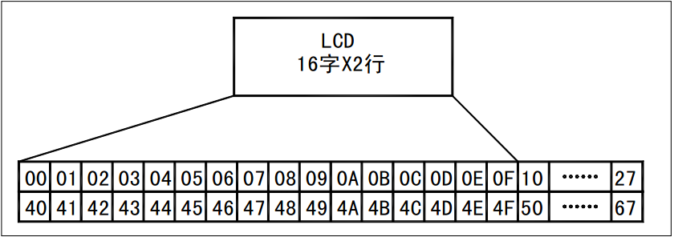

# 一千六百零二、液晶的读写时序介绍

1602 液晶内部带了 80 个字节的显示 RAM，用来存储我们发送的数据，它的结构如图 12-2 所示。

图 12-2  1602 内部 RAM 结构

第一行的地址是 0x00H 到 0x27，第二行的地址从 0x40 到 0x67，其中第一行 0x00 到 0x0F 是与液晶上第一行 16 个字符显示位置相对应的，第二行 0x40 到 0x4F 是与第二行 16 个字符显示位置相对应的。而每行都多出来一部分，是为了显示移动字幕设置的。1602 字符液晶是显示字符的，因此它跟 ASCII 字符表是对应的。比如我们给 0x00 这个地址写一个„a‟，也就是十进制的 97，液晶的最左上方的那个小块就会显示一个字母 a。此外，我们本章学过指针了，液晶内部有个数据指针，它指向哪里，我们写的那个数据就会送到相应的那个地址里。

液晶有一个状态字字节，我们通过读取这个状态字的内容，就可以知道 1602 液晶的一些内部情况，如表 12-5 所示。

表 12-5 1602 液晶状态字

| bit0~bit6 | 当前数据的指针的值 |
| bit7 | 读写操作使能 | 1：禁止   0：允许 |

这个状态字节有 8 个位，最高位表示了当前液晶是不是“忙”，如果这个位是 1 表示液晶正“忙”，禁止我们读写数据或者命令，如果是 0，则可以进行读写。而低 7 位就表示了当前数据地址指针的位置。

1602 的基本操作时序，一共有 4 个，这些大家都不需要记住，但是都需要理解，因为我们现在不是为了应付考试，所以不需要你把手册背熟，但是你写程序的时候，打开手册要能看懂如何操作，还要再提醒一句，单片机读外部状态前，必须先保证自己是高电平哦。

我们这里要做 1602 液晶的程序，因此先把用到的总线接口做一个统一声明：

```
#define LCD1602_DB P0
sbit LCD1602_RS = P1⁰;
sbit LCD1602_RW = P1¹;
sbit LCD1602_E = P1⁵;
```

1、读状态：RS=L，R/W=H，E=H。这是个很简单的逻辑，就是说，我们直接写

```
LCD1602_DB = 0xFF;
LCD1602_RS = 0;
LCD1602_RW = 1;
LCD1602_E = 1;
sta = LCD1602_DB;
```

这样就把当前液晶的状态字读到了 sta 这个变量中，我们可以通过判断 sta 最高位的值来了解当前液晶是否处于“忙”状态，也可以得知当前数据的指针位置。两个问题，一是如果我们当前读到的状态是“不忙”，那么我们程序可以进行读写操作，如果当前状态是“忙”，那么我们还得继续等待重新判断液晶的状态；问题二，大家可以看我们的原理图，流水灯、数码管、点阵、1602 液晶都用到了 P0 口总线，我们读完了液晶状态继续保持 LCD1602_E 是高电平的话，1602 液晶会继续输出它的状态值，输出的这个值会占据了 P0 总线，干扰到流水灯数码管等其它外设，所以我们读完了状态，通常要把这个引脚拉低来释放总线，这里我们用了一个 do...while 循环语句来实现。

```
LCD1602_DB = 0xFF;
LCD1602_RS = 0;
LCD1602_RW = 1;
do {
    LCD1602_E = 1;
    sta = LCD1602_DB; //读取状态字
    LCD1602_E = 0;  //读完撤销使能，防止液晶输出数据干扰 P0 总线
} while (sta & 0x80);
//bit7 等于 1 表示液晶正忙，重复检测直到其等于 0 为止
```

2、读数据：RS=H，R/W=L，E=H。这个逻辑也很简单，但是读数据不常用，大家了解一下就可以了，这里就不详细解释了。

3、写指令：RS=L，R/W=L，D0~D7=指令码，E=高脉冲。

这个在逻辑上没什么难的，只是 E=高脉冲这个问题要解释一下。这个指令一共有 4 条语句，其中前三条语句顺序无所谓，但是 E=高脉冲这一句很关键。实际上流程是这样的：因为我们现在是写数据，所以我们首先要保证我们的 E 引脚是低电平状态，而前三句不管我们怎么写，1602 液晶只要没有接收到 E 引脚的使能控制，它都不会来读总线上的信号的。当通过前三句准备好数据之后，E 使能引脚从低电平到高电平变化，然后 E 使能引脚再从高电平到低电平出现一个下降沿，1602 液晶内部一旦检测到这个下降沿后，并且检测到 RS=L，R/W=L，就马上来读取 D0~D7 的数据，完成单片机写 1602 指令过程。归纳总结我们写了个 E=高脉冲，意思就是：E 使能引脚先从低拉高，再从高拉低，形成一个高脉冲。

4、写数据：RS=H，R/W=L，D0~D7=数据，E=高脉冲。

写数据和写指令是类似的，就是把 RS 改成 H，把总线改成数据即可。

此外要顺便提一句，这里用的 1602 液晶所使用的接口时序是摩托罗拉公司所创立的 6800 时序，还有另外一种时序是 Intel 公司的 8080 时序，也有部分液晶模块采用，只是相对来说比较少见，大家知道这么回事即可。

这里还要说明一个问题，就是从这 4 个时序大家可以看出来，1602 液晶的使能引脚 E，高电平的时候是有效，低电平的时候是无效，前面也提到了高电平时会影响 P0 口，因此正常情况下，如果我们没有使用液晶的话，那么程序开始写一句 LCD1602_E=0，就可以避免 1602 干扰到其它外设。我们之前的程序没有加这句，是因为我们板子在这个引脚上加了一个 15K 的下拉电阻，这个下拉电阻就可以保证这个引脚上电后默认是低电平，如图 12-3 所示。


图 12-3  液晶使能引脚的下拉电阻

如果不加这个下拉电阻，刚开始讲点亮 LED 小灯的时候，我们就得写一句：LCD1602_E=0，可能很多初学者容易弄不明白，所以我们才加了这样一个电路。但是在实际开发过程中，就不必要这样了。如果这是个实际产品，能用软件去处理的，我们就不会用硬件去实现，所以大家在做实际产品的时候，这块电路可以直接去掉，只需要在程序开头多加一条语句即可。