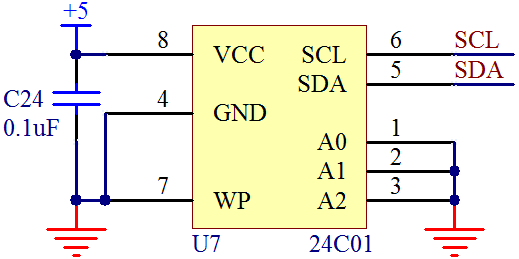

# 单片机 I2C 寻址模式

上一节介绍的是 I²C 每一位信号的时序流程，而 I²C 通信在字节级的传输中，也有固定的时序要求。I²C 通信的起始信号(Start)后，首先要发送一个从机的地址，这个地址一共有 7 位，紧跟着的第 8 位是数据方向位(R/W)，“0”表示接下来要发送数据（写），‘“1”表示接下来是请求数据（读）。

我们知道，打电话的时候，当拨通电话，接听方捡起电话肯定要回一个“喂”，这就是告诉拨电话的人，这边有人了。同理，这个第九位 ACK 实际上起到的就是这样一个作用。当我们发送完了这 7 位地址和 1 位方向后，如果发送的这个地址确实存在，那么这个地址的器件应该回应一个 ACK（拉低 SDA 即输出“0”），如果不存在，就没“人”回应 ACK（SDA 将保持高电平即“1”）。

那我们写一个简单的程序，访问一下我们板子上的 EEPROM 的地址，另外再写一个不存在的地址，看看它们是否能回一个 ACK，来了解和确认一下这个问题。

我们板子上的 EEPROM 器件型号是 24C02，在 24C02 的数据手册 3.6 节中可查到，24C02 的 7 位地址中，其中高 4 位是固定的 0b1010，而低 3 位的地址取决于具体电路的设计,由芯片上的 A2、A1、A0 这 3 个引脚的实际电平决定，来看一下我们的 24C02 的电路图，它和 24C01 的原理图完全一样，如图 14-4 所示。



图 14-4   24C02 原理图

从图 14-4 可以看出来，我们的 A2、A1、A0 都是接的 GND，也就是说都是 0，因此 24C02 的 7 位地址实际上是二进制的 0b1010000，也就是 0x50。我们用 I²C 的协议来寻址 0x50，另外再寻址一个不存在的地址 0x62，寻址完毕后，把返回的 ACK 显示到我们的 1602 液晶上，大家对比一下。

```
/***************************Lcd1602.c 文件程序源代码*****************************/
#include <reg52.h>
#define LCD1602_DB P0
sbit LCD1602_RS = P1⁰;
sbit LCD1602_RW = P1¹;
sbit LCD1602_E = P1⁵;

/* 等待液晶准备好 */
void LcdWaitReady(){
    unsigned char sta;
    LCD1602_DB = 0xFF;
    LCD1602_RS = 0;
    LCD1602_RW = 1;
    do {
        LCD1602_E = 1;
        sta = LCD1602_DB; //读取状态字
        LCD1602_E = 0;
    } while (sta & 0x80); //bit7 等于 1 表示液晶正忙，重复检测直到其等于 0 为止
}
/* 向 LCD1602 液晶写入一字节命令，cmd-待写入命令值 */
void LcdWriteCmd(unsigned char cmd){
    LcdWaitReady();
    LCD1602_RS = 0;
    LCD1602_RW = 0;
    LCD1602_DB = cmd;
    LCD1602_E = 1;
    LCD1602_E = 0;
}
/* 向 LCD1602 液晶写入一字节数据，dat-待写入数据值 */
void LcdWriteDat(unsigned char dat){
    LcdWaitReady();
    LCD1602_RS = 1;
    LCD1602_RW = 0;
    LCD1602_DB = dat;
    LCD1602_E = 1;
    LCD1602_E = 0;
}
/* 设置显示 RAM 起始地址，亦即光标位置，(x,y)-对应屏幕上的字符坐标 */
void LcdSetCursor(unsigned char x, unsigned char y){
    unsigned char addr;
    if (y == 0){ //由输入的屏幕坐标计算显示 RAM 的地址
        addr = 0x00 + x; //第一行字符地址从 0x00 起始
    }else{
        addr = 0x40 + x; //第二行字符地址从 0x40 起始
    }
    LcdWriteCmd(addr | 0x80); //设置 RAM 地址
}
/* 在液晶上显示字符串，(x,y)-对应屏幕上的起始坐标，str-字符串指针 */
void LcdShowStr(unsigned char x, unsigned char y, unsigned char *str){
    LcdSetCursor(x, y);//设置起始地址
    while (*str != '\0'){ //连续写入字符串数据，直到检测到结束符
        LcdWriteDat(*str++);
    }
}
/* 初始化 1602 液晶 */
void InitLcd1602(){
    LcdWriteCmd(0x38); //16*2 显示，5*7 点阵，8 位数据接口
    LcdWriteCmd(0x0C); //显示器开，光标关闭
    LcdWriteCmd(0x06); //文字不动，地址自动+1
    LcdWriteCmd(0x01); //清屏
}
```

```
/*****************************main.c 文件程序源代码******************************/
#include <reg52.h>
#include <intrins.h>
#define I2CDelay() {_nop_();_nop_();_nop_();_nop_();}
sbit I2C_SCL = P3⁷;
sbit I2C_SDA = P3⁶;
bit I2CAddressing(unsigned char addr);
extern void InitLcd1602();
extern void LcdShowStr(unsigned char x, unsigned char y, unsigned char *str);

void main(){
    bit ack;
    unsigned char str[10];
    InitLcd1602(); //初始化液晶
    ack = I2CAddressing(0x50); //查询地址为 0x50 的器件
    str[0] = '5'; //将地址和应答值转换为字符串
    str[1] = '0';
    str[2] = ':';
    str[3] = (unsigned char)ack + '0';
    str[4] = '\0';
    LcdShowStr(0, 0, str); //显示到液晶上
    ack = I2CAddressing(0x62); //查询地址为 0x62 的器件
    str[0] = '6'; //将地址和应答值转换为字符串
    str[1] = '2';
    str[2] = ':';
    str[3] = (unsigned char)ack + '0';
    str[4] = '\0';
    LcdShowStr(8, 0, str); //显示到液晶上
    while (1);
}
/* 产生总线起始信号 */
void I2CStart(){
    I2C_SDA = 1; //首先确保 SDA、SCL 都是高电平
    I2C_SCL = 1;
    I2CDelay();
    I2C_SDA = 0; //先拉低 SDA
    I2CDelay();
    I2C_SCL = 0; //再拉低 SCL
}
/* 产生总线停止信号 */
void I2CStop(){
    I2C_SCL = 0; //首先确保 SDA、SCL 都是低电平
    I2C_SDA = 0;
    I2CDelay();
    I2C_SCL = 1; //先拉高 SCL
    I2CDelay();
    I2C_SDA = 1; //再拉高 SDA
    I2CDelay();
}
/* I2C 总线写操作，dat-待写入字节，返回值-从机应答位的值 */
bit I2CWrite(unsigned char dat){
    bit ack; //用于暂存应答位的值
    unsigned char mask; //用于探测字节内某一位值的掩码变量

    for (mask=0x80; mask!=0; mask>>=1){ //从高位到低位依次进行
        if ((mask&dat) == 0){ //该位的值输出到 SDA 上
            I2C_SDA = 0;
        }else{
            I2C_SDA = 1;
        }
        I2CDelay();
    }
    I2C_SCL = 1; //拉高 SCL
    I2CDelay();
    I2C_SCL = 0; //再拉低 SCL，完成一个位周期
    I2C_SDA = 1; //8 位数据发送完后，主机释放 SDA，以检测从机应答
    I2CDelay();
    I2C_SCL = 1; //拉高 SCL
    ack = I2C_SDA; //读取此时的 SDA 值，即为从机的应答值
    I2CDelay();
    I2C_SCL = 0; //再拉低 SCL 完成应答位，并保持住总线
    return ack; //返回从机应答值
}
/* I2C 寻址函数，即检查地址为 addr 的器件是否存在，返回值-从器件应答值 */
bit I2CAddressing(unsigned char addr){
    bit ack;
    I2CStart(); //产生起始位，即启动一次总线操作
    //器件地址需左移一位，因寻址命令的最低位
    //为读写位，用于表示之后的操作是读或写
    ack = I2CWrite(addr<<1);
    I2CStop(); //不需进行后续读写，而直接停止本次总线操作
    return ack;
}
```

我们把这个程序在 KST-51 开发板上运行完毕，会在液晶上边显示出来我们预想的结果，主机发送一个存在的从机地址，从机会回复一个应答位，即应答位为 0；主机如果发送一个不存在的从机地址，就没有从机应答，即应答位为 1。

前面的章节中已经提到利用库函数 _nop_()可以进行精确延时，一个 _nop_()的时间就是一个机器周期，这个库函数包含在 intrins.h 这个文件中，如果要使用这个库函数，只需要在程序最开始，和包含 reg52.h 一样，include<intrins.h>之后，程序中就可以使用这个库函数了。

还有一点要提一下，I²C 通信分为低速模式 100kbit/s、快速模式 400kbit/s 和高速模式 3.4Mbit/s。因为所有的 I²C 器件都支持低速，但却未必支持另外两种速度，所以作为通用的 I²C 程序我们选择 100k 这个速率来实现，也就是说实际程序产生的时序必须小于等于 100k 的时序参数，很明显也就是要求 SCL 的高低电平持续时间都不短于 5us，因此我们在时序函数中通过插入 I2CDelay()这个总线延时函数（它实际上就是 4 个 NOP 指令，用 define 在文件开头做了定义），加上改变 SCL 值语句本身占用的至少一个周期，来达到这个速度限制。如果以后需要提高速度，那么只需要减小这里的总线延时时间即可。

此外我们要学习一个发送数据的技巧，就是 I²C 通信时如何将一个字节的数据发送出去。大家注意函数 I2CWrite 中，用的那个 for 循环的技巧。for (mask=0x80; mask!=0; mask>>=1)，由于 I²C 通信是从高位开始发送数据，所以我们先从最高位开始，0x80 和 dat 进行按位与运算，从而得知 dat 第 7 位是 0 还是 1，然后右移一位，也就是变成了用 0x40 和 dat 按位与运算，得到第 6 位是 0 还是 1，一直到第 0 位结束，最终通过 if 语句，把 dat 的 8 位数据依次发送了出去。其它的逻辑大家对照前边讲到的理论知识，认真研究明白就可以了。