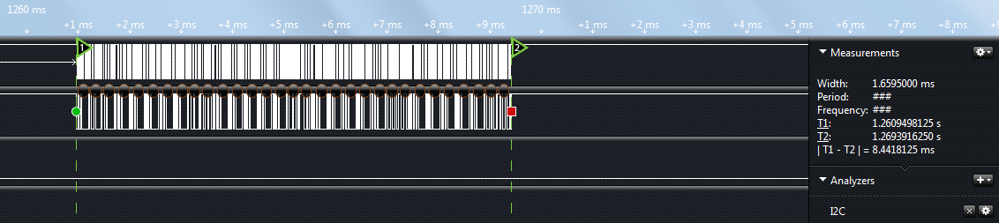
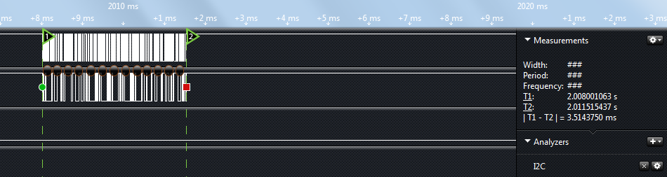

# 单片机 EEPROM 的页写入

在向 EEPROM 连续写入多个字节的数据时，如果每写一个字节都要等待几 ms 的话，整体上的写入效率就太低了。因此 EEPROM 的厂商就想了一个办法，把 EEPROM 分页管理。24C01、24C02 这两个型号是 8 个字节一个页，而 24C04、24C08、24C16 是 16 个字节一页。我们开发板上用的型号是 24C02，一共是 256 个字节，8 个字节一页，那么就一共有 32 页。

分配好页之后，如果我们在同一个页内连续写入几个字节后，最后再发送停止位的时序。EEPROM 检测到这个停止位后，就会一次性把这一页的数据写到非易失区域，就不需要像上节课那样写一个字节检测一次了，并且页写入的时间也不会超过 5ms。如果我们写入的数据跨页了，那么写完了一页之后，我们要发送一个停止位，然后等待并且检测 EEPROM 的空闲模式，一直等到把上一页数据完全写到非易失区域后，再进行下一页的写入，这样就可以在很大程度上提高数据的写入效率。

/*****************************I2C.c 文件程序源代码*******************************/

（此处省略，可参考之前章节的代码）

/***************************Lcd1602.c 文件程序源代码*****************************/

（此处省略，可参考之前章节的代码）

```
/****************************eeprom.c 文件程序源代码*****************************/
#include <reg52.h>

extern void I2CStart();
extern void I2CStop();
extern unsigned char I2CReadACK();
extern unsigned char I2CReadNAK();
extern bit I2CWrite(unsigned char dat);

/* E2 读取函数，buf-数据接收指针，addr-E2 中的起始地址，len-读取长度 */
void E2Read(unsigned char *buf, unsigned char addr, unsigned char len){
do { //用寻址操作查询当前是否可进行读写操作
    I2CStart();
    if (I2CWrite(0x50<<1)){ //应答则跳出循环，非应答则进行下一次查询
        break;
    }
    I2CStop();
}while(1);

    I2CWrite(addr); //写入起始地址
    I2CStart();//发送重复启动信号
    I2CWrite((0x50<<1)|0x01); //寻址器件，后续为读操作
    while (len > 1){//连续读取 len-1 个字节
        *buf++ = I2CReadACK(); //最后字节之前为读取操作+应答
        len--;
    }
    *buf = I2CReadNAK(); //最后一个字节为读取操作+非应答
    I2CStop();
}
/* E2 写入函数，buf-源数据指针，addr-E2 中的起始地址，len-写入长度 */
void E2Write(unsigned char *buf, unsigned char addr, unsigned char len){
    while (len > 0){ //等待上次写入操作完成
        do { //用寻址操作查询当前是否可进行读写操作
            I2CStart();
            if (I2CWrite(0x50<<1)){ //应答则跳出循环，非应答则进行下一次查询
                break;
            }
            I2CStop();
        } while(1);
    //按页写模式连续写入字节

        I2CWrite(addr); //写入起始地址
        while (len > 0){
            I2CWrite(*buf++); //写入一个字节数据
            len--; //待写入长度计数递减
            addr++; //E2 地址递增
            //检查地址是否到达页边界，24C02 每页 8 字节，
            //所以检测低 3 位是否为零即可
            if ((addr&0x07) == 0){
                break; //到达页边界时，跳出循环，结束本次写操作
            }
        }
        I2CStop();
    }
}
```

遵循模块化的原则，我们把 EEPROM 的读写函数也单独写成一个 eeprom.c 文件。其中 E2Read 函数和上一节是一样的，因为读操作与分页无关。重点是 E2Write 函数，我们在写入数据的时候，要计算下一个要写的数据的地址是否是一个页的起始地址，如果是的话，则必须跳出循环，等待 EEPROM 把当前这一页写入到非易失区域后，再进行后续页的写入。

```
/*****************************main.c 文件程序源代码******************************/
#include <reg52.h>

extern void InitLcd1602();
extern void LcdShowStr(unsigned char x, unsigned char y, unsigned char *str);
extern void E2Read(unsigned char *buf, unsigned char addr, unsigned char len);
extern void E2Write(unsigned char *buf, unsigned char addr, unsigned char len);
void MemToStr(unsigned char *str, unsigned char *src, unsigned char len);

void main(){
    unsigned char i;
    unsigned char buf[5];
    unsigned char str[20];

    InitLcd1602(); //初始化液晶
    E2Read(buf, 0x8E, sizeof(buf)); //从 E2 中读取一段数据
    MemToStr(str, buf, sizeof(buf)); //转换为十六进制字符串
    LcdShowStr(0, 0, str); //显示到液晶上
    for (i=0; i<sizeof(buf); i++){ //数据依次+1,+2,+3...
        buf[i] = buf[i] + 1 + i;
    }
    E2Write(buf, 0x8E, sizeof(buf)); //再写回到 E2 中
    while(1);
}
/* 将一段内存数据转换为十六进制格式的字符串，
str-字符串指针，src-源数据地址，len-数据长度 */
void MemToStr(unsigned char *str, unsigned char *src, unsigned char len){
    unsigned char tmp;
    while (len--){
        tmp = *src >> 4; //先取高 4 位
        if (tmp <= 9){ //转换为 0-9 或 A-F
            *str++ = tmp + '0';
        }else{
            *str++ = tmp - 10 + 'A';
        }
        tmp = *src & 0x0F; //再取低 4 位
        if (tmp <= 9){  //转换为 0-9 或 A-F
            *str++ = tmp + '0';
        }else{
            *str++ = tmp - 10 + 'A';
        }
        *str++ = ' '; //转换完一个字节添加一个空格
        src++;
    }
}
```

多字节写入和页写入程序都编写出来了，而且页写入的程序我们还特地跨页写的数据，它们的写入时间到底差别多大呢。我们用一些工具可以测量一下，比如示波器，逻辑分析仪等工具。我现在把两次写入时间用逻辑分析仪给抓了出来，并且用时间标签 T1 和 T2 标注了开始位置和结束位置，如图 14-5 和图 14-6 所示，右侧显示的|T1-T2|就是最终写入 5 个字节所耗费的时间。多字节一个一个写入，每次写入后都需要再次通信检测 EEPROM 是否在“忙”，因此耗费了大量的时间，同样的写入 5 个字节的数据，一个一个写入用了 8.4ms 左右的时间，而使用页写入，只用了 3.5ms 左右的时间。

图 14-5  多字节写入时间



图 14-6  跨页写入时间