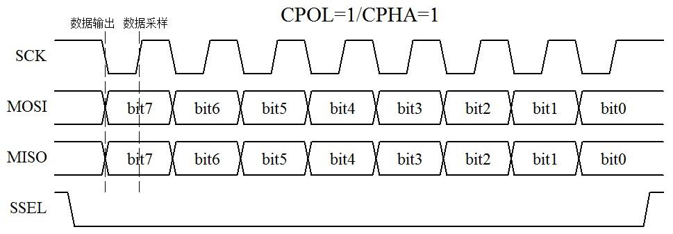
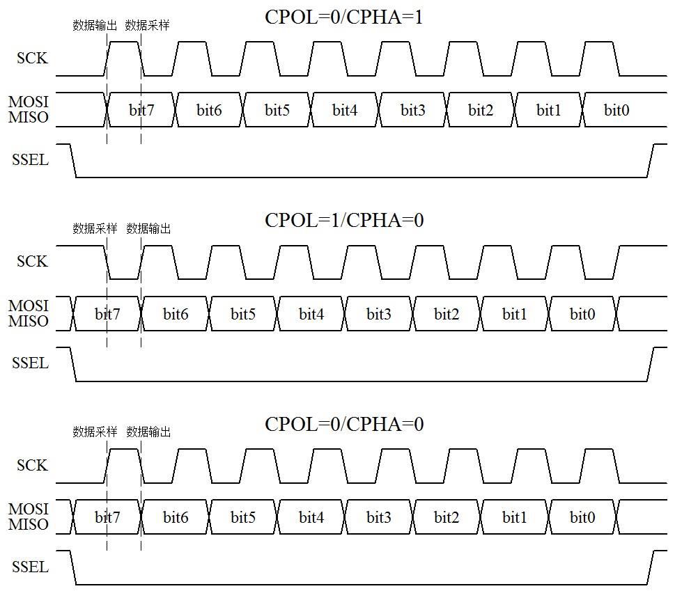

# 单片机 SPI 通信接口

UART、I²C 和 SPI 是单片机系统中最常用的三种通信协议。前边我们已经学了 UART 和 I²C 通信协议，这节课我们来学习剩下的 SPI 通信协议。

SPI 是英语 Serial Peripheral Interface 的缩写，顾名思义就是串行外围设备接口。SPI 是一种高速的、全双工、同步通信总线，标准的 SPI 也仅仅使用 4 个引脚，常用于单片机和 EEPROM、FLASH、实时时钟、数字信号处理器等器件的通信。SPI 通信原理比 I²C 要简单，它主要是主从方式通信，这种模式通常只有一个主机和一个或者多个从机，标准的 SPI 是 4 根线，分别是 SSEL（片选，也写作 SCS）、SCLK（时钟，也写作 SCK）、MOSI（主机输出从机输入 Master Output/Slave Input）和 MISO（主机输入从机输出 Master Input/Slave Output）。

SSEL：从设备片选使能信号。如果从设备是低电平使能的话，当拉低这个引脚后，从设备就会被选中，主机和这个被选中的从机进行通信。

SCLK：时钟信号，由主机产生，和 I²C 通信的 SCL 有点类似。

MOSI：主机给从机发送指令或者数据的通道。

MISO：主机读取从机的状态或者数据的通道。

在某些情况下，我们也可以用 3 根线的 SPI 或者 2 根线的 SPI 进行通信。比如主机只给从机发送命令，从机不需要回复数据的时候，那么 MISO 就可以不要；而在主机只读取从机的数据，不需要给从机发送指令的时候，那 MOSI 就可以不要；当一个主机一个从机的时候，从机的片选有时可以固定为有效电平而一直处于使能状态，那么 SSEL 就可以不要；此时如果再加上主机只给从机发送数据，那么 SSEL 和 MISO 都可以不要；如果主机只读取从机送来的数据，SSEL 和 MOSI 都可以不要。

3 线和 2 线的 SPI 大家要知道怎么回事，实际使用也是有应用的，但是当我们提及 SPI 的时候，一般都是指标准 SPI，都是指 4 根线的这种形式。

SPI 通信的主机也是我们的单片机，在读写数据时序的过程中，有四种模式，要了解这四种模式，首先我们得学习以下两个名词。

CPOL：Clock Polarity，就是时钟的极性。时钟的极性是什么概念呢？通信的整个过程分为空闲时刻和通信时刻，如果 SCLK 在数据发送之前和之后的空闲状态是高电平，那么就是 CPOL=1，如果空闲状态 SCLK 是低电平，那么就是 CPOL=0。

CPHA：Clock Phase，就是时钟的相位。

主机和从机要交换数据，就牵涉到一个问题，即主机在什么时刻输出数据到 MOSI 上而从机在什么时刻采样这个数据，或者从机在什么时刻输出数据到 MISO 上而主机什么时刻采样这个数据。同步通信的一个特点就是所有数据的变化和采样都是伴随着时钟沿进行的，也就是说数据总是在时钟的边沿附近变化或被采样。而一个时钟周期必定包含了一个上升沿和一个下降沿，这是周期的定义所决定的，只是这两个沿的先后并无规定。又因为数据从产生的时刻到它的稳定是需要一定时间的，那么，如果主机在上升沿输出数据到 MOSI 上，从机就只能在下降沿去采样这个数据了。反之如果一方在下降沿输出数据，那么另一方就必须在上升沿采样这个数据。

CPHA=1，就表示数据的输出是在一个时钟周期的第一个沿上，至于这个沿是上升沿还是下降沿，这要视 CPOL 的值而定，CPOL=1 那就是下降沿，反之就是上升沿。那么数据的采样自然就是在第二个沿上了。

CPHA=0，就表示数据的采样是在一个时钟周期的第一个沿上，同样它是什么沿由 CPOL 决定。那么数据的输出自然就在第二个沿上了。仔细想一下，这里会有一个问题：就是当一帧数据开始传输第一个 bit 时，在第一个时钟沿上就采样该数据了，那么它是在什么时候输出来的呢？有两种情况：一是 SSEL 使能的边沿，二是上一帧数据的最后一个时钟沿，有时两种情况还会同时生效。

我们以 CPOL=1/CPHA=1 为例，把时序图画出来给大家看一下，如图 15-1 所示。

图 15-1  SPI 通信时序图（一）

大家看图 15-1 所示，当数据未发送时以及发送完毕后，SCK 都是高电平，因此 CPOL=1。可以看出，在 SCK 第一个沿的时候，MOSI 和 MISO 会发生变化，同时 SCK 第二个沿的时候，数据是稳定的，此刻采样数据是合适的，也就是上升沿即一个时钟周期的后沿锁存读取数据，即 CPHA=1。注意最后最隐蔽的 SSEL 片选，这个引脚通常用来决定是哪个从机和主机进行通信。剩余的三种模式，我们把图画出来，简化起见把 MOSI 和 MISO 合在一起了，大家仔细对照看看研究一下，把所有的理论过程都弄清楚，有利于你对 SPI 通信的深刻理解，如图 15-2 所示。

图 15-2  SPI 通信时序图（二）

在时序上，SPI 是不是比 I²C 要简单的多？没有了起始、停止和应答，UART 和 SPI 在通信的时候，只负责通信，不管是否通信成功，而 I²C 却要通过应答信息来获取通信成功失败的信息，所以相对来说，UART 和 SPI 的时序都要比 I²C 简单一些。