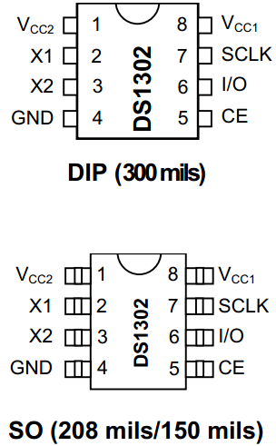

# 实时时钟芯片 DS1302 介绍

DS1302 是个实时时钟芯片，我们可以用单片机写入时间或者读取当前的时间数据，下面带着大家通过阅读这个芯片的数据手册来学习和掌握这个器件。

由于 IT 技术国际化比较强，因此数据手册绝大多数都是英文的，导致很多英语基础不好的同学看到英文手册头就大了。这里我要告诉大家的是，只要精神不退缩，方法总比困难多，很多英语水平不高的，看数据手册照样完全没问题，因为我们用到的专业词汇也就那么几个，多看几次就认识了。我们现在不是考试，因此大家可以充分利用一些英文翻译软件，翻译过来的中文意思有时候可能不是那么准确，那你就把翻译的内容和英文手册里的一些图表比较参考学习。此外数据手册除了介绍性的说明外，一般还会配相关的图形或者表格，结合起来看也有利于理解手册所表达的意思。这节课我会把 DS1302 的英文资料尽可能的用比较便于理解的方式给大家表达出来，同学们可以把我的表达和英文手册多做一下对比，尽可能快的开始学会了解英文手册。

## DS1302 的特点

DS1302 是 DALLAS（达拉斯）公司推出的一款涓流充电时钟芯片，2001 年 DALLAS 被 MAXIM（美信）收购，因此我们看到的 DS1302 的数据手册既有 DALLAS 的标志，又有 MAXIM 的标志，大家了解即可。

DS1302 实时时钟芯片广泛应用于电话、传真、便携式仪器等产品领域，它的主要性能指标如下：

1) DS1302 是一个实时时钟芯片，可以提供秒、分、小时、日期、月、年等信息，并且还有软件自动调整的能力，可以通过配置 AM/PM 来决定采用 24 小时格式还是 12 小时格式。

2) 拥有 31 字节数据存储 RAM。

3) 串行 I/O 通信方式，相对并行来说比较节省 IO 口的使用。

4) DS1302 的工作电压比较宽，在 2.0～5.5V 的范围内都可以正常工作。

5) DS1302 这种时钟芯片功耗一般都很低，它在工作电压 2.0V 的时候，工作电流小于 300nA。

6) DS1302 共有 8 个引脚，有两种封装形式，一种是 DIP-8 封装，芯片宽度（不含引脚）是 300mil，一种是 SOP-8 封装，有两种宽度，一种是 150mil，一种是 208mil。我们看一下 DS1302 的引脚封装图，如图 15-3 所示。

图 15-3  DS1302 封装图

所谓的 DIP(Dual In-line Package)封装，就是双列直插式封装技术，就如同我们开发板上的 STC89C52 单片机，就是个典型的 DIP 封装，当然这个 STC89C52 还有其它的封装样式，为了方便学习使用，我们采用的是 DIP 封装。而 74HC245、74HC138、24C02、DS1302 我们用的都是 SOP(Small Out-Line Package)封装，是一种芯片两侧引出 L 形引脚的封装技术，大家可以看看开发板上的芯片，了解一下这些常识性知识。

7) 当供电电压是 5V 的时候，兼容标准的 TTL 电平标准，这里的意思是，可以完美的和单片机进行通信。

8) 由于 DS1302 是 DS1202 的升级版本，所以所有的功能都兼容 DS1202。此外 DS1302 有两个电源输入，一个是主电源，另外一个是备用电源，比如可以用电池或者大电容，这样做是为了在系统掉电的情况下，我们的时钟还会继续走。如果使用的是充电电池，还可以在正常工作时，设置充电功能，给我们的备用电池进行充电。

DS1302 的特点第二条“拥有 31 字节数据存储 RAM”，这是 DS1302 额外存在的资源。这 31 字节的 RAM 相当于一个存储器一样，我们编写单片机程序的时候，可以把我们想存储的数据存储在 DS1302 里边，需要的时候读出来，这块功能和 EEPROM 有点类似，相当于一个掉电丢失数据的“EEPROM”，如果我们的时钟电路加上备用电池，那么这 31 个字节的 RAM 就可以替代 EEPROM 的功能了。这 31 字节的 RAM 功能使用很少，所以在这里我们就不讲了，大家了解即可。