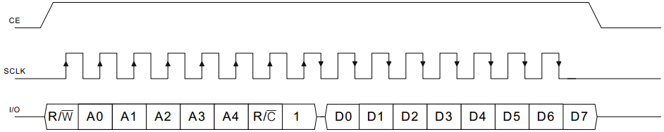

# DS1302 通信时序介绍

DS1302 我们前边也有提起过，是三根线，分别是 CE、I/O 和 SCLK，其中 CE 是使能线，SCLK 是时钟线，I/O 是数据线。前边我们介绍过了 SPI 通信，同学们发现没发现，这个 DS1302 的通信线定义和 SPI 怎么这么像呢？

事实上，DS1302 的通信是 SPI 的变异种类，它用了 SPI 的通信时序，但是通信的时候没有完全按照 SPI 的规则来，下面我们一点点解剖 DS1302 的变异 SPI 通信方式。先看一下单字节写入操作，如图 15-11 所示。


图 15-11  DS1302 单字节写操作

然后我们再对比一下 CPOL=0/CPHA=0 情况下的 SPI 的操作时序，如图 15-12 所示。


图 15-12  CPOL=0/CPHA=0 通信时序

图 15-11 和图 15-12 的通信时序，其中 CE 和 SSEL 的使能控制是反的，对于通信写数据，都是在 SCK 的上升沿，从机进行采样，下降沿的时候，主机发送数据。DS1302 的时序里，单片机要预先写一个字节指令，指明要写入的寄存器的地址以及后续的操作是写操作，然后再写入一个字节的数据。

对于单字节读操作，我就不做对比了，把 DS1302 的时序图贴出来，大家自己看一下即可，如图 15-13 所示。



图 15-13  DS1302 单字节读操作

读操作有两处需要特别注意的地方。第一，DS1302 的时序图上的箭头都是针对 DS1302 来说的，因此读操作的时候，先写第一个字节指令，上升沿的时候 DS1302 来锁存数据，下降沿我们用单片机发送数据。到了第二个字数据，由于我们这个时序过程相当于 CPOL=0/CPHA=0，前沿发送数据，后沿读取数据，第二个字节是 DS1302 下降沿输出数据，我们的单片机上升沿来读取，因此箭头从 DS1302 角度来说，出现在了下降沿。

第二个需要注意的地方就是，我们的单片机没有标准的 SPI 接口，和 I2C 一样需要用 IO 口来模拟通信过程。在读 DS1302 的时候，理论上 SPI 是上升沿读取，但是程序是用 IO 口模拟的，所以数据的读取和时钟沿的变化不可能同时了，必然就有一个先后顺序。通过实验发现，如果先读取 IO 线上的数据，再拉高 SCLK 产生上升沿，那么读到的数据一定是正确的，而颠倒顺序后数据就有可能出错。这个问题产生的原因还是在于 DS1302 的通信协议与标准 SPI 协议存在的差异造成的，如果是标准 SPI 的数据线，数据会一直保持到下一个周期的下降沿才会变化，所以读取数据和上升沿的先后顺序就无所谓了；但 DS1302 的 IO 线会在时钟上升沿后被 DS1302 释放，也就是撤销强推挽输出变为弱下拉状态，而此时在 51 单片机引脚内部上拉的作用下，IO 线上的实际电平会慢慢上升，从而导致在上升沿产生后再读取 IO 数据的话就可能会出错。因此这里的程序我们按照先读取 IO 数据，再拉高 SCLK 产生上升沿的顺序。

下面我们就写一个程序，先将 2013 年 10 月 8 号星期二 12 点 30 分 00 秒这个时间写到 DS1302 内部，让 DS1302 正常运行，然后再不停的读取 DS1302 的当前时间，并显示在我们的液晶屏上。

/***************************Lcd1602.c 文件程序源代码*****************************/

（此处省略，可参考之前章节的代码）

```
/*****************************main.c 文件程序源代码******************************/
#include <reg52.h>

sbit DS1302_CE = P1⁷;
sbit DS1302_CK = P3⁵;
sbit DS1302_IO = P3⁴;
bit flag200ms = 0; //200ms 定时标志
unsigned char T0RH = 0; //T0 重载值的高字节
unsigned char T0RL = 0; //T0 重载值的低字节

void ConfigTimer0(unsigned int ms);
void InitDS1302();
unsigned char DS1302SingleRead(unsigned char reg);
extern void InitLcd1602();
extern void LcdShowStr(unsigned char x, unsigned char y, unsigned char *str);

void main(){
    unsigned char i;
    unsigned char psec=0xAA; //秒备份，初值 AA 确保首次读取时间后会刷新显示
    unsigned char time[8]; //当前时间数组
    unsigned char str[12]; //字符串转换缓冲区
    EA = 1; //开总中断
    ConfigTimer0(1); //T0 定时 1ms
    InitDS1302(); //初始化实时时钟
    InitLcd1602(); //初始化液晶

    while (1){
        if (flag200ms){ //每 200ms 读取一次时间
            flag200ms = 0;
            for (i=0; i<7; i++){ //读取 DS1302 当前时间
                time[i] = DS1302SingleRead(i);
            }
            if (psec != time[0]){ //检测到时间有变化时刷新显示
                str[0] = '2'; //添加年份的高 2 位：20
                str[1] = '0';
                str[2] = (time[6] >> 4) + '0'; //“年”高位数字转换为 ASCII 码
                str[3] = (time[6]&0x0F) + '0'; //“年”低位数字转换为 ASCII 码
                str[4] = '-'; //添加日期分隔符
                str[5] = (time[4] >> 4) + '0'; //“月”
                str[6] = (time[4]&0x0F) + '0';
                str[7] = '-';
                str[8] = (time[3] >> 4) + '0'; //“日”
                str[9] = (time[3]&0x0F) + '0';
                str[10] = '\0';
                LcdShowStr(0, 0, str); //显示到液晶的第一行
                str[0] = (time[5]&0x0F) + '0'; //“星期”
                str[1] = '\0';
                LcdShowStr(11, 0, "week");
                LcdShowStr(15, 0, str); //显示到液晶的第一行
                str[0] = (time[2] >> 4) + '0'; //“时”
                str[1] = (time[2]&0x0F) + '0';
                str[2] = ':'; //添加时间分隔符
                str[3] = (time[1] >> 4) + '0'; //“分”
                str[4] = (time[1]&0x0F) + '0';
                str[5] = ':';
                str[6] = (time[0] >> 4) + '0'; //“秒”
                str[7] = (time[0]&0x0F) + '0';
                str[8] = '\0';
                LcdShowStr(4, 1, str); //显示到液晶的第二行
                psec = time[0]; //用当前值更新上次秒数
            }
        }
    }
}
/* 发送一个字节到 DS1302 通信总线上 */
void DS1302ByteWrite(unsigned char dat){
    unsigned char mask;

    for (mask=0x01; mask!=0; mask<<=1){ //低位在前，逐位移出
        if ((mask&dat) != 0){ //首先输出该位数据
            DS1302_IO = 1;
        }else{
            DS1302_IO = 0;
        }
        DS1302_CK = 1; //然后拉高时钟
        DS1302_CK = 0; //再拉低时钟，完成一个位的操作
    }
    DS1302_IO = 1; //最后确保释放 IO 引脚
}
/* 由 DS1302 通信总线上读取一个字节 */
unsigned char DS1302ByteRead(){
    unsigned char mask;
    unsigned char dat = 0;

    for (mask=0x01; mask!=0; mask<<=1){ //低位在前，逐位读取
        if (DS1302_IO != 0){ //首先读取此时的 IO 引脚，并设置 dat 中的对应位
            dat |= mask;
        }
        DS1302_CK = 1; //然后拉高时钟
        DS1302_CK = 0; //再拉低时钟，完成一个位的操作
    }
    return dat; //最后返回读到的字节数据
}
/* 用单次写操作向某一寄存器写入一个字节，reg-寄存器地址，dat-待写入字节 */
void DS1302SingleWrite(unsigned char reg, unsigned char dat){
    DS1302_CE = 1; //使能片选信号
    DS1302ByteWrite((reg<<1)|0x80); //发送写寄存器指令
    DS1302ByteWrite(dat); //写入字节数据
    DS1302_CE = 0; //除能片选信号
}
/* 用单次读操作从某一寄存器读取一个字节，reg-寄存器地址，返回值-读到的字节 */
unsigned char DS1302SingleRead(unsigned char reg){
    unsigned char dat;
    DS1302_CE = 1; //使能片选信号
    DS1302ByteWrite((reg<<1)|0x81); //发送读寄存器指令
    dat = DS1302ByteRead()//读取字节数据
    DS1302_CE = 0; //除能片选信号
    return dat;
}
/* DS1302 初始化，如发生掉电则重新设置初始时间 */
void InitDS1302(){
    unsigned char i;
    unsigned char code InitTime[] = { //2013 年 10 月 8 日 星期二 12:30:00
        0x00,0x30,0x12, 0x08, 0x10, 0x02, 0x13
    };

    DS1302_CE = 0; //初始化 DS1302 通信引脚
    DS1302_CK = 0;
    i = DS1302SingleRead(0); //读取秒寄存器

    if ((i & 0x80) != 0){ //由秒寄存器最高位 CH 的值判断 DS1302 是否已停止
        DS1302SingleWrite(7, 0x00); //撤销写保护以允许写入数据
        for (i=0; i<7; i++){ //设置 DS1302 为默认的初始时间
            DS1302SingleWrite(i, InitTime[i]);
        }
    }
}
/* 配置并启动 T0，ms-T0 定时时间 */
void ConfigTimer0(unsigned int ms){
    unsigned long tmp; //临时变量
    tmp = 11059200 / 12; //定时器计数频率
    tmp = (tmp * ms) / 1000; //计算所需的计数值
    tmp = 65536 - tmp; //计算定时器重载值
    tmp = tmp + 12; //补偿中断响应延时造成的误差
    T0RH = (unsigned char)(tmp>>8); //定时器重载值拆分为高低字节
    T0RL = (unsigned char)tmp;
    TMOD &= 0xF0; //清零 T0 的控制位
    TMOD |= 0x01; //配置 T0 为模式 1
    TH0 = T0RH; //加载 T0 重载值
    TL0 = T0RL;
    ET0 = 1; //使能 T0 中断
    TR0 = 1; //启动 T0
}
/* T0 中断服务函数，执行 200ms 定时 */
void InterruptTimer0() interrupt 1{
    static unsigned char tmr200ms = 0;
    TH0 = T0RH; //重新加载重载值
    TL0 = T0RL;
    tmr200ms++;
    if (tmr200ms >= 200){ //定时 200ms
        tmr200ms = 0;
        flag200ms = 1;
    }
}
```

前边学习了 I2C 和 EEPROM 的底层读写时序，那么 DS1302 的底层读写时序程序的实现方法是与之类似的，这里就不过多解释了，大家自己认真揣摩一下。