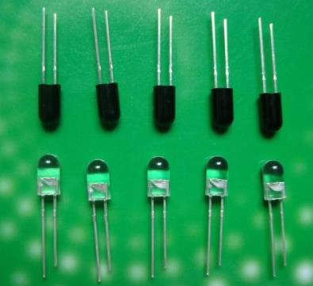
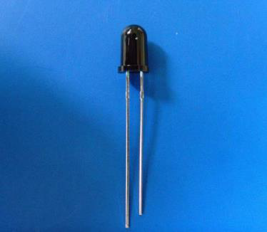

# 红外光的基本原理

红外线是波长介于微波和可见光之间的电磁波，波长在 760 纳米到 1 毫米之间，是波形比红光长的非可见光。自然界中的一切物体，只要它的温度高于绝对零度(-273)就存在分子和原子的无规则运动，其表面就会不停的辐射红外线。当然了，虽然是都辐射红外线，但是不同的物体辐射的强度是不一样的，而我们正是利用了这一点把红外技术应用到我们的实际开发中。

红外发射管很常用，在我们的遥控器上都可以看到，它类似发光二极管，但是它发射出来的是红外光，是我们肉眼所看不到的。第二章我们学过发光二极管的亮度会随着电流的增大而增加，同样的道理，红外发射管发射红外线的强度也会随着电流的增大而增强，常见的红外发射管如图 16-1 所示。

图 16-1  红外发射管

红外接收管内部是一个具有红外光敏感特征的 PN 节，属于光敏二极管，但是它只对红外光有反应。无红外光时，光敏管不导通，有红外光时，光敏管导通形成光电流，并且在一定范围内电流随着红外光的强度的增强而增大。典型的红外接收管如图 16-2 所示。

图 16-2  红外接收管

这种红外发射和接收对管在小车、机器人避障以及红外循迹小车中有所应用，这部分内容在我们的 KST-51 开发板上并没有实现，但是属于红外部分的内容，所以我提供一个原理图给大家作为学习之用，如图 16-3 所示。

图 16-3   红外避障、循迹原理图

在图 16-3 中，发射控制和接收检测都是接到单片机的 IO 口上的。

发射部分：当发射控制输出高电平时，三极管 Q1 不导通，红外发射管 L1 不会发射红外信号；当发射控制输出低电平的时候，通过三极管 Q1 导通让 L1 发出红外光。

接收部分：R4 是一个电位器，我们通过调整电位器给 LM393 的 2 脚提供一个阈值电压，这个电压值的大小可以根据实际情况来调试确定。而红外光敏二极管 L2 收到红外光的时候，会产生电流，并且随着红外光的从弱变强，电流会从小变大。当没有红外光或者说红外光很弱的时候，3 脚的电压就会接近 VCC，如果 3 脚比 2 脚的电压高的话，通过 LM393 比较器后，接收检测引脚输出一个高电平。当随着光强变大，电流变大，3 脚的电压值等于 VCC-I*R3，电压就会越来越小，当小到一定程度，比 2 脚的电压还小的时候，接收检测引脚就会变为低电平。

这个电路用于避障的时候，发射管先发送红外信号，红外信号会随着传送距离的加大逐渐衰减，如果遇到障碍物，就会形成红外反射。当反射回来的信号比较弱时，光敏二极管 L2 接收的红外光较弱，比较器 LM393 的 3 脚电压高于 2 脚电压，接收检测引脚输出高电平，说明障碍物比较远；当反射回来的信号比较强，接收检测引脚输出低电平，说明障碍物比较近了。

用于小车循迹的时候，必须要有黑色和白色的轨道。当红外信号发送到黑色轨道时，黑色因为吸光能力比较强，红外信号发送出去后就会被吸收掉，反射部分很微弱。白色轨道就会把大部分红外信号反射回来。通常情况下的循迹小车，需要应用多个红外模块同时检测，从多个角度判断轨道，根据判断的结果来调整小车使其按照正常循迹前行。