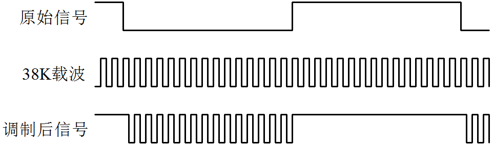
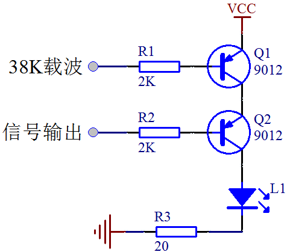
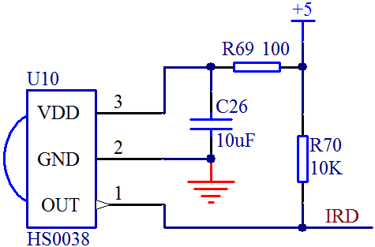

# 红外遥控通信原理

在实际的通信领域，发出来的信号一般有较宽的频谱，而且都是在比较低的频率段分布大量的能量，所以称之为基带信号，这种信号是不适合直接在信道中传输的。为便于传输、提高抗干扰能力和有效的利用带宽，通常需要将信号调制到适合信道和噪声特性的频率范围内进行传输，这就叫做信号调制。在通信系统的接收端要对接收到的信号进行解调，恢复出原来的基带信号。这部分通信原理的内容，大家了解一下即可。

我们平时用到的红外遥控器里的红外通信，通常是使用 38K 左右的载波进行调制的，下面我把原理大概给大家介绍一下，先看发送部分原理。

调制：就是用待传送信号去控制某个高频信号的幅度、相位、频率等参量变化的过程，即用一个信号去装载另一个信号。比如我们的红外遥控信号要发送的时候，先经过 38K 调制，如图 16-4 所示。

图 16-4  红外信号调制

原始信号就是我们要发送的一个数据“0”位或者一位数据“1”位，而所谓 38K 载波就是频率为 38K 的方波信号，调制后信号就是最终我们发射出去的波形。我们使用原始信号来控制 38K 载波，当信号是数据“0”的时候，38K 载波毫无保留的全部发送出去，当信号是数据“1”的时候，不发送任何载波信号。

那在原理上，我们如何从电路的角度去实现这个功能呢？如图 16-5 所示。

图 16-5   红外发射原理图

38K 载波，我们可以用 455K 晶振，经过 12 分频得到 37.91K，也可以由时基电路 NE555 来产生，或者使用单片机的 PWM 来产生。当信号输出引脚输出高电平时，Q2 截止，不管 38K 载波信号如何控制 Q1，右侧的竖向支路都不会导通，红外管 L1 不会发送任何信息。当信号输出是低电平的时候，那么 38K 载波就会通过 Q1 释放出来，在 L1 上产生 38K 的载波信号。这里要说明的是，大多数家电遥控器的 38K 的占空比是 1/3，也有 1/2 的，但是相对少一些。

正常的通信来讲，接收端要首先对信号通过监测、放大、滤波、解调等等一系列电路处理，然后输出基带信号。但是红外通信的一体化接收头 HS0038B，已经把这些电路全部集成到一起了，我们只需要把这个电路接上去，就可以直接输出我们所要的基带信号了，如图 16-6 所示。

图 16-6  红外接收原理图

由于红外接收头内部放大器的增益很大，很容易引起干扰，因此在接收头供电引脚上必须加上滤波电容，官方手册给的值是 4.7uF，我们这里直接用的 10uF，手册里还要求在供电引脚和电源之间串联 100 欧的电阻，进一步降低干扰。

图 16-6 所示的电路，用来接收图 16-5 电路发送出来的波形，当 HS0038B 监测到有 38K 的红外信号时，就会在 OUT 引脚输出低电平，当没有 38K 的时候，OUT 引脚就会输出高电平。那我们把 OUT 引脚接到单片机的 IO 口上，通过编程，就可以获取红外通信发过来的数据了。

大家想想，OUT 引脚输出的数据是不是又恢复成为基带信号数据了呢？那我们单片机在接收这个基带信号数据的时候，如何判断接收到的是什么数据，应该遵循什么协议呢？像我们前边学到的 UART、I2C、SPI 等通信协议都是基带通信的通信协议，而红外的 38K 仅仅是对基带信号进行调制解调，让信号更适合在信道中传输。

由于我们的红外调制信号是半双工的，而且同一时刻空间只能允许一个信号源，所以红外的基带信号不适合在 I2C 或者 SPI 通信协议中进行的，我们前边提到过 UART 虽然是 2 条线，但是通信的时候，实际上一条线即可，所以红外可以在 UART 中进行通信。当然，这个通信也不是没有限制的，比如在 HS0038B 的数据手册中标明，要想让 HS0038B 识别到 38K 的红外信号，那么这个 38K 的载波必须要大于 10 个周期，这就限定了红外通信的基带信号的比特率必须不能高于 3800，那如果把串口输出的信号直接用 38K 调制的话，波特率也就不能高于 3800。当然还有很多其它基带协议可以利用红外来调制，下面我们介绍一种遥控器常用的红外通信协议——NEC 协议。