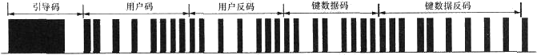
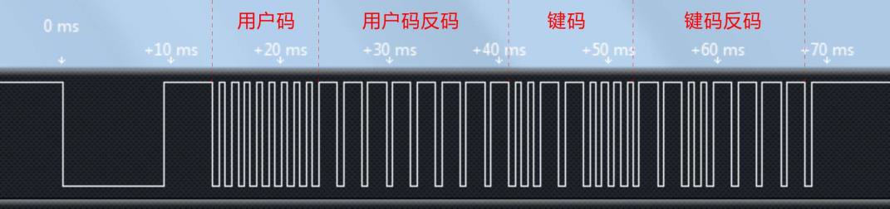
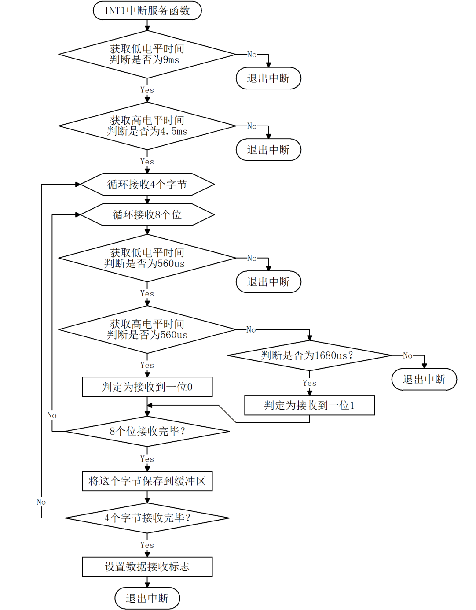
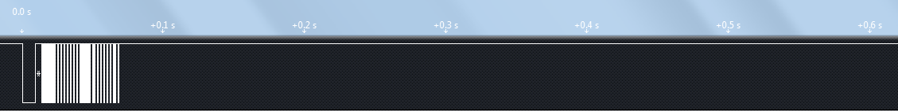
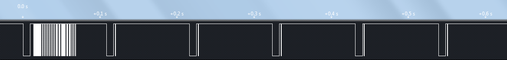

# NEC 协议红外遥控器

家电遥控器通信距离往往要求不高，而红外的成本比其它无线设备要低的多，所以家电遥控器应用中红外始终占据着一席之地。遥控器的基带通信协议很多，大概有几十种，常用的就有 ITT 协议、NEC 协议、Sharp 协议、Philips RC-5 协议、Sony SIRC 协议等。用的最多的就是 NEC 协议了，因此我们 KST-51 开发板配套的遥控器直接采用 NEC 协议，我们这节课也以 NEC 协议标准来讲解一下。

NEC 协议的数据格式包括了引导码、用户码、用户码（或者用户码反码）、按键键码和键码反码，最后一个停止位。停止位主要起隔离作用，一般不进行判断，编程时我们也不予理会。其中数据编码总共是 4 个字节 32 位，如图 16-7 所示。第一个字节是用户码，第二个字节可能也是用户码，或者是用户码的反码，具体由生产商决定，第三个字节就是当前按键的键数据码，而第四个字节是键数据码的反码，可用于对数据的纠错。



图 16-7  NEC 协议数据格式

这个 NEC 协议，表示数据的方式不像我们之前学过的比如 UART 那样直观，而是每一位数据本身也需要进行编码，编码后再进行载波调制。

*   引导码：9ms 的载波+4.5ms 的空闲。
*   比特值“0”：560us 的载波+560us 的空闲。
*   比特值“1”：560us 的载波+1.68ms 的空闲。

结合图 16-7 我们就能看明白了，最前面黑乎乎的一段，是引导码的 9ms 载波，紧接着是引导码的 4.5ms 的空闲，而后边的数据码，是众多载波和空闲交叉，它们的长短就由其要传递的具体数据来决定。HS0038B 这个红外一体化接收头，当收到有载波的信号的时候，会输出一个低电平，空闲的时候会输出高电平，我们用逻辑分析仪抓出来一个红外按键通过 HS0038B 解码后的图形来了解一下，如图 16-8 所示。



图 16-8  红外遥控器按键编码

从图上可以看出，先是 9ms 载波加 4.5ms 空闲的起始码，数据码是低位在前，高位在后，数据码第一个字节是 8 组 560us 的载波加 560us 的空闲，也就是 0x00，第二个字节是 8 组 560us 的载波加 1.68ms 的空闲，可以看出来是 0xFF，这两个字节就是用户码和用户码的反码。按键的键码二进制是 0x0C，反码就是 0xF3，最后跟了一个 560us 载波停止位。对于我们的遥控器来说，不同的按键，就是键码和键码反码的区分，用户码是一样的。这样我们就可以通过单片机的程序，把当前的按键的键码给解析出来。

我们前边学习中断的时候，学到 51 单片机有外部中断 0 和外部中断 1 这两个外部中断。我们的红外接收引脚接到了 P3.3 引脚上，这个引脚的第二功能就是外部中断 1。在寄存器 TCON 中的 bit3 和 bit2 这两位，是和外部中断 1 相关的两位。其中 IE1 是外部中断标志位，当外部中断发生后，这一位被自动置 1，和定时器中断标志位 TF 相似，进入中断后会自动清零，也可以软件清零。bit2 是设置外部中断类型的，如果 bit2 为 0，那么只要 P3.3 为低电平就可以触发中断，如果 bit2 为 1，那么 P3.3 从高电平到低电平的下降沿发生才可以触发中断。此外，外部中断 1 使能位是 EX1。那下面我们就把程序写出来，使用数码管把遥控器的用户码和键码显示出来。

Infrared.c 文件主要是用来检测红外通信的，当发生外部中断后，进入外部中断，通过定时器 1 定时，首先对引导码判断，而后对数据码的每个位逐位获取高低电平的时间，从而得知每一位是 0 还是 1，最终把数据码解出来。虽然最终实现的功能很简单，但因为编码本身的复杂性，使得红外接收的中断程序在逻辑上显得就比较复杂，那么我们首先提供出中断函数的程序流程图，大家可以对照流程图来理解程序代码，如图 16-9 所示。



图 16-9  红外接收程序流程图

```
/***************************Infrared.c 文件程序源代码*****************************/
#include <reg52.h>
sbit IR_INPUT = P3³; //红外接收引脚
bit irflag = 0; //红外接收标志，收到一帧正确数据后置 1
unsigned char ircode[4]; //红外代码接收缓冲区

/* 初始化红外接收功能 */
void InitInfrared(){
    IR_INPUT = 1; //确保红外接收引脚被释放
    TMOD &= 0x0F; //清零 T1 的控制位
    TMOD |= 0x10; //配置 T1 为模式 1
    TR1 = 0; //停止 T1 计数
    ET1 = 0; //禁止 T1 中断
    IT1 = 1; //设置 INT1 为负边沿触发
    EX1 = 1; //使能 INT1 中断
}
/* 获取当前高电平的持续时间 */
unsigned int GetHighTime(){
    TH1 = 0; //清零 T1 计数初值
    TL1 = 0;
    TR1 = 1; //启动 T1 计数
    while (IR_INPUT){ //红外输入引脚为 1 时循环检测等待，变为 0 时则结束本循环
        //当 T1 计数值大于 0x4000，即高电平持续时间超过约 18ms 时，
        //强制退出循环，是为了避免信号异常时，程序假死在这里。
        if (TH1 >= 0x40){
            break;
        }
    }
    TR1 = 0; //停止 T1 计数
    return (TH1*256 + TL1); //T1 计数值合成为 16bit 整型数，并返回该数
}
/* 获取当前低电平的持续时间 */
unsigned int GetLowTime(){
    TH1 = 0; //清零 T1 计数初值
    TL1 = 0;
    TR1 = 1; //启动 T1 计数
    while (!IR_INPUT){ //红外输入引脚为 0 时循环检测等待，变为 1 时则结束本循环
        //当 T1 计数值大于 0x4000，即低电平持续时间超过约 18ms 时，
        //强制退出循环，是为了避免信号异常时，程序假死在这里。
        if (TH1 >= 0x40){
            break;
        }
    }
    TR1 = 0; //停止 T1 计数
    return (TH1*256 + TL1); //T1 计数值合成为 16bit 整型数，并返回该数
}
/* INT1 中断服务函数，执行红外接收及解码 */
void EXINT1_ISR() interrupt 2{
    unsigned char i, j;
    unsigned char byt;
    unsigned int time;

    //接收并判定引导码的 9ms 低电平
    time = GetLowTime();
    //时间判定范围为 8.5～9.5ms，
    //超过此范围则说明为误码，直接退出
    if ((time<7833) || (time>8755)){
        IE1 = 0; //退出前清零 INT1 中断标志
        return;
    }
    //接收并判定引导码的 4.5ms 高电平
    time = GetHighTime();
    //时间判定范围为 4.0～5.0ms，
    //超过此范围则说明为误码，直接退出
    if ((time<3686) || (time>4608)){
        IE1 = 0;
        return;
    }
    //接收并判定后续的 4 字节数据
    for (i=0; i<4; i++){ //循环接收 4 个字节
        for (j=0; j<8; j++){ //循环接收判定每字节的 8 个 bit
            //接收判定每 bit 的 560us 低电平
            time = GetLowTime();
            //时间判定范围为 340～780us，
            //超过此范围则说明为误码，直接退出
            if ((time<313) || (time>718)){
                IE1 = 0;
                return;
            }
            //接收每 bit 高电平时间，判定该 bit 的值
            time = GetHighTime();
            //时间判定范围为 340～780us，
            //在此范围内说明该 bit 值为 0
            if ((time>313) && (time<718)){
                byt >>= 1; //因低位在先，所以数据右移，高位为 0
                //时间判定范围为 1460～1900us，
                //在此范围内说明该 bit 值为 1
            }else if ((time>1345) && (time<1751)){
                byt >>= 1; //因低位在先，所以数据右移，
                byt |= 0x80; //高位置 1
            }else{ //不在上述范围内则说明为误码，直接退出
                IE1 = 0;
                return;
            }
        }
        ircode[i] = byt; //接收完一个字节后保存到缓冲区
    }
    irflag = 1; //接收完毕后设置标志
    IE1 = 0; //退出前清零 INT1 中断标志
}
```

大家在阅读这个程序时，会发现我们在获取高低电平时间的时候做了超时判断 if(TH1 >= 0x40)，这个超时判断主要是为了应对输入信号异常（比如意外的干扰等）情况的，如果不做超时判断，当输入信号异常时，程序就有可能会一直等待一个无法到来的跳变沿，而造成程序假死。

另外补充一点，遥控器的单按按键和持续按住按键发出来的信号是不同的。我们先来对比一下两种按键方式的实测信号波形，如图 16-10 和 16-11 所示。



图 16-10   红外单次按键时序图



图 16-11  红外持续按键时序图

单次按键的结果 16-9 和我们之前的图 16-8 是一样的，这个不需要再解释。而持续按键，首先会发出一个和单次按键一样的波形出来，经过大概 40ms 后，会产生一个 9ms 载波加 2.25ms 空闲，再跟一个停止位的波形，这个叫做重复码，而后只要你还在按住按键，那么每隔约 108ms 就会产生一个重复码。对于这个重复码我们的程序并没有对它单独解析，而是直接忽略掉了，这并不影响对正常按键数据的接收。如果你日后做程序时需要用到这个重复码，那么只需要再把对重复码的解析添加进来就可以了。

```
/*****************************main.c 文件程序源代码******************************/
#include <reg52.h>
sbit ADDR3 = P1³;
sbit ENLED = P1⁴;

unsigned char code LedChar[] = { //数码管显示字符转换表
    0xC0, 0xF9, 0xA4, 0xB0, 0x99, 0x92, 0x82, 0xF8,
    0x80, 0x90, 0x88, 0x83, 0xC6, 0xA1, 0x86, 0x8E
};
unsigned char LedBuff[6] = { //数码管显示缓冲区
    0xFF, 0xFF, 0xFF, 0xFF, 0xFF, 0xFF
};
unsigned char T0RH = 0; //T0 重载值的高字节
unsigned char T0RL = 0; //T0 重载值的低字节
extern bit irflag;
extern unsigned char ircode[4];
extern void InitInfrared();
void ConfigTimer0(unsigned int ms);

void main(){
    EA = 1; //开总中断
    ENLED = 0; //使能选择数码管
    ADDR3 = 1;
    InitInfrared(); //初始化红外功能
    ConfigTimer0(1); //配置 T0 定时 1ms
    //PT0 = 1; //配置 T0 中断为高优先级，启用本行可消除接收时的闪烁

    while (1){
        if (irflag){ //接收到红外数据时刷新显示
            irflag = 0;
            LedBuff[5] = LedChar[ircode[0] >> 4]; //用户码显示
            LedBuff[4] = LedChar[ircode[0]&0x0F];
            LedBuff[1] = LedChar[ircode[2] >> 4]; //键码显示
            LedBuff[0] = LedChar[ircode[2]&0x0F];
        }
    }
}
/* 配置并启动 T0，ms-T0 定时时间 */
void ConfigTimer0(unsigned int ms){
    unsigned long tmp; //临时变量
    tmp = 11059200 / 12; //定时器计数频率
    tmp = (tmp * ms) / 1000; //计算所需的计数值
    tmp = 65536 - tmp; //计算定时器重载值
    tmp = tmp + 13; //补偿中断响应延时造成的误差
    T0RH = (unsigned char)(tmp>>8); //定时器重载值拆分为高低字节
    T0RL = (unsigned char)tmp;

    TMOD &= 0xF0; //清零 T0 的控制位
    TMOD |= 0x01; //配置 T0 为模式 1
    TH0 = T0RH; //加载 T0 重载值
    TL0 = T0RL;
    ET0 = 1; //使能 T0 中断
    TR0 = 1; //启动 T0
}
/* LED 动态扫描刷新函数，需在定时中断中调用 */
void LedScan(){
    static unsigned char i = 0; //动态扫描索引
    P0 = 0xFF; //关闭所有段选位，显示消隐
    P1 = (P1 & 0xF8) | i; //位选索引值赋值到 P1 口低 3 位
    P0 = LedBuff[i]; //缓冲区中索引位置的数据送到 P0 口
    if (i < sizeof(LedBuff)-1){ //索引递增循环，遍历整个缓冲区
        i++;
    }else{
        i = 0;
    }
}
/* T0 中断服务函数，执行数码管扫描显示 */
void InterruptTimer0() interrupt 1{
    TH0 = T0RH; //重新加载重载值
    TL0 = T0RL;
    LedScan(); //数码管扫描显示
}
```

main.c 文件的主要功能就是把获取到的红外遥控器的用户码和键码信息，传送到数码管上显示出来，并且通过定时器 T0 的 1ms 中断进行数码管的动态刷新。不知道大家经过试验发现没有，当我们按下遥控器按键的时候，数码管显示的数字会闪烁，这是什么原因呢？单片机的程序都是顺序执行的，一旦我们按下遥控器按键，单片机就会进入遥控器解码的中断程序内，而这个程序执行的时间又比较长，要几十个毫秒，而如果数码管动态刷新间隔超过 10ms 后就会感觉到闪烁，因此这个闪烁是由于程序执行红外解码时，延误了数码管动态刷新造成的。

如何解决？前边我们讲过中断优先级问题，如果设置了中断的抢占优先级，就会产生中断嵌套。中断嵌套的原理，我们在前边讲中断的时候已经讲过一次了，大家可以回头再复习一下。那么这个程序中，有 2 个中断程序，一个是外部中断程序负责接收红外数据，一个是定时器中断程序负责数码管扫描，要使红外接收不耽误数码管扫描的执行，那么就必须让定时器中断对外部中断实现嵌套，即把定时器中断设置为高抢占优先级。定时器中断程序，执行时间只有几十个 us，即使打断了红外接收中断的执行，也最多是给每个位的时间测量附加了几十 us 的误差，而这个误差在最短 560us 的时间判断中完全是容许的，所以中断嵌套并不会影响红外数据的正常接收。在 main 函数中，大家把这行程序“//PT0 = 1;”的注释取消，也就是使这行代码生效，这样就设置了 T0 中断的高抢占优先级，再编译一下，下载到单片机里，然后按键试试，是不是没有任何闪烁了呢？而中断嵌套的意义也有所体会了吧。