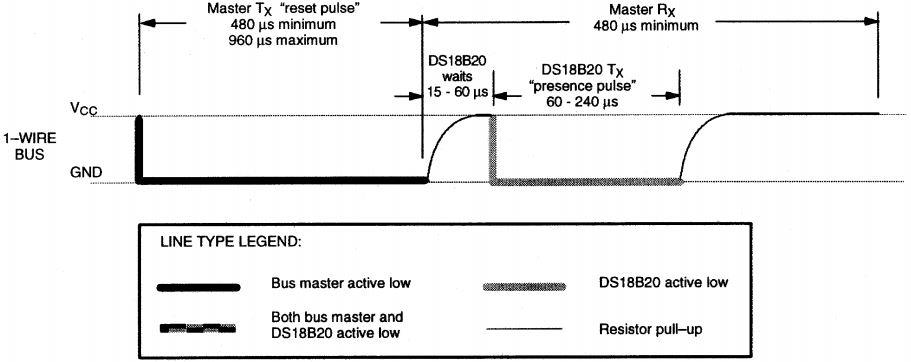
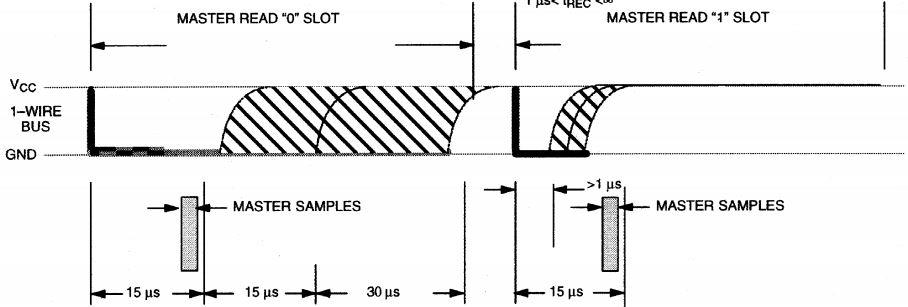

# 温度传感器 DS18B20

DS18B20 是美信公司的一款温度传感器，单片机可以通过 1-Wire 协议与 DS18B20 进行通信，最终将温度读出。1-Wire 总线的硬件接口很简单，只需要把 DS18B20 的数据引脚和单片机的一个 IO 口接上就可以了。硬件的简单，随之而来的，就是软件时序的复杂。1-Wire 总线的时序比较复杂，很多同学在这里独立看时序图都看不明白，所以这里还要带着大家来研究 DS18B20 的时序图。我们先来看一下 DS18B20 的硬件原理图，如图 16-12 所示。

图 16-12  DS18B20 电路原理图

DS18B20 通过编程，可以实现最高 12 位的温度存储值，在寄存器中，以补码的格式存储，如图 16-13 所示。


图 16-13  DS18B20 温度数据格式

一共 2 个字节，LSB 是低字节，MSB 是高字节，其中 MSb 是字节的高位，LSb 是字节的低位。大家可以看出来，二进制数字，每一位代表的温度的含义，都表示出来了。其中 S 表示的是符号位，低 11 位都是 2 的幂，用来表示最终的温度。DS18B20 的温度测量范围是从-55 度到+125 度，而温度数据的表现形式，有正负温度，寄存器中每个数字如同卡尺的刻度一样分布，如图 16-14 所示。


图 16-14  DS18B20 温度值

二进制数字最低位变化 1，代表温度变化 0.0625 度的映射关系。当 0 度的时候，那就是 0x0000，当温度 125 度的时候，对应十六进制是 0x07D0，当温度是零下 55 度的时候，对应的数字是 0xFC90。反过来说，当数字是 0x0001 的时候，那温度就是 0.0625 度了。

首先，我先根据手册上 DS18B20 工作协议过程大概讲解一下。

**1) 初始化**

和 I2C 的寻址类似，1-Wire 总线开始也需要检测这条总线上是否存在 DS18B20 这个器件。如果这条总线上存在 DS18B20，总线会根据时序要求返回一个低电平脉冲，如果不存在的话，也就不会返回脉冲，即总线保持为高电平，所以习惯上称之为检测存在脉冲。此外，获取存在脉冲不仅仅是检测是否存在 DS18B20，还要通过这个脉冲过程通知 DS18B20 准备好，单片机要对它进行操作了，如图 16-15 所示。



图 16-15  检测存在脉冲

大家注意看图，实粗线是我们的单片机 IO 口拉低这个引脚，虚粗线是 DS18B20 拉低这个引脚，细线是单片机和 DS18B20 释放总线后，依靠上拉电阻的作用把 IO 口引脚拉上去。这个我们前边提到过了，51 单片机释放总线就是给高电平。

存在脉冲检测过程，首先单片机要拉低这个引脚，持续大概 480us 到 960us 之间的时间即可，我们的程序中持续了 500us。然后，单片机释放总线，就是给高电平，DS18B20 等待大概 15 到 60us 后，会主动拉低这个引脚大概是 60 到 240us，而后 DS18B20 会主动释放总线，这样 IO 口会被上拉电阻自动拉高。

有的同学还是不能够彻底理解，程序列出来逐句解释。首先，由于 DS18B20 时序要求非常严格，所以在操作时序的时候，为了防止中断干扰总线时序，先关闭总中断。然后第一步，拉低 DS18B20 这个引脚，持续 500us；第二步，延时 60us；第三步，读取存在脉冲，并且等待存在脉冲结束。

```
bit Get18B20Ack(){
    bit ack;
    EA = 0; //禁止总中断
    IO_18B20 = 0; //产生 500us 复位脉冲
    DelayX10us(50);
    IO_18B20 = 1;
    DelayX10us(6); //延时 60us
    ack = IO_18B20; //读取存在脉冲
    while(!IO_18B20); //等待存在脉冲结束
    EA = 1; //重新使能总中断
    return ack;
}
```

很多同学对第二步不理解，时序图上明明是 DS18B20 等待 15us 到 60us，为什么要延时 60us 呢？举个例子，妈妈在做饭，告诉你大概 5 分钟到 10 分钟饭就可以吃了，那么我们什么时候去吃，能够绝对保证吃上饭呢？很明显，10 分钟以后去吃肯定可以吃上饭。同样的道理，DS18B20 等待大概是 15us 到 60us，我们要保证读到这个存在脉冲，那么 60us 以后去读肯定可以读到。当然，不能延时太久，太久，超过 75us，就可能读不到了，为什么是 75us，大家自己思考一下。

**2) ROM 操作指令**

我们学 I2C 总线的时候就了解到，总线上可以挂多个器件，通过不同的器件地址来访问不同的器件。同样，1-Wire 总线也可以挂多个器件，但是它只有一条线，如何区分不同的器件呢？

在每个 DS18B20 内部都有一个唯一的 64 位长的序列号，这个序列号值就存在 DS18B20 内部的 ROM 中。开始的 8 位是产品类型编码（DS18B20 是 0x10），接着的 48 位是每个器件唯一的序号，最后的 8 位是 CRC 校验码。DS18B20 可以引出去很长的线，最长可以到几十米，测不同位置的温度。单片机可以通过和 DS18B20 之间的通信，获取每个传感器所采集到的温度信息，也可以同时给所有的 DS18B20 发送一些指令。这些指令相对来说比较复杂，而且应用很少，所以这里大家有兴趣的话就自己去查手册完成吧，我们这里只讲一条总线上只接一个器件的指令和程序。

Skip ROM（跳过 ROM）：0xCC。当总线上只有一个器件的时候，可以跳过 ROM，不进行 ROM 检测。

**3) RAM 存储器操作指令**

RAM 读取指令，只讲 2 条，其它的大家有需要可以随时去查资料。

Read Scratchpad（读暂存寄存器）：0xBE

这里要注意的是，DS18B20 的温度数据是 2 个字节，我们读取数据的时候，先读取到的是低字节的低位，读完了第一个字节后，再读高字节的低位，直到两个字节全部读取完毕。

Convert Temperature（启动温度转换）：0x44

当我们发送一个启动温度转换的指令后，DS18B20 开始进行转换。从转换开始到获取温度，DS18B20 是需要时间的，而这个时间长短取决于 DS18B20 的精度。前边说 DS18B20 最高可以用 12 位来存储温度，但是也可以用 11 位，10 位和 9 位一共四种格式。位数越高，精度越高，9 位模式最低位变化 1 个数字温度变化 0.5 度，同时转换速度也要快一些，如图 16-16 所示。


图 16-16  DS18B20 温度转换时间

其中寄存器 R1 和 R0 决定了转换的位数，出厂默认值就 11，也就是 12 位表示温度，最大的转换时间是 750ms。当启动转换后，至少要再等 750ms 之后才能读取温度，否则读到的温度有可能是错误的值。这就是为什么很多同学读 DS18B20 的时候，第一次读出来的是 85 度，这个值要么是没有启动转换，要么是启动转换了，但还没有等待一次转换彻底完成，读到的是一个错误的数据。

**4) DS18B20 的位读写时序**

DS18B20 的时序图不是很好理解，大家对照时序图，结合我的解释，一定要把它学明白。写时序图如图 16-17 所示。


图 16-17  DS18B20 位写入时序

当要给 DS18B20 写入 0 的时候，单片机直接将引脚拉低，持续时间大于 60us 小于 120us 就可以了。图上显示的意思是，单片机先拉低 15us 之后，DS18B20 会在从 15us 到 60us 之间的时间来读取这一位，DS18B20 最早会在 15us 的时刻读取，典型值是在 30us 的时刻读取，最多不会超过 60us，DS18B20 必然读取完毕，所以持续时间超过 60us 即可。

当要给 DS18B20 写入 1 的时候，单片机先将这个引脚拉低，拉低时间大于 1us，然后马上释放总线，即拉高引脚，并且持续时间也要大于 60us。和写 0 类似的是，DS18B20 会在 15us 到 60us 之间来读取这个 1。

可以看出来，DS18B20 的时序比较严格，写的过程中最好不要有中断打断，但是在两个“位”之间的间隔，是大于 1 小于无穷的，那在这个时间段，我们是可以开中断来处理其它程序的。发送即写入一个字节的数据程序如下。

```
void Write18B20(unsigned char dat){
    unsigned char mask;

    EA = 0; //禁止总中断
    for (mask=0x01; mask!=0; mask<<=1){ //低位在先，依次移出 8 个 bit
        IO_18B20 = 0; //产生 2us 低电平脉冲
        _nop_();
        _nop_();
        if ((mask&dat) == 0){ //输出该 bit 值
            IO_18B20 = 0;
        }else{
            IO_18B20 = 1;
        }
        DelayX10us(6); //延时 60us
        IO_18B20 = 1; //拉高通信引脚
    }
    EA = 1; //重新使能总中断
}
```

读时序图如图 16-18 所示。

图 16-18  DS18B20 位读取时序

当要读取 DS18B20 的数据的时候，我们的单片机首先要拉低这个引脚，并且至少保持 1us 的时间，然后释放引脚，释放完毕后要尽快读取。从拉低这个引脚到读取引脚状态，不能超过 15us。大家从图 16-18 可以看出来，主机采样时间，也就是 MASTER SAMPLES，是在 15us 之内必须完成的，读取一个字节数据的程序如下。

```
unsigned char Read18B20({
    unsigned char dat;
    unsigned char mask;

    EA = 0; //禁止总中断
    for (mask=0x01; mask!=0; mask<<=1){ //低位在先，依次采集 8 个 bit
        IO_18B20 = 0; //产生 2us 低电平脉冲
        _nop_();
        _nop_();
        IO_18B20 = 1; //结束低电平脉冲，等待 18B20 输出数据
        _nop_(); //延时 2us
        _nop_();
        if (!IO_18B20){ //读取通信引脚上的值
            dat &= ~mask;
        }else{
            dat |= mask;
        }
        DelayX10us(6); //再延时 60us
    }
    EA = 1; //重新使能总中断
    return dat;
}
```

DS18B20 所表示的温度值中，有小数和整数两部分。常用的带小数的数据处理方法有两种，一种是定义成浮点型直接处理，第二种是定义成整型，然后把小数和整数部分分离出来，在合适的位置点上小数点即可。我们在程序中使用的是第二种方法，下面我们就写一个程序，将读到的温度值显示在 1602 液晶上，并且保留一位小数位。

```
/***************************DS18B20.c 文件程序源代码****************************/
#include <reg52.h>
#include <intrins.h>
sbit IO_18B20 = P3²; //DS18B20 通信引脚
/* 软件延时函数，延时时间(t*10)us */
void DelayX10us(unsigned char t){
    do {
        _nop_();
        _nop_();
        _nop_();
        _nop_();
        _nop_();
        _nop_();
        _nop_();
        _nop_();
    } while (--t);
}
/* 复位总线，获取存在脉冲，以启动一次读写操作 */
bit Get18B20Ack(){
    bit ack;
    EA = 0; //禁止总中断
    IO_18B20 = 0; //产生 500us 复位脉冲
    DelayX10us(50);
    IO_18B20 = 1;
    DelayX10us(6); //延时 60us
    ack = IO_18B20; //读取存在脉冲
    while(!IO_18B20); //等待存在脉冲结束
    EA = 1; //重新使能总中断
    return ack;
}
/* 向 DS18B20 写入一个字节，dat-待写入字节 */
void Write18B20(unsigned char dat){
    unsigned char mask;
    EA = 0; //禁止总中断
    for (mask=0x01; mask!=0; mask<<=1){ //低位在先，依次移出 8 个 bit
        IO_18B20 = 0; //产生 2us 低电平脉冲
        _nop_();
        _nop_();
        if ((mask&dat) == 0){ //输出该 bit 值
            IO_18B20 = 0;
        }else{
            IO_18B20 = 1;
        }
    }
    DelayX10us(6); //延时 60us
    IO_18B20 = 1; //拉高通信引脚
    EA = 1; //重新使能总中断
}
/* 从 DS18B20 读取一个字节，返回值-读到的字节 */
unsigned char Read18B20(){
    unsigned char dat;
    unsigned char mask;
    EA = 0; //禁止总中断
    for (mask=0x01; mask!=0; mask<<=1){ //低位在先，依次采集 8 个 bit
        IO_18B20 = 0; //产生 2us 低电平脉冲
        _nop_();
        _nop_();
        IO_18B20 = 1; //结束低电平脉冲，等待 18B20 输出数据
        _nop_(); //延时 2us
        _nop_();
        if (!IO_18B20){ //读取通信引脚上的值
            dat &= ~mask;
        }else{
            dat |= mask;
        }
        DelayX10us(6); //再延时 60us
    }
    EA = 1; //重新使能总中断
    return dat;
}
/* 启动一次 18B20 温度转换，返回值-表示是否启动成功 */
bit Start18B20(){
    bit ack;
    ack = Get18B20Ack(); //执行总线复位，并获取 18B20 应答
    if (ack == 0){ //如 18B20 正确应答，则启动一次转换
        Write18B20(0xCC); //跳过 ROM 操作
        Write18B20(0x44); //启动一次温度转换
    }
    return ~ack; //ack==0 表示操作成功，所以返回值对其取反
}
/* 读取 DS18B20 转换的温度值，返回值-表示是否读取成功 */
bit Get18B20Temp(int *temp){
    bit ack;
    unsigned char LSB, MSB; //16bit 温度值的低字节和高字节
    ack = Get18B20Ack(); //执行总线复位，并获取 18B20 应答
    if (ack == 0){ //如 18B20 正确应答，则读取温度值
        Write18B20(0xCC); //跳过 ROM 操作
        Write18B20(0xBE); //发送读命令
        LSB = Read18B20(); //读温度值的低字节
        MSB = Read18B20(); //读温度值的高字节
        *temp = ((int)MSB << 8) + LSB; //合成为 16bit 整型数
    }
    return ~ack; //ack==0 表示操作应答，所以返回值为其取反值
}
```

/***************************Lcd1602.c 文件程序源代码*****************************/

（此处省略，可参考之前章节的代码）

```
/*****************************main.c 文件程序源代码******************************/
#include <reg52.h>
bit flag1s = 0; //1s 定时标志
unsigned char T0RH = 0; //T0 重载值的高字节
unsigned char T0RL = 0; //T0 重载值的低字节

void ConfigTimer0(unsigned int ms);
unsigned char IntToString(unsigned char *str, int dat);
extern bit Start18B20();
extern bit Get18B20Temp(int *temp);
extern void InitLcd1602();
extern void LcdShowStr(unsigned char x, unsigned char y, unsigned char *str);

void main(){
    bit res;
    int temp; //读取到的当前温度值
    int intT, decT; //温度值的整数和小数部分
    unsigned char len;
    unsigned char str[12];

    EA = 1; //开总中断
    ConfigTimer0(10); //T0 定时 10ms
    Start18B20(); //启动 DS18B20
    InitLcd1602(); //初始化液晶

    while (1){
        if (flag1s){ //每秒更新一次温度
            flag1s = 0;
            res = Get18B20Temp(&temp); //读取当前温度
            if (res){ //读取成功时，刷新当前温度显示
                intT = temp >> 4; //分离出温度值整数部分
                decT = temp & 0xF; //分离出温度值小数部分
                len = IntToString(str, intT); //整数部分转换为字符串
                str[len++] = '.'; //添加小数点
                decT = (decT*10) / 16; //二进制的小数部分转换为 1 位十进制位
                str[len++] = decT + '0'; //十进制小数位再转换为 ASCII 字符
                while (len < 6){ //用空格补齐到 6 个字符长度
                    str[len++] = ' ';
                }
                str[len] = '\0'; //添加字符串结束符
                LcdShowStr(0, 0, str); //显示到液晶屏上
            }else{ //读取失败时，提示错误信息
                LcdShowStr(0, 0, "error!");
            }
            Start18B20(); //重新启动下一次转换
        }
    }
}
/* 整型数转换为字符串，str-字符串指针，dat-待转换数，返回值-字符串长度 */
unsigned char IntToString(unsigned char *str, int dat){
    signed char i = 0;
    unsigned char len = 0;
    unsigned char buf[6];

    if (dat < 0){ //如果为负数，首先取绝对值，并在指针上添加负号
        dat = -dat;
        *str++ = '-';
        len++;
    }
    do { //先转换为低位在前的十进制数组
        buf[i++] = dat % 10;
        dat /= 10;
    } while (dat > 0);
    len += i; //i 最后的值就是有效字符的个数
    while (i-- > 0){ //将数组值转换为 ASCII 码反向拷贝到接收指针上
        *str++ = buf[i] + '0';
    }
    *str = '\0'; //添加字符串结束符
    return len; //返回字符串长度
}
/* 配置并启动 T0，ms-T0 定时时间 */
void ConfigTimer0(unsigned int ms){
    unsigned long tmp; //临时变量
    tmp = 11059200 / 12; //定时器计数频率
    tmp = (tmp * ms) / 1000; //计算所需的计数值
    tmp = 65536 - tmp; //计算定时器重载值
    tmp = tmp + 12; //补偿中断响应延时造成的误差
    T0RH = (unsigned char)(tmp>>8); //定时器重载值拆分为高低字节
    T0RL = (unsigned char)tmp;
    TMOD &= 0xF0; //清零 T0 的控制位
    TMOD |= 0x01; //配置 T0 为模式 1
    TH0 = T0RH; //加载 T0 重载值
    TL0 = T0RL;
    ET0 = 1; //使能 T0 中断
    TR0 = 1; //启动 T0
}
/* T0 中断服务函数，完成 1 秒定时 */
void InterruptTimer0() interrupt 1{
    static unsigned char tmr1s = 0;
    TH0 = T0RH; //重新加载重载值
    TL0 = T0RL;
    tmr1s++;
    if (tmr1s >= 100){ //定时 1s
        tmr1s = 0;
        flag1s = 1;
    }
}
```