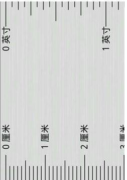

# A/D 和 D/A 的基本概念

A/D 是模拟量到数字量的转换，依靠的是模数转换器(Analog to Digital Converter)，简称 ADC。D/A 是数字量到模拟量的转换，依靠的是数模转换器(Digital to Analog Converter)，简称 DAC。它们的道理是完全一样的，只是转换方向不同，因此我们讲解过程主要以 A/D 为例来讲解。

很多同学学到 A/D 这部分的时候，感觉是个难点，概念搞不清楚，掌握不好。我个人认为主要原因不在于技术问题，而是不太会感悟生活。我们生活中有很多很多 A/D 的例子，只是没有在单片机领域里应用而已，下面我带着大家一起感悟一下 A/D 的概念。

什么是模拟量？就是指变量在一定范围内连续变化的量，也就是在一定范围内可以取任意值。比如米尺，从 0 到 1 米之间，可以是任意值。什么是任意值，也就是可以是 1cm，也可以是 1.001cm，当然也可以 10.000„„后边有无限个小数。总之，任何两个数字之间都有无限个中间值，所以称之为连续变化的量，也就是模拟量。

而我们用的米尺上被我们人为的做上了刻度符号，每两个刻度之间的间隔是 1mm，这个刻度实际上就是我们对模拟量的数字化，由于有一定的间隔，不是连续的，所以在专业领域里我们称之为离散的。ADC 就是起到把连续的信号用离散的数字表达出来的作用。那么我们就可以使用米尺这个“ADC”来测量连续的长度或者高度这些模拟量。如图 17-1 一个简单的米尺刻度示意图。

图 17-1  米尺刻度示意图

我们往杯子里倒水，水位会随着倒入的水量的多少而变化。现在就用这个米尺来测量我们杯子里的水位的高度。水位变化是连续的，而我们只能通过尺子上的刻度来读取水位的高度，获取我们想得到的水位的数字量信息。这个过程，就可以简单理解为我们电路中的 ADC 采样。