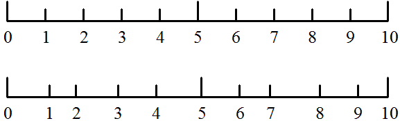

# A/D(模数转换)的主要指标

我们在选取和使用 A/D 的时候，依靠什么指标来判断很重要。由于 AD 的种类很多，分为积分型、逐次逼近型、并行/串行比较型、Σ-Δ型等多种类型。同时指标也比较多，并且有的指标还有轻微差别，在这里我是以同学们便于理解的方法去讲解，如果和某一确定类型 A/D 概念和原理有差别，也不会影响实际应用。

## ADC 的位数

一个 n 位的 ADC 表示这个 ADC 共有 2 的 n 次方个刻度。8 位的 ADC，输出的是从 0～255 一共 256 个数字量，也就是 2 的 8 次方个数据刻度。

## 基准源

基准源，也叫基准电压，是 ADC 的一个重要指标，要想把输入 ADC 的信号测量准确，那么基准源首先要准，基准源的偏差会直接导致转换结果的偏差。比如一根米尺，总长度本应该是 1 米，假定这根米尺被火烤了一下，实际变成了 1.2 米，再用这根米尺测物体长度的话自然就有了较大的偏差。假如我们的基准源应该是 5.10V，但是实际上提供的却是 4.5V，这样误把 4.5V 当成了 5.10V 来处理的话，偏差也会比较大。

## 分辨率

分辨率是数字量变化一个最小刻度时，模拟信号的变化量，定义为满刻度量程与 2n-1 的比值。假定 5.10V 的电压系统，使用 8 位的 ADC 进行测量，那么相当于 0～255 一共 256 个刻度把 5.10V 平均分成了 255 份，那么分辨率就是 5.10/255 = 0.02V。

## INL（积分非线性度）和 DNL（差分非线性度）

初学者最容易混淆的两个概念就是“分辨率”和“精度”，认为分辨率越高，则精度越高，而实际上，两者之间是没有必然联系的。分辨率是用来描述刻度划分的，而精度是用来描述准确程度的。同样一根米尺，刻度数相同，分辨率就相当，但是精度却可以相差很大，如图 17-2 所示。

图 17-2  米尺精度对比

图 17-2 表示的精度一目了然，不需多说。和 ADC 精度关系重大的两个指标是 INL(Integral NonLiner)和 DNL(Differencial NonLiner)。

INL 指的是 ADC 器件在所有的数值上对应的模拟值，和真实值之间误差最大的那一个点的误差值，是 ADC 最重要的一个精度指标，单位是 LSB。LSB（Least Significant Bit）是最低有效位的意思，那么它实际上对应的就是 ADC 的分辨率。一个基准为 5.10V 的 8 位 ADC，它的分辨率就是 0.02V，用它去测量一个电压信号，得到的结果是 100，就表示它测到的电压值是 100*0.02V=2V，假定它的 INL 是 1LSB，就表示这个电压信号真实的准确值是在 1.98V～2.02V 之间的，按理想情况对应得到的数字应该是 99～101，测量误差是一个最低有效位，即 1LSB。

DNL 表示的是 ADC 相邻两个刻度之间最大的差异，单位也是 LSB。一把分辨率是 1 毫米的尺子，相邻的刻度之间并不都刚好是 1 毫米，而总是会存在或大或小的误差。同理，一个 ADC 的两个刻度线之间也不总是准确的等于分辨率，也是存在误差，这个误差就是 DNL。

一个基准为 5.10V 的 8 位 ADC，假定它的 DNL 是 0.5LSB，那么当它的转换结果从 100 增加到 101 时，理想情况下实际电压应该增加 0.02V，但 DNL 为 0.5LSB 的情况下实际电压的增加值是在 0.01～0.03V 之间。值得一提的是 DNL 并非一定小于 1LSB，很多时候它会等于或大于 1LSB，这就相当于是一定程度上的刻度紊乱，当实际电压保持不变时，ADC 得出的结果可能会在几个数值之间跳动，很大程度上就是由于这个原因（但并不完全是，因为还有无时无处不在的干扰的影响）。

## 转换速率

转换速率，是指 ADC 每秒能进行采样转换的最大次数，单位是 sps（或 s/s、sa/s，即 samples per second），它与 ADC 完成一次从模拟到数字的转换所需要的时间互为倒数关系。ADC 的种类比较多，其中积分型的 ADC 转换时间是毫秒级的，属于低速 ADC；逐次逼近型 ADC 转换时间是微妙级的，属于中速 ADC；并行/串行的 ADC 的转换时间可达到纳秒级，属于高速 ADC。

ADC 的这几个主要指标大家先熟悉一下，对于其它的，作为一个入门级别的选手来说，先不着急深入理解。以后使用过程中遇到了，再查找相关资料深入学习，当前重点是在头脑中建立一个 ADC 的基本概念。