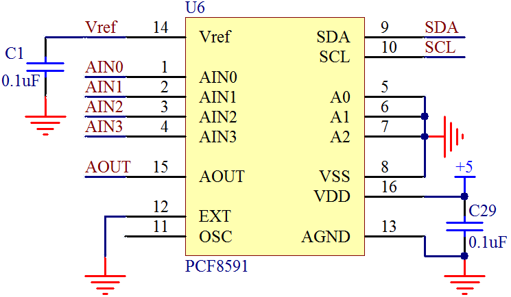
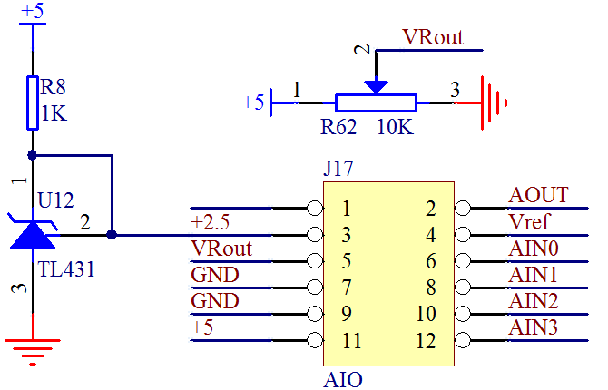

# PCF8591 硬件接口(电路图引脚图)

PCF8591 是一个单电源低功耗的 8 位 CMOS 数据采集器件，具有 4 路模拟输入，1 路模拟输出和一个串行 I2C 总线接口用来与单片机通信。与前面讲过的 24C02 类似，3 个地址引脚 A0、A1、A2 用于编程硬件地址，允许最多 8 个器件连接到 I2C 总线而不需要额外的片选电路。器件的地址、控制以及数据都是通过 I2C 总线来传输，我们先看一下 PCF8591 的原理图，如图 17-3 所示。

图 17-3  PCF8591 原理图

其中引脚 1、2、3、4 是 4 路模拟输入，引脚 5、6、7 是 I2C 总线的硬件地址，8 脚是数字地 GND，9 脚和 10 脚是 I2C 总线的 SDA 和 SCL。12 脚是时钟选择引脚，如果接高电平表示用外部时钟输入，接低电平则用内部时钟，我们这套电路用的是内部时钟，因此 12 脚直接接 GND，同时 11 脚悬空。13 脚是模拟地 AGND，在实际开发中，如果有比较复杂的模拟电路，那么 AGND 部分在布局布线上要特别处理，而且和 GND 的连接也有多种方式，这里大家先了解即可。在我们板子上没有复杂的模拟部分电路，所以我们把 AGND 和 GND 接到一起。14 脚是基准源，15 脚是 DAC 的模拟输出，16 脚是供电电源 VCC。

PCF8591 的 ADC 是逐次逼近型的，转换速率算是中速，但是它的速度瓶颈在 I2C 通信上。由于 I2C 通信速度较慢，所以最终的 PCF8591 的转换速度，直接取决于 I2C 的通信速率。由于 I2C 速度的限制，所以 PCF8591 得算是个低速的 AD 和 DA 的集成，主要应用在一些转换速度要求不高，希望成本较低的场合，比如电池供电设备，测量电池的供电电压，电压低于某一个值，报警提示更换电池等类似场合。

Vref 基准电压的提供有两种方法。一是采用简易的原则，直接接到 VCC 上去，但是由于 VCC 会受到整个线路的用电功耗情况影响，一来不是准确的 5V，实测大多在 4.8V 左右，二来随着整个系统负载情况的变化会产生波动，所以只能用在简易的、对精度要求不高的场合。方法二是使用专门的基准电压器件，比如 TL431，它可以提供一个精度很高的 2.5V 的电压基准，这是我们通常采用的方法。如图 17-4 所示。

图 17-4  PCF8591 基准与对外接口原理图

图中 J17 是双排插针，大家可以根据自己的需求选择跳线帽短接还是使用杜邦线连接其它外部电路，二者都是可以的。在这个地方，我们直接把 J17 的 3 脚和 4 脚用跳线帽短路起来，那么现在 Vref 的基准源就是 2.5V 了。分别把 5 和 6、7 和 8、9 和 10、11 和 12 用跳线帽短接起来的话，那么我们的 AIN0 实测的就是电位器的分压值，AIN1 和 AIN2 测的是 GND 的值，AIN3 测的是+5V 的值。这里需要注意的是，AIN3 虽然测的是+5V 的值，但是对于 AD 来说，只要输入信号超过 Vref 基准源，它得到的始终都是最大值，即 255，也就是说它实际上无法测量超过其 Vref 的电压信号的。需要注意的是，所有输入信号的电压值都不能超过 VCC，即+5V，否则可能会损坏 ADC 芯片。