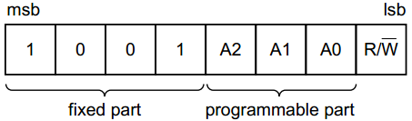
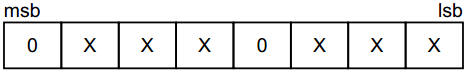
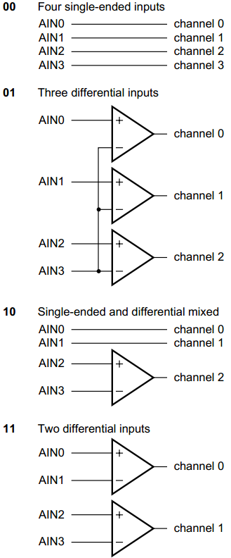

# PCF8591 应用程序

PCF8591 的通信接口是 I2C，那么编程肯定是要符合这个协议的。单片机对 PCF8591 进行初始化，一共发送三个字节即可。第一个字节，和 EEPROM 类似，是器件地址字节，其中 7 位代表地址，1 位代表读写方向。地址高 4 位固定是 0b1001，低三位是 A2，A1，A0，这三位我们电路上都接了 GND，因此也就是 0b000，如图 17-5 所示。

图 17-5  PCF8591 地址字节

发送到 PCF8591 的第二个字节将被存储在控制寄存器，用于控制 PCF8591 的功能。其中第 3 位和第 7 位是固定的 0，另外 6 位各自有各自的作用，如图 17-6 所示，我逐一介绍。



图 17-6  PCF8591 控制字节

控制字节的第 6 位是 DA 使能位，这一位置 1 表示 DA 输出引脚使能，会产生模拟电压输出功能。第 4 位和第 5 位可以实现把 PCF8591 的 4 路模拟输入配置成单端模式和差分模式，单端模式和差分模式的区别，我们在 17.5 节有介绍，这里大家只需要知道这两位是配置 AD 输入方式的控制位即可，如图 17-7 所示。



图 17-7  PCF8591 模拟输入配置方式

控制字节的第 2 位是自动增量控制位，自动增量的意思就是，比如我们一共有 4 个通道，当我们全部使用的时候，读完了通道 0，下一次再读，会自动进入通道 1 进行读取，不需要我们指定下一个通道，由于 A/D 每次读到的数据，都是上一次的转换结果，所以同学们在使用自动增量功能的时候，要特别注意，当前读到的是上一个通道的值。为了保持程序的通用性，我们的代码没有使用这个功能，直接做了一个通用的程序。

控制字节的第 0 位和第 1 位就是通道选择位了，00、01、10、11 代表了从 0 到 3 的一共 4 个通道选择。

发送给 PCF8591 的第三个字节 D/A 数据寄存器，表示 D/A 模拟输出的电压值。D/A 模拟我们一会介绍，大家知道这个字节的作用即可。我们如果仅仅使用 A/D 功能的话，就可以不发送第三个字节。

下面我们用一个程序，把 AIN0、AIN1、AIN3 测到的电压值显示在液晶上，同时大家可以转动电位器，会发现 AIN0 的值发生变化。

/***************************Lcd1602.c 文件程序源代码*****************************/

（此处省略，可参考之前章节的代码）

/*****************************I2C.c 文件程序源代码*******************************/

（此处省略，可参考之前章节的代码）

```
/*****************************main.c 文件程序源代码******************************/
#include <reg52.h>
bit flag300ms = 1; //300ms 定时标志
unsigned char T0RH = 0; //T0 重载值的高字节
unsigned char T0RL = 0; //T0 重载值的低字节

void ConfigTimer0(unsigned int ms);
unsigned char GetADCValue(unsigned char chn);
void ValueToString(unsigned char *str, unsigned char val);
extern void I2CStart();
extern void I2CStop();
extern unsigned char I2CReadACK();
extern unsigned char I2CReadNAK();
extern bit I2CWrite(unsigned char dat);
extern void InitLcd1602();
extern void LcdShowStr(unsigned char x, unsigned char y, unsigned char *str);

void main(){
    unsigned char val;
    unsigned char str[10];

    EA = 1; //开总中断
    ConfigTimer0(10); //配置 T0 定时 10ms
    InitLcd1602(); //初始化液晶
    LcdShowStr(0, 0, "AIN0 AIN1 AIN3"); //显示通道指示

    while (1){
        if (flag300ms){
            flag300ms = 0; //显示通道 0 的电压
            val = GetADCValue(0); //获取 ADC 通道 0 的转换值
            ValueToString(str, val); //转为字符串格式的电压值
            LcdShowStr(0, 1, str); //显示到液晶上
            //显示通道 1 的电压
            val = GetADCValue(1);
            ValueToString(str, val);
            LcdShowStr(6, 1, str);
            //显示通道 3 的电压
            val = GetADCValue(3);
            ValueToString(str, val);
            LcdShowStr(12, 1, str);
        }
    }
}
/* 读取当前的 ADC 转换值，chn-ADC 通道号 0~3 */
unsigned char GetADCValue(unsigned char chn){
    unsigned char val;
    I2CStart();
    if (!I2CWrite(0x48<<1)){ //寻址 PCF8591，如未应答，则停止操作并返回 0
        I2CStop();
        return 0;
    }
    I2CWrite(0x40|chn); //写入控制字节，选择转换通道
    I2CStart();
    I2CWrite((0x48<<1)|0x01); //寻址 PCF8591，指定后续为读操作
    I2CReadACK(); //先空读一个字节，提供采样转换时间
    val = I2CReadNAK(); //读取刚刚转换完的值
    I2CStop();
    return val;
}
/* ADC 转换值转为实际电压值的字符串形式，str-字符串指针，val-AD 转换值 */
void ValueToString(unsigned char *str, unsigned char val){
    //电压值=转换结果*2.5V/255，式中的 25 隐含了一位十进制小数
    val = (val*25) / 255;
    str[0] = (val/10) + '0'; //整数位字符
    str[1] = '.'; //小数点
    str[2] = (val%10) + '0'; //小数位字符
    str[3] = 'V'; //电压单位
    str[4] = '\0'; //结束符
}
/* 配置并启动 T0，ms-T0 定时时间 */
void ConfigTimer0(unsigned int ms){
    unsigned long tmp; //临时变量
    tmp = 11059200 / 12; //定时器计数频率
    tmp = (tmp * ms) / 1000; //计算所需的计数值
    tmp = 65536 - tmp; //计算定时器重载值
    tmp = tmp + 12; //补偿中断响应延时造成的误差
    T0RH = (unsigned char)(tmp>>8); //定时器重载值拆分为高低字节
    T0RL = (unsigned char)tmp;
    TMOD &= 0xF0; //清零 T0 的控制位
    TMOD |= 0x01; //配置 T0 为模式 1
    TH0 = T0RH; //加载 T0 重载值
    TL0 = T0RL;
    ET0 = 1; //使能 T0 中断
    TR0 = 1; //启动 T0
}
/* T0 中断服务函数，执行 300ms 定时 */
void InterruptTimer0() interrupt 1{
    static unsigned char tmr300ms = 0;
    TH0 = T0RH; //重新加载重载值
    TL0 = T0RL;
    tmr300ms++;
    if (tmr300ms >= 30){ //定时 300ms
        tmr300ms = 0;
        flag300ms = 1;
    }
}
```

细心阅读程序的同学会发现，程序在进行 A/D 读取数据的时候，共使用了两条程序去读了 2 个字节：I2CReadACK(); val = I2CReadNAK(); PCF8591 的转换时钟是 I2C 的 SCL，8 个 SCL 周期完成一次转换，所以当前的转换结果总是在下一个字节的 8 个 SCL 上才能读出，因此我们这里第一条语句的作用是产生一个整体的 SCL 时钟提供给 PCF8591 进行 A/D 转换，第二次是读取当前的转换结果。如果我们只使用第二条语句的话，每次读到的都是上一次的转换结果。