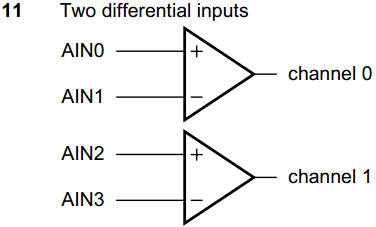
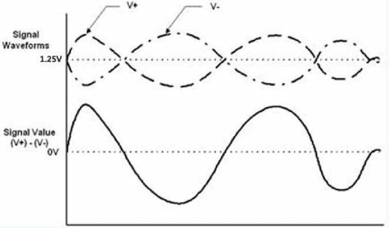

# A/D 差分输入信号

在上一节已经提到过，控制字的第 4 位和第 5 位是用于控制 PCF8591 的模拟输入引脚是单端输入还是差分输入。差分输入是模拟电路常用的一个技巧，这里我们把相关知识做一些简单介绍。

从严格意义上来讲，其实所有的信号都是差分信号，因为所有的电压只能是相对于另外一个电压而言。但是大多数系统，我们都是把系统的 GND 作为基准点。而对于 A/D 来说的差分输入，通常情况下是除了 GND 以外，另外两路幅度相同，极性相反的输入信号，其实理解起来很简单，就如同跷跷板一样。如图 17-8 所示。

图 17-8  差分输入原理

差分输入的话，就不是单个输入，而是由 2 个输入端构成的一组输入。PCF8591 一共是 4 个模拟输入端，可以配置成 4 种模式，最典型的是 4 个输入端构造成的两路差分模式，如图 17-9 所示。

图 17-9  PCF8591 差分输入模式

当控制字的第 4 位和第 5 位都是 1 的时候，那么 4 路模拟被配置成 2 路差分模式输入 channel 0 和 channel 1。我们以 channel 0 为例，其中 AIN0 是正向输入端，AIN1 是反向输入端，它们之间的信号输入是幅度相同，极性相反的信号，通过减法器后，得到的是两个输入通道的差值，如图 17-10 所示。

图 17-10  差分输入信号

通常情况下，差分输入的中线是基准电压的一半，我们的基准电压是 2.5V，假如 1.25V 作为中线，V+是 AIN0 的输入波形，V-是 AIN1 的输入波形，Signal Value 就是经过减法器后的波形。很多 A/D 都采用差分的方式输入，因为差分输入方式比单端输入来说，有更强的抗干扰能力。

单端输入信号时，如果一线上发生干扰变化，比如幅度增大 5mv，GND 不变，测到的数据会有偏差；而差分信号输入时，当外界存在干扰信号时，只要布线合理，大都同时被耦合到两条线上，幅度增大 5mv 会同时增大 5mv，而接收端关心的只是两个信号的差值，所以外界的这种共模噪声可以被完全抵消掉。由于两根信号的极性相反，它们对外辐射的电磁场可以相互抵消，有效的抑制释放到外界的电磁能量。

在我们的 KST-51 开发板上，我们没有做差分信号输入的实验环境，由于这个内容在 A/D 部分比较重要，所以还是介绍给大家，以供参考。