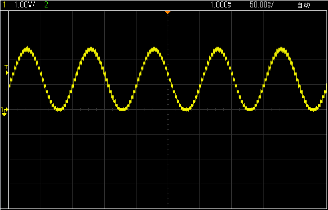
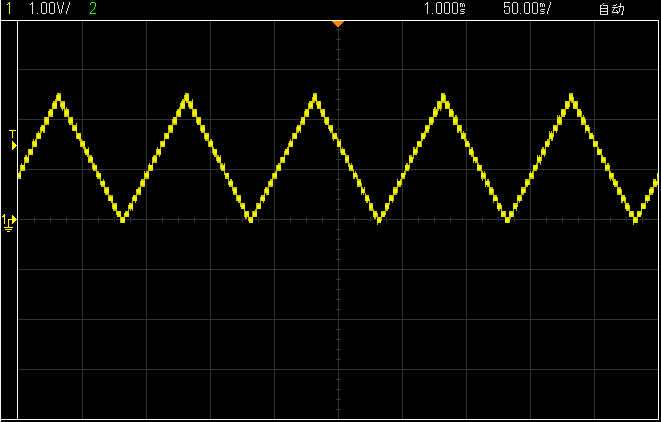
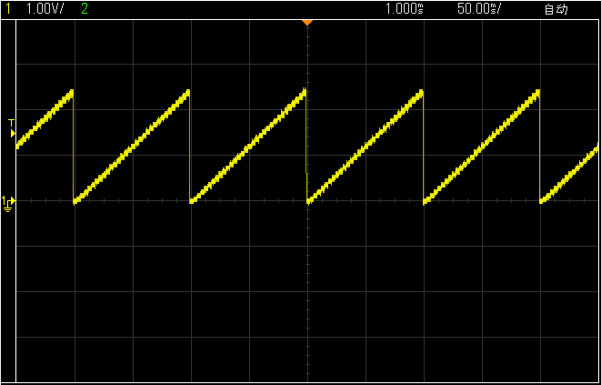

# 单片机信号发生器程序

有了 D/A 这个武器，我们就不仅仅可以输出方波信号了，可以输出任意波形了，比如正弦波、三角波、锯齿波等等。以正弦波为例，首先我们要建立一个正弦波的波表。这些不需要大家去逐一计算，可以通过搜索找到正弦波数据表，然后可以根据时间参数自己选取其中一定量数据作为我们程序的正弦波表，我们的程序代码选取了 32 个点。

/*****************************I2C.c 文件程序源代码*******************************/

（此处省略，可参考之前章节的代码）

/***************************keyboard.c 文件程序源代码****************************/

（此处省略，可参考之前章节的代码）

/*****************************main.c 文件程序源代码******************************/

```
#include <reg52.h>

unsigned char code SinWave[] = { //正弦波波表
    127, 152, 176, 198, 217, 233, 245, 252,
    255, 252, 245, 233, 217, 198, 176, 152,
    127, 102, 78, 56, 37, 21, 9, 2,
    0, 2, 9, 21, 37, 56, 78, 102
};
unsigned char code TriWave[] = { //三角波波表
    0, 16, 32, 48, 64, 80, 96, 112,
    128, 144, 160, 176, 192, 208, 224, 240,
    255, 240, 224, 208, 192, 176, 160, 144,
    128, 112, 96, 80, 64, 48, 32, 16
};
unsigned char code SawWave[] = { //锯齿波表
    0, 8, 16, 24, 32, 40, 48, 56,
    64, 72, 80, 88, 96, 104, 112, 120,
    128, 136, 144, 152, 160, 168, 176, 184,
    192, 200, 208, 216, 224, 232, 240, 248
};
unsigned char code *pWave; //波表指针
unsigned char T0RH = 0; //T0 重载值的高字节
unsigned char T0RL = 0; //T0 重载值的低字节
unsigned char T1RH = 1; //T1 重载值的高字节
unsigned char T1RL = 1; //T1 重载值的低字节

void ConfigTimer0(unsigned int ms);
void SetWaveFreq(unsigned char freq);
extern void KeyScan();
extern void KeyDriver();
extern void I2CStart();
extern void I2CStop();
extern bit I2CWrite(unsigned char dat);

void main(){
    EA = 1; //开总中断
    ConfigTimer0(1); //配置 T0 定时 1ms
    pWave = SinWave; //默认正弦波
    SetWaveFreq(10); //默认频率 10Hz

    while (1){
        KeyDriver(); //调用按键驱动
    }
}
/* 按键动作函数，根据键码执行相应的操作，keycode-按键键码 */
void KeyAction(unsigned char keycode){
    static unsigned char i = 0;
    if (keycode == 0x26){ //向上键，切换波形
        //在 3 种波形间循环切换
        if (i == 0){
            i = 1;
            pWave = TriWave;
        }else if (i == 1){
            i = 2;
            pWave = SawWave;
        }else{
            i = 0;
            pWave = SinWave;
        }
    }
}

/* 设置 DAC 输出值，val-设定值 */
void SetDACOut(unsigned char val){
    I2CStart();
    if (!I2CWrite(0x48<<1)){ //寻址 PCF8591，如未应答，则停止操作并返回
        I2CStop();
        return;
    }
    I2CWrite(0x40); //写入控制字节
    I2CWrite(val); //写入 DA 值
    I2CStop();
}
/* 设置输出波形的频率，freq-设定频率 */
void SetWaveFreq(unsigned char freq){
    unsigned long tmp;
    tmp = (11059200/12) / (freq*32); //定时器计数频率，是波形频率的 32 倍
    tmp = 65536 - tmp; //计算定时器重载值
    tmp = tmp + 33; //修正中断响应延时造成的误差
    T1RH = (unsigned char)(tmp>>8); //定时器重载值拆分为高低字节
    T1RL = (unsigned char)tmp;
    TMOD &= 0x0F; //清零 T1 的控制位
    TMOD |= 0x10; //配置 T1 为模式 1
    TH1 = T1RH; //加载 T1 重载值
    TL1 = T1RL;
    ET1 = 1; //使能 T1 中断
    PT1 = 1; //设置为高优先级
    TR1 = 1; //启动 T1
}
/* 配置并启动 T0，ms-T0 定时时间 */
void ConfigTimer0(unsigned int ms){
    unsigned long tmp; //临时变量
    tmp = 11059200 / 12; //定时器计数频率
    tmp = (tmp * ms) / 1000; //计算所需的计数值
    tmp = 65536 - tmp; //计算定时器重载值
    tmp = tmp + 28;//补偿中断响应延时造成的误差
    T0RH = (unsigned char)(tmp>>8); //定时器重载值拆分为高低字节
    T0RL = (unsigned char)tmp;
    TMOD &= 0xF0; //清零 T0 的控制位
    TMOD |= 0x01; //配置 T0 为模式 1
    TH0 = T0RH; //加载 T0 重载值
    TL0 = T0RL;
    ET0 = 1; //使能 T0 中断
    TR0 = 1; //启动 T0
}
/* T0 中断服务函数，执行按键扫描 */
void InterruptTimer0() interrupt 1{
    TH0 = T0RH; //重新加载重载值
    TL0 = T0RL;
    KeyScan(); //按键扫描
}
/* T1 中断服务函数，执行波形输出 */
void InterruptTimer1() interrupt 3{
    static unsigned char i = 0;
    TH1 = T1RH; //重新加载重载值
    TL1 = T1RL;
    //循环输出波表中的数据
    SetDACOut(pWave[i]);
    i++;
    if (i >= 32){
        i = 0;
    }
}
```

这个程序可以通过“向上”按键来实现波形输出切换，波形输出的定时刷新由定时器 T1 定时来完成，改变 T1 的定时周期即可改变波形的输出频率。D/A 输出没有办法接到显示界面，所以我们用示波器抓出来波形给大家看一下，如图 17-11、图 17-12、图 17-13 所示。

图 17-11   D/A 输出正弦波形



图 17-12  D/A 输出三角波形



图 17-13  D/A 输出锯齿波形

这几张图可以直观的看到我们程序输出的波形。细心的同学会发现我们波形上有很多小锯齿，没有平滑的连起来。这是因为我们 DA 最多只能输出 0～Vref 之间的 256 个离散的电压值，而不是连续的任意值，所以每个离散值都会持续一定的时间，然后跳变到下一个离散值，于是就呈现出了波形上的这种锯齿。在实际开发中，我们只需要在 DA 后级加一级低通滤波电路，就可以让带锯齿的波形变得平滑起来。