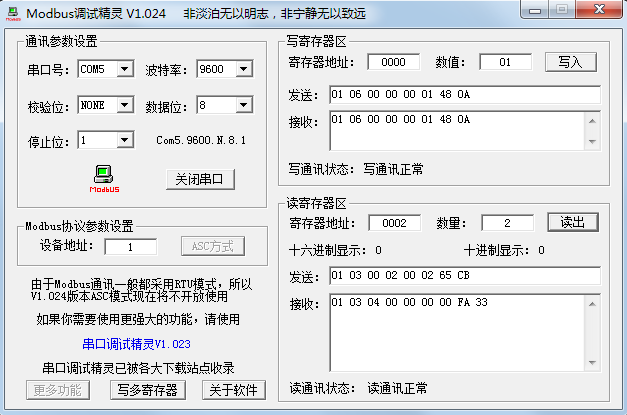

# 单片机 Modbus 多机通信程序设计

给从机下发不同的指令，从机去执行不同的操作，这个就是判断一下功能码即可，和我们前边学的实用串口例程是类似的。多机通信，无非就是添加了一个设备地址判断而已，难度也不大。我们找了一个 Modbus 调试精灵，通过设置设备地址，读写寄存器的地址以及数值数量等参数，可以直接替代串口调试助手，比较方便的下发多个字节的数据，如图 18-7 所示。我们先来就图中的设置和数据来对 Modbus 做进一步的分析，图中的数据来自于调试精灵与我们接下来要讲的例程之间的交互。

图 18-7  Modbus 调试精灵

如图，我们的 USB 转 RS485 模块虚拟出的是 COM5，波特率 9600，无校验位，数据位是 8 位，1 位停止位，设备地址假设为 1。

写寄存器的时候，如果我们要把 01 写到一个地址是 0000 的寄存器地址里，点一下“写入”，就会出现发送指令：01 06 00 00 00 01 48 0A。我们来分析一下这帧数据，其中 01 是设备地址，06 是功能码，代表写寄存器这个功能，后边跟 00 00 表示的是要写入的寄存器的地址，00 01 就是要写入的数据，48 0A 就是 CRC 校验码，这是软件自动算出来的。而根据 Modbus 协议，当写寄存器的时候，从机成功完成该指令的操作后，会把主机发送的指令直接返回，我们的调试精灵会接收到这样一帧数据：01 06 00 00 00 01 48 0A。

假如我们现在要从寄存器地址 0002 开始读取寄存器，并且读取的数量是 2 个。点一下“读出”，就会出现发送指令：01 03 00 02 00 02 65 CB。其中 01 是设备地址，03 是功能码，代表读寄存器这个功能，00 02 就是读寄存器的起始地址，后一个 00 02 就是要读取 2 个寄存器的数值，65 CB 就是 CRC 校验。而接收到的数据是：01 03 04 00 00 00 00 FA 33。其中 01 是设备地址，03 是功能码，04 代表的是后边读到的数据字节数是 4 个，00 00 00 00 分别是地址为 00 02 和 00 03 的寄存器内部的数据，而 FA 33 就是 CRC 校验了。

似乎越来越明朗了，所谓的 Modbus 通信协议，无非就是主机下发了不同的指令，从机根据指令的判断来执行不同的操作而已。由于我们的开发板没有 Modbus 功能码那么多相应的功能，我们在程序中定义了一个数组 regGroup[5]，相当于 5 个寄存器，此外又定义了第 6 个寄存器，控制蜂鸣器，通过下发不同的指令我们改变寄存器组的数据或者改变蜂鸣器的开关状态。在 Modbus 协议里寄存器的地址和数值都是 16 位的，即 2 个字节，我们默认高字节是 0x00，低字节就是数组 regGroup 对应的值。其中地址 0x0000 到 0x0004 对应的就是 regGroup 数组中的元素，我们写入的同时把数字又显示到 1602 液晶上，而 0x0005 这个地址，写入 0x00，蜂鸣器就不响，写入任何其它数值，蜂鸣器就报警。我们单片机的主要工作也就是解析串口接收的数据执行不同操作。

/***************************Lcd1602.c 文件程序源代码*****************************/

（此处省略，可参考之前章节的代码）

/****************************RS485.c 文件程序源代码*****************************/

（此处省略，可参考之前章节的代码）

/****************************CRC16.c 文件程序源代码****************************/

```
/* CRC16 计算函数，ptr-数据指针，len-数据长度，返回值-计算出的 CRC16 数值 */
unsigned int GetCRC16(unsigned char *ptr, unsigned char len){
    unsigned int index;
    unsigned char crch = 0xFF; //高 CRC 字节
    unsigned char crcl = 0xFF; //低 CRC 字节
    unsigned char code TabH[] = { //CRC 高位字节值表
        0x00, 0xC1, 0x81, 0x40, 0x01, 0xC0, 0x80, 0x41, 0x01, 0xC0,
        0x80, 0x41, 0x00, 0xC1, 0x81, 0x40, 0x01, 0xC0, 0x80, 0x41,
        0x00, 0xC1, 0x81, 0x40, 0x00, 0xC1, 0x81, 0x40, 0x01, 0xC0,
        0x80, 0x41, 0x01, 0xC0, 0x80, 0x41, 0x00, 0xC1, 0x81, 0x40,
        0x00, 0xC1, 0x81, 0x40, 0x01, 0xC0, 0x80, 0x41, 0x00, 0xC1,
        0x81, 0x40, 0x01, 0xC0, 0x80, 0x41, 0x01, 0xC0, 0x80, 0x41,
        0x00, 0xC1, 0x81, 0x40, 0x01, 0xC0, 0x80, 0x41, 0x00, 0xC1,
        0x81, 0x40, 0x00, 0xC1, 0x81, 0x40, 0x01, 0xC0, 0x80, 0x41,
        0x00, 0xC1, 0x81, 0x40, 0x01, 0xC0, 0x80, 0x41, 0x01, 0xC0,
        0x80, 0x41, 0x00, 0xC1, 0x81, 0x40, 0x00, 0xC1, 0x81, 0x40,
        0x01, 0xC0, 0x80, 0x41, 0x01, 0xC0, 0x80, 0x41, 0x00, 0xC1,
        0x81, 0x40, 0x01, 0xC0, 0x80, 0x41, 0x00, 0xC1, 0x81, 0x40,
        0x00, 0xC1, 0x81, 0x40, 0x01, 0xC0, 0x80, 0x41, 0x01, 0xC0,
        0x80, 0x41, 0x00, 0xC1, 0x81, 0x40, 0x00, 0xC1, 0x81, 0x40,
        0x01, 0xC0, 0x80, 0x41, 0x00, 0xC1, 0x81, 0x40, 0x01, 0xC0,
        0x80, 0x41, 0x01, 0xC0, 0x80, 0x41, 0x00, 0xC1, 0x81, 0x40,
        0x00, 0xC1, 0x81, 0x40, 0x01, 0xC0, 0x80, 0x41, 0x01, 0xC0,
        0x80, 0x41, 0x00, 0xC1, 0x81, 0x40, 0x01, 0xC0, 0x80, 0x41,
        0x00, 0xC1, 0x81, 0x40, 0x00, 0xC1, 0x81, 0x40, 0x01, 0xC0,
        0x80, 0x41, 0x00, 0xC1, 0x81, 0x40, 0x01, 0xC0, 0x80, 0x41,
        0x01, 0xC0, 0x80, 0x41, 0x00, 0xC1, 0x81, 0x40, 0x01, 0xC0,
        0x80, 0x41, 0x00, 0xC1, 0x81, 0x40, 0x00, 0xC1, 0x81, 0x40,
        0x01, 0xC0, 0x80, 0x41, 0x01, 0xC0, 0x80, 0x41, 0x00, 0xC1,
        0x81, 0x40, 0x00, 0xC1, 0x81, 0x40, 0x01, 0xC0, 0x80, 0x41,
        0x00, 0xC1, 0x81, 0x40, 0x01, 0xC0, 0x80, 0x41, 0x01, 0xC0,
        0x80, 0x41, 0x00, 0xC1, 0x81, 0x40
    } ;
    unsigned char code TabL[] = { //CRC 低位字节值表
        0x00, 0xC0, 0xC1, 0x01, 0xC3, 0x03, 0x02, 0xC2, 0xC6, 0x06,
        0x07, 0xC7, 0x05, 0xC5, 0xC4, 0x04, 0xCC, 0x0C, 0x0D, 0xCD,
        0x0F, 0xCF, 0xCE, 0x0E, 0x0A, 0xCA, 0xCB, 0x0B, 0xC9, 0x09,
        0x08, 0xC8, 0xD8, 0x18, 0x19, 0xD9, 0x1B, 0xDB, 0xDA, 0x1A,
        0x1E, 0xDE, 0xDF, 0x1F, 0xDD, 0x1D, 0x1C, 0xDC, 0x14, 0xD4,
        0xD5, 0x15, 0xD7, 0x17, 0x16, 0xD6, 0xD2, 0x12, 0x13, 0xD3,
        0x11, 0xD1, 0xD0, 0x10, 0xF0, 0x30, 0x31, 0xF1, 0x33, 0xF3,
        0xF2, 0x32, 0x36, 0xF6, 0xF7, 0x37, 0xF5, 0x35, 0x34, 0xF4,
        0x3C, 0xFC, 0xFD, 0x3D, 0xFF, 0x3F, 0x3E, 0xFE, 0xFA, 0x3A,
        0x3B, 0xFB, 0x39, 0xF9, 0xF8, 0x38, 0x28, 0xE8, 0xE9, 0x29,
        0xEB, 0x2B, 0x2A, 0xEA, 0xEE, 0x2E, 0x2F, 0xEF, 0x2D, 0xED,
        0xEC, 0x2C, 0xE4, 0x24, 0x25, 0xE5, 0x27, 0xE7, 0xE6, 0x26,
        0x22, 0xE2, 0xE3, 0x23, 0xE1, 0x21, 0x20, 0xE0, 0xA0, 0x60,
        0x61, 0xA1, 0x63, 0xA3, 0xA2, 0x62, 0x66, 0xA6, 0xA7, 0x67,
        0xA5, 0x65, 0x64, 0xA4, 0x6C, 0xAC, 0xAD, 0x6D, 0xAF, 0x6F,
        0x6E, 0xAE, 0xAA, 0x6A, 0x6B, 0xAB, 0x69, 0xA9, 0xA8, 0x68,
        0x78, 0xB8, 0xB9, 0x79, 0xBB, 0x7B, 0x7A, 0xBA, 0xBE, 0x7E,
        0x7F, 0xBF, 0x7D, 0xBD, 0xBC, 0x7C, 0xB4, 0x74, 0x75, 0xB5,
        0x77, 0xB7, 0xB6, 0x76, 0x72, 0xB2, 0xB3, 0x73, 0xB1, 0x71,
        0x70, 0xB0, 0x50, 0x90, 0x91, 0x51, 0x93, 0x53, 0x52, 0x92,
        0x96, 0x56, 0x57, 0x97, 0x55, 0x95, 0x94, 0x54, 0x9C, 0x5C,
        0x5D, 0x9D, 0x5F, 0x9F, 0x9E, 0x5E, 0x5A, 0x9A, 0x9B, 0x5B,
        0x99, 0x59, 0x58, 0x98, 0x88, 0x48, 0x49, 0x89, 0x4B, 0x8B,
        0x8A, 0x4A, 0x4E, 0x8E, 0x8F, 0x4F, 0x8D, 0x4D, 0x4C, 0x8C,
        0x44, 0x84, 0x85, 0x45, 0x87, 0x47, 0x46, 0x86, 0x82, 0x42,
        0x43, 0x83, 0x41, 0x81, 0x80, 0x40
    } ;

    while (len--){ //计算指定长度的 CRC
        index = crch ^ *ptr++;
        crch = crcl ^ TabH[index];
        crcl = TabL[index];
    }
    return ((crch<<8) | crcl);
}
```

关于 CRC 校验的算法，如果不是专门学习校验算法本身，大家可以不去研究这个程序的细节，直接使用现成的函数即可。

/*****************************main.c 文件程序源代码******************************/

```
#include <reg52.h>
sbit BUZZ = P1⁶;
bit flagBuzzOn = 0; //蜂鸣器启动标志
unsigned char T0RH = 0; //T0 重载值的高字节
unsigned char T0RL = 0; //T0 重载值的低字节
unsigned char regGroup[5]; //Modbus 寄存器组，地址为 0x00～0x04

void ConfigTimer0(unsigned int ms);
extern void UartDriver();
extern void ConfigUART(unsigned int baud);
extern void UartRxMonitor(unsigned char ms);
extern void UartWrite(unsigned char *buf, unsigned char len);
extern unsigned int GetCRC16(unsigned char *ptr, unsigned char len);
extern void InitLcd1602();
extern void LcdShowStr(unsigned char x, unsigned char y, unsigned char *str);

void main(){
    EA = 1; //开总中断
    ConfigTimer0(1); //配置 T0 定时 1ms
    ConfigUART(9600); //配置波特率为 9600
    InitLcd1602(); //初始化液晶

    while (1){
        UartDriver(); //调用串口驱动
    }
}
/* 串口动作函数，根据接收到的命令帧执行响应的动作
buf-接收到的命令帧指针，len-命令帧长度 */
void UartAction(unsigned char *buf, unsigned char len){
    unsigned char i;
    unsigned char cnt;
    unsigned char str[4];
    unsigned int crc;
    unsigned char crch, crcl;
    /* 本例中的本机地址设定为 0x01，
    如数据帧中的地址字节与本机地址不符，
    则直接退出，即丢弃本帧数据不做任何处理 */
    if (buf[0] != 0x01){
        return;
    }
    //地址相符时，再对本帧数据进行校验
    crc = GetCRC16(buf, len-2); //计算 CRC 校验值
    crch = crc >> 8;
    crcl = crc & 0xFF;
    if ((buf[len-2]!=crch) || (buf[len-1]!=crcl)){
        return; //如 CRC 校验不符时直接退出
    }
    //地址和校验字均相符后，解析功能码，执行相关操作
    switch (buf[1]){
        case 0x03: //读取一个或连续的寄存器
            if ((buf[2]==0x00) && (buf[3]<=0x05)){ //只支持 0x0000～0x0005
                if (buf[3] <= 0x04){
                    i = buf[3]; //提取寄存器地址
                    cnt = buf[5]; //提取待读取的寄存器数量
                    buf[2] = cnt*2; //读取数据的字节数，为寄存器数*2
                    len = 3; //帧前部已有地址、功能码、字节数共 3 个字节
                    while (cnt--){
                        buf[len++] = 0x00; //寄存器高字节补 0
                        buf[len++] = regGroup[i++]; //寄存器低字节
                    }
                }else{ //地址 0x05 为蜂鸣器状态
                    buf[2] = 2; //读取数据的字节数
                    buf[3] = 0x00;
                    buf[4] = flagBuzzOn;
                    len = 5;
                }
                break;
            }else{ //寄存器地址不被支持时，返回错误码
                buf[1] = 0x83; //功能码最高位置 1
                buf[2] = 0x02; //设置异常码为 02-无效地址
                len = 3;
                break;
            }

        case 0x06: //写入单个寄存器
            if ((buf[2]==0x00) && (buf[3]<=0x05)){ //只支持 0x0000～0x0005
               if (buf[3] <= 0x04){
                    i = buf[3]; //提取寄存器地址
                    regGroup[i] = buf[5]; //保存寄存器数据
                    cnt = regGroup[i] >> 4; //显示到液晶上
                    if (cnt >= 0xA){
                        str[0] = cnt - 0xA + 'A';
                    }else{
                        str[0] = cnt + '0';
                    }
                    cnt = regGroup[i] & 0x0F;
                    if (cnt >= 0xA){
                        str[1] = cnt - 0xA + 'A';
                    }else{
                        str[1] = cnt + '0';
                    }
                    str[2] = '\0';
                    LcdShowStr(i*3, 0, str);
                }else{ //地址 0x05 为蜂鸣器状态
                    flagBuzzOn = (bit)buf[5]; //寄存器值转为蜂鸣器的开关
                }
                len -= 2; //长度-2 以重新计算 CRC 并返回原帧
                break;
            }else{ //寄存器地址不被支持时，返回错误码
                buf[1] = 0x86; //功能码最高位置 1
                buf[2] = 0x02; //设置异常码为 02-无效地址
                len = 3;
                break;
            }

        default: //其它不支持的功能码
            buf[1] |= 0x80; //功能码最高位置 1
            buf[2] = 0x01; //设置异常码为 01-无效功能
            len = 3;
            break;
    }
    crc = GetCRC16(buf, len); //计算返回帧的 CRC 校验值
    buf[len++] = crc >> 8; //CRC 高字节
    buf[len++] = crc & 0xFF; //CRC 低字节
    UartWrite(buf, len); //发送返回帧
}
/* 配置并启动 T0，ms-T0 定时时间 */
void ConfigTimer0(unsigned int ms){
    unsigned long tmp; //临时变量
    tmp = 11059200 / 12; //定时器计数频率
    tmp = (tmp * ms) / 1000; //计算所需的计数值
    tmp = 65536 - tmp; //计算定时器重载值
    tmp = tmp + 33; //补偿中断响应延时造成的误差
    T0RH = (unsigned char)(tmp>>8); //定时器重载值拆分为高低字节
    T0RL = (unsigned char)tmp;
    TMOD &= 0xF0; //清零 T0 的控制位
    TMOD |= 0x01; //配置 T0 为模式 1
    TH0 = T0RH; //加载 T0 重载值
    TL0 = T0RL;
    ET0 = 1; //使能 T0 中断
    TR0 = 1; //启动 T0
}
/* T0 中断服务函数，执行串口接收监控和蜂鸣器驱动 */
void InterruptTimer0() interrupt 1{
    TH0 = T0RH; //重新加载重载值
    TL0 = T0RL;
    if (flagBuzzOn){ //执行蜂鸣器鸣叫或关闭
        BUZZ = ~BUZZ;
    }else{
        BUZZ = 1;
    }
    UartRxMonitor(1); //串口接收监控
}
```

大家可以看到负责解析协议的 UartAction 函数很长，因为协议解析本来就是一件很繁琐的事情。我们的例程仅解析执行了两个功能命令，就已经有近百行程序了，如果你需要解析更多的功能命令的话，那么建议把每个功能都做一个函数，然后在相应的 case 分支里调用即可，这样就不会使单个函数过于庞大而难以维护。