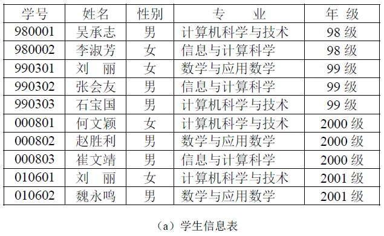
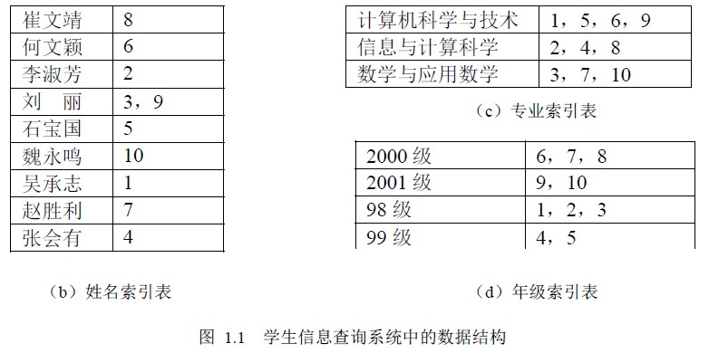
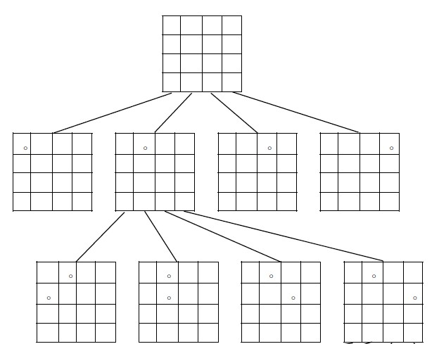
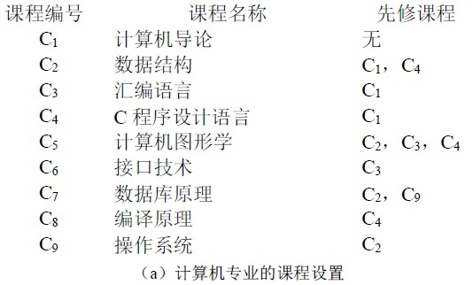
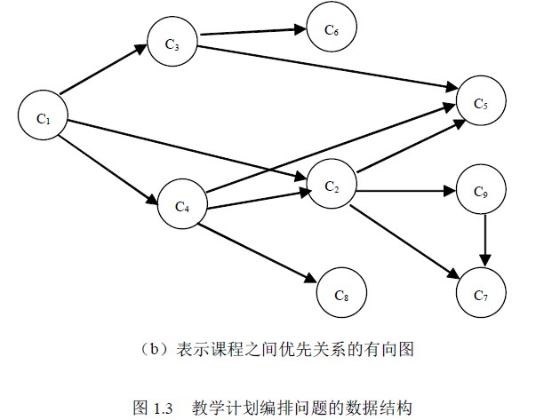

# 1．1 数据结构的概念—为什么要学习数据结构

数据结构是计算机科学与技术专业的专业基础课，是十分重要的核心课程。所有的计算机系统软件和应用软件都要用到各种类型的数据结构。因此，要想更好地运用计算机来解决实际问题，仅掌握几种计算机程序设计语言是难以应付众多复杂的课题的。要想有效地使用计算机、充分发挥计算机的性能，还必须学习和掌握好数据结构的有关知识。打好“数据结构”这门课程的扎实基础，对于学习计算机专业的其他课程，如操作系统、编译原理、数据库管理系统、软件工程、人工智能等都是十分有益的。

## 1.1.1 为什么要学习数据结构

在计算机发展的初期，人们使用计算机的目的主要是处理数值计算问题。当我们使用计算机来解决一个具体问题时，一般需要经过下列几个步骤：首先要从该具体问题抽象出一个适当的数学模型，然后设计或选择一个解此数学模型的算法，最后编出程序进行调试、测试，直至得到最终的解答。例如，求解梁架结构中应力的数学模型的线性方程组，该方程组可以使用迭代算法来求解。

由于当时所涉及的运算对象是简单的整型、实型或布尔类型数据，所以程序设计者的主要精力是集中于程序设计的技巧上，而无须重视数据结构。随着计算机应用领域的扩大和软、硬件的发展，非数值计算问题越来越显得重要。据统计，当今处理非数值计算性问题占用了 90%以上的机器时间。这类问题涉及到的数据结构更为复杂，数据元素之间的相互关系一般无法用数学方程式加以描述。因此，解决这类问题的关键不再是数学分析和计算方法，而是要设计出合适的数据结构，才能有效地解决问题。下面所列举的就是属于这一类的具体问题。

[例 1] 学生信息检索系统。当我们需要查找某个学生的有关情况的时候；或者想查询某个专业或年级的学生的有关情况的时候，只要我们建立了相关的数据结构，按照某种算法编写了相关程序，就可以实现计算机自动检索。由此，可以在学生信息检索系统中建立一张按学号顺序排列的学生信息表和分别按姓名、专业、年级顺序排列的索引表，如图 1.1 所示。由这四张表构成的文件便是学生信息检索的数学模型，计算机的主要操作便是按照某个特定要求（如给定姓名）对学生信息文件进行查询。诸如此类的还有电话自动查号系统、考试查分系统、仓库库存管理系统等。在这类文档管理的数学模型中，计算机处理的对象之间通常存在着的是一种简单的线性关系，这类数学模型可称为线性的数据结构。

[例 2] 八皇后问题。在八皇后问题中，处理过程不是根据某种确定的计算法则，而是利用试探和回溯的探索技术求解。为了求得合理布局，在计算机中要存储布局的当前状态。从最初的布局状态开始，一步步地进行试探，每试探一步形成一个新的状态，整个试探过程形成了一棵隐含的状态树。如图 1.2 所示（为了描述方便，将八皇后问题简化为四皇后问题）。回溯法求解过程实质上就是一个遍历状态树的过程。在这个问题中所出现的树也是一种数据结构，它可以应用在许多非数值计算的问题中。

图 1.2 四皇后问题中隐含的状态树

[例 3] 教学计划编排问题。一个教学计划包含许多课程，在教学计划包含的许多课程之间，有些必须按规定的先后次序进行，有些则没有次序要求。即有些课程之间有先修和后续的关系，有些课程可以任意安排次序。这种各个课程之间的次序关系可用一个称作图的数据结构来表示，如图 1.3 所示。有向图中的每个顶点表示一门课程，如果从顶点 vi 到 vj 之间存在有向边<vi，vj>，则表示课程 i 必须先于课程 j 进行。

由以上三个例子可见，描述这类非数值计算问题的数学模型不再是数学方程，而是诸如表、树、图之类的数据结构。因此，可以说数据结构课程主要是研究非数值计算的程序设计问题中所出现的计算机操作对象以及它们之间的关系和操作的学科。

学习数据结构的目的是为了了解计算机处理对象的特性，将实际问题中所涉及的处理对象在计算机中表示出来并对它们进行处理。与此同时，通过算法训练来提高学生的思维能力，通过程序设计的技能训练来促进学生的综合应用能力和专业素质的提高。

