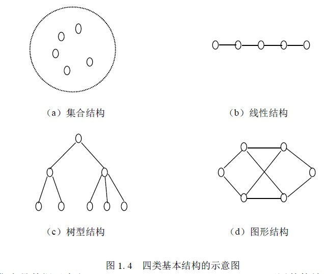

# 1.1 数据结构的概念—有关概念和术语

在系统地学习数据结构知识之前，先对一些基本概念和术语赋予确切的含义。

**数据（Data）**是信息的载体，它能够被计算机识别、存储和加工处理。它是计算机程

序加工的原料，应用程序处理各种各样的数据。计算机科学中，所谓数据就是计算机加工

处理的对象，它可以是数值数据，也可以是非数值数据。数值数据是一些整数、实数或复

数，主要用于工程计算、科学计算和商务处理等；非数值数据包括字符、文字、图形、图

像、语音等。

**数据元素（Data Element）**是数据的基本单位。在不同的条件下，数据元素又可称为元素、结点、顶点、记录等。例如，学生信息检索系统中学生信息表中的一个记录、八皇后问题中状态树的一个状态、教学计划编排问题中的一个顶点等，都被称为一个数据元素。有时，一个数据元素可由若干个数据项（Data Item）组成，例如，学籍管理系统中学生信息表的每一个数据元素就是一个学生记录。它包括学生的学号、姓名、性别、籍贯、出生年月、成绩等数据项。

这些数据项可以分为两种：一种叫做初等项，如学生的性别、籍贯等，这些数据项是在数据处理时不能再分割的最小单位；另一种叫做组合项，如学生的成绩，它可以再划分为数学、物理、化学等更小的项。通常，在解决实际应用问题时是把每个学生记录当作一个基本单位进行访问和处理的。

**数据对象（Data Object）**或**数据元素类（Data Element Class）**是具有相同性质的数据元素的集合。在某个具体问题中，数据元素都具有相同的性质（元素值不一定相等），属于同一数据对象（数据元素类），数据元素是数据元素类的一个实例。例如，在交通咨询系统的交通网中，所有的顶点是一个数据元素类，顶点 A 和顶点 B 各自代表一个城市，是该数据元素类中的两个实例，其数据元素的值分别为 A 和 B。

**数据结构（Data Structure）**是指互相之间存在着一种或多种关系的数据元素的集合。在任何问题中，数据元素之间都不会是孤立的，在它们之间都存在着这样或那样的关系，这种数据元素之间的关系称为结构。根据数据元素间关系的不同特性，通常有下列四类基本的结构：

1.  集合结构。在集合结构中，数据元素间的关系是“属于同一个集合”。集合是元素 关系极为松散的一种结构。
2.  线性结构。该结构的数据元素之间存在着一对一的关系。
3.  树型结构。该结构的数据元素之间存在着一对多的关系。
4.  图形结构。该结构的数据元素之间存在着多对多的关系，图形结构也称作网状结构。

图 1.4 为表示上述四类基本结构的示意图。

由于集合是数据元素之间关系极为松散的一种结构，因此也可用其他结构来表示它。从上面所介绍的数据结构的概念中可以知道，一个数据结构有两个要素。一个是数据元素的集合，另一个是关系的集合。在形式上，数据结构通常可以采用一个二元组来表示。数据结构的形式定义为：数据结构是一个二元组

Data_Structure ＝（D，R）其中，D 是数据元素的有限集，R 是 D 上关系的有限集。

数据结构包括数据的逻辑结构和数据的物理结构。数据的逻辑结构可以看作是从具体问题抽象出来的数学模型，它与数据的存储无关。我们研究数据结构的目的是为了在计算机中实现对它的操作，为此还需要研究如何在计算机中表示一个数据结构。数据结构在计算机中的标识（又称映像）称为数据的物理结构，或称存储结构。它所研究的是数据结构在计算机中的实现方法，包括数据结构中元素的表示及元素间关系的表示。

**数据的存储结构可采用顺序存储或链式存储的方法。**

**顺序存储方法**是把逻辑上相邻的元素存储在物理位置相邻的存储单元中，由此得到的存储表示称为顺序存储结构。顺序存储结构是一种最基本的存储表示方法，通常借助于程序设计语言中的数组来实现。

**链式存储方法**对逻辑上相邻的元素不要求其物理位置相邻，元素间的逻辑关系通过附设的指针字段来表示，由此得到的存储表示称为链式存储结构，链式存储结构通常借助于程序设计语言中的指针类型来实现。

除了通常采用的顺序存储方法和链式存储方法外，有时为了查找的方便还采用索引存储方法和散列存储方法。