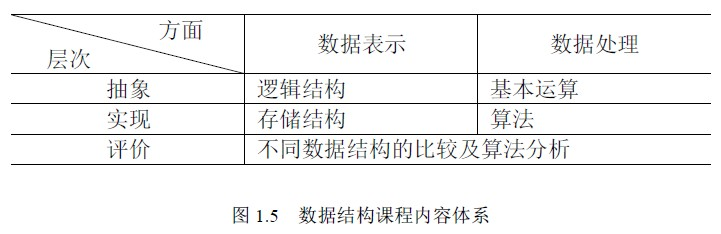

# 1.1 数据结构的概念—数据结构课程的内容

数据结构与数学、计算机硬件和软件有十分密切的关系。数据结构是介于数学、计算机硬件和计算机软件之间的一门计算机科学与技术专业的核心课程，是高级程序设计语言、编译原理、操作系统、数据库、人工智能等课程的基础。同时，数据结构技术也广泛应用于信息科学、系统工程、应用数学以及各种工程技术领域。

数据结构课程集中讨论软件开发过程中的设计阶段、同时设计编码和分析阶段的若干基本问题。此外，为了构造出好的数据结构及其实现，还需考虑数据结构及其实现的评价与选择。因此，数据结构的内容包括**三个层次的五个“要素”**，如图 1.5 所示。

数据结构的核心技术是分解与抽象。通过分解可以划分出数据的三个层次；再通过抽象，舍弃数据元素的具体内容，就得到逻辑结构。类似地，通过分解将处理要求划分成各种功能，再通过抽象舍弃实现细节，就得到运算的定义。上述两个方面的结合使我们将问题变换为数据结构。这是一个从具体（即具体问题）到抽象（即数据结构）的过程。然后，通过增加对实现细节的考虑进一步得到存储结构和实现运算，从而完成设计任务。这是一个从抽象（即数据结构）到具体（即具体实现）的过程。熟练地掌握这两个过程是数据结构课程在专业技能培养方面的基本目标。

数据结构作为一门独立的课程在国外是从 1968 年才开始的，但在此之前其有关内容已散见于编译原理及操作系统之中。20 世纪 60 年代中期，美国的一些大学开始设立有关课程，但当时的课程名称并不叫数据结构。1968 年美国唐.欧.克努特教授开创了数据结构的最初体系，他所著的《计算机程序设计技巧》第一卷《基本算法》是第一本较系统地阐述数据的逻辑结构和存储结构及其操作的著作。从 20 世纪 60 年代末到 70 年代初，出现了大型程序，软件也相对独立，结构程序设计成为程序设计方法学的主要内容，人们越来越重视数据结构。从 70 年代中期到 80 年代，各种版本的数据结构著作相继出现。目前，数据结构的发展并未终结，一方面，面向各专门领域中特殊问题的数据结构得到研究和发展，如多维图形数据结构等；另一方面，从抽象数据类型和面向对象的观点来讨论数据结构已成为一种新的趋势，越来越被人们所重视。